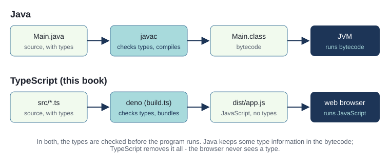
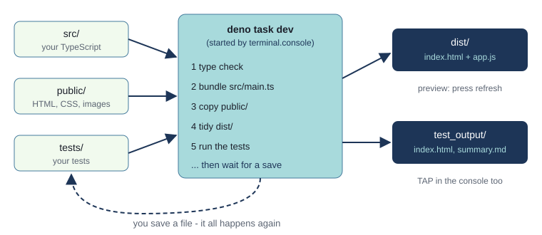
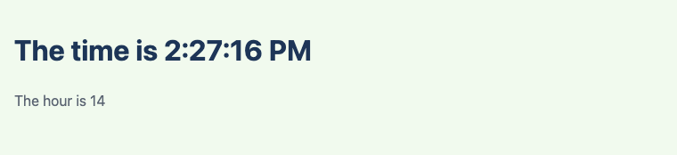
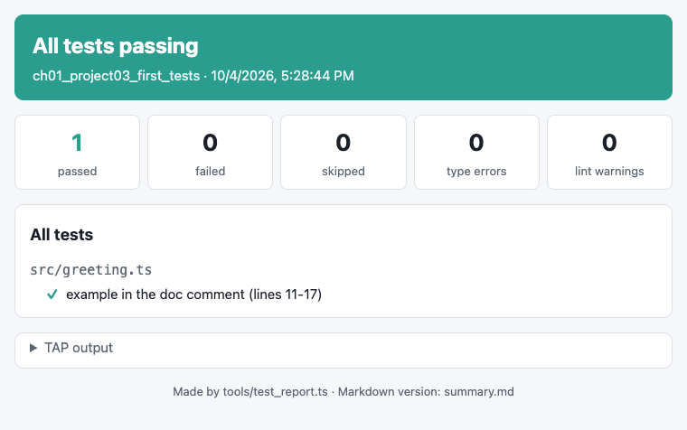
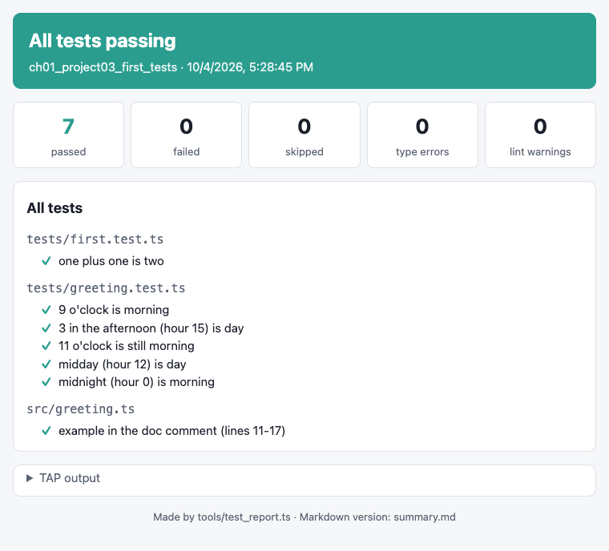
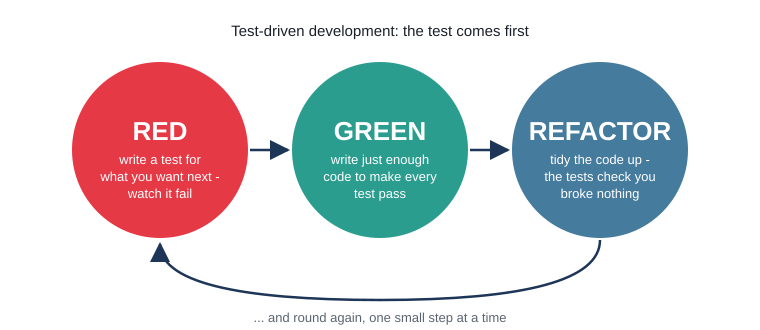
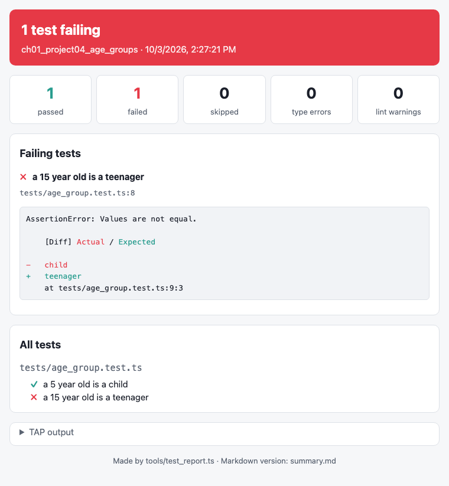
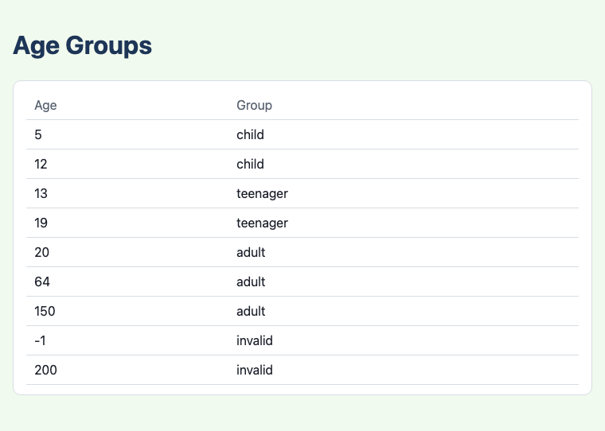
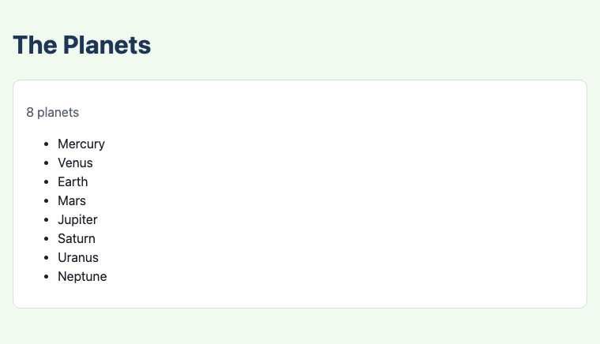
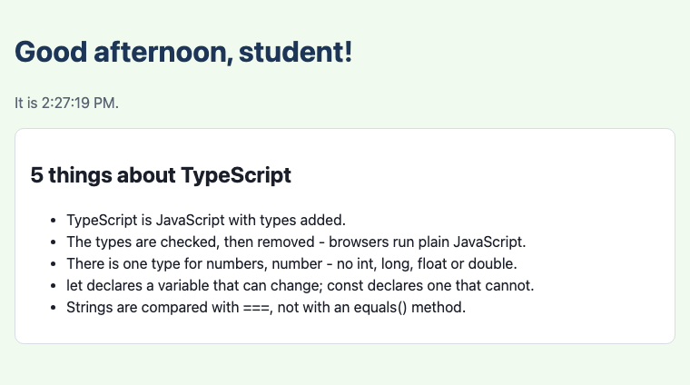

# Chapter 1 - Introduction: TypeScript, Deno and Celbridge

You already know how to write programs in Java. This book shows you how to write object-oriented
programs in **TypeScript**, the language most web software is now written in, and how to write them
**test first**. This chapter takes it slowly. You start with one file that says "Hello, world!",
and add one small idea at a time: the time of day, functions, your first tests, a function written
test first, and lists of data. By the end you will have built seven small projects, each only a
little bigger than the one before.


## What you will learn

- what TypeScript is, and how it compares with Java's "compile, then run"
- how a project is opened in Celbridge, built by Deno, tested, and previewed - automatically, every
  time you save
- the TypeScript basics for Java programmers: `const` and `let`, types, template literals, `if`,
  functions, `export` and `import`, arrays and `for ... of`
- how TypeScript finds and changes elements on a web page
- why we test; checking a function with an example in its doc comment; test files; reading the results
- **test-driven development**: writing the test before the code
- how to keep data in a JSON file and use it in a page

## The projects

| Project | What it shows |
|---|---|
| [ch01_project01_hello_world](projects/ch01_project01_hello_world/) | the smallest project: one file, `main.ts`, that changes the page |
| [ch01_project02_whats_the_time](projects/ch01_project02_whats_the_time/) | getting the time, and the `number` type |
| [ch01_project03_first_tests](projects/ch01_project03_first_tests/) | a function in its own file, an example in its doc comment that Deno checks, and the first test files |
| [ch01_project04_age_groups](projects/ch01_project04_age_groups/) | a function written test first |
| [ch01_project05_bullet_list](projects/ch01_project05_bullet_list/) | an array, a loop, and a bulleted list on the page |
| [ch01_project06_list_from_json](projects/ch01_project06_list_from_json/) | the list's data in a JSON file |
| [ch01_project07_hello_page](projects/ch01_project07_hello_page/) | everything together: functions, imports, a list, and tests |

You do not have to type the projects in: each one is ready to open. But each step in the chapter
starts from the project before and asks you to make a small change yourself (the **Exercises**).
Try each exercise before reading on - the answer follows straight after it.

## What is TypeScript?

Web browsers run one programming language: **JavaScript**. It has no types: a variable can hold a
number, then a string, then a list, and nothing complains until the program goes wrong while it is
running.

**TypeScript** is JavaScript with types added. You write `let count: number = 0;` and the TypeScript
checker makes sure that `count` only ever holds numbers. Before the program runs, the types are
checked and then **removed**, leaving ordinary JavaScript that any browser can run.



This is close to what you know from Java. `javac` checks your types and turns `Main.java` into
bytecode, which the Java Virtual Machine runs. In this book, Deno checks your types and turns your
TypeScript into one JavaScript file, `dist/app.js`, which the browser runs. The big difference is
the last step: the browser never sees a single TypeScript type. Types are a safety net that works
**before** the program runs.

TypeScript has classes, interfaces, `extends`, `implements`, `public`, `private` and `protected`,
and they mean almost the same as in Java - you will meet them from Chapter 2 on. Some things are
different: there is only one number type, functions do not have to live inside classes, and you
compare strings with `===`. Each chapter points out where TypeScript differs from Java.

## The tools

Everything in this book uses two tools.

- **[Deno](https://deno.com/)** runs TypeScript. It has a type checker, a bundler (to join many
  files into one for the browser), a test runner, a linter (to spot likely mistakes) and a code
  formatter built in, so there is nothing else to install. You need Deno 2.4 or later; check with
  `deno --version` in a terminal.
- **[Celbridge](https://celbridge.org/)** opens each project folder as a project, with an explorer,
  editors, a console at the bottom, and previews of web pages and Markdown files at the side.

The first build of the first project downloads one small package, Deno's library for tests, so it
needs an internet connection. After that everything works offline.

### Opening a project

Open a project folder in Celbridge - start with `projects/ch01_project01_hello_world`. Three things
open by themselves:

1. **the console**, at the bottom, which immediately runs `deno task dev` (see below)
2. **`dist/index.html`**, at the side, shown as a preview: this is your web page
3. **`README.md`**, the project's own notes

A fourth shortcut, with a clipboard icon, opens the **test report** (`test_output/index.html`).

### What happens when you save

`deno task dev` does five things, then waits. Every time you save a file in `src/`, `public/` or
`tests/`, it does them all again:



1. **type checks** every `.ts` file and lists any errors (the page is still built, so you can keep
   experimenting - but read the errors, they are nearly always a real bug)
2. **bundles** `src/main.ts`, and every file it imports, into one JavaScript file, `dist/app.js`
3. **copies** everything in `public/` (the HTML page, its CSS, any images) into `dist/`
4. **tidies** `dist/`, removing anything that is no longer in `public/`
5. **runs the tests** in `tests/`, prints the results, and writes a report to `test_output/`

When `dist/` changes, the **refresh** button on the `dist/index.html` preview lights up. Press it to
see your changes.

The console has buttons down its side too: rebuild-and-watch, build once, test once, and lint. If
`deno task dev` is running (it usually is), press **Ctrl+C** in the console before using them.

> **Note** - There is no web server. The build makes one plain `<script>` file, which a browser is
> happy to load straight from your disk, so `dist/index.html` works in Celbridge's preview or in
> any browser. Without Celbridge, run `deno task dev` in a terminal in the project's folder, and open
> `dist/index.html` in a browser.

### A project's files

Every project in the book has the same layout:

| File or folder | What it is | Do you edit it? |
|---|---|---|
| `src/` | your TypeScript: `main.ts`, and other files as the project grows | yes - this is your program |
| `tests/` | your tests, in files ending `.test.ts` | yes |
| `public/` | `index.html`, `styles.css`, and any images | yes |
| `dist/` | the built page - **made by the build** | no - it is overwritten on every save |
| `test_output/` | the test report - made by the build | no |
| `deno.json` | the project's settings: its tasks (`dev`, `build`, `test`, ...) | rarely |
| `build.ts`, `tools/` | the build and the test report | no |
| `terminal.console`, `*.celbridge` | Celbridge's console and project settings | no |

The rule to remember: **change `src/`, `public/` and `tests/`; look at `dist/` and `test_output/`**.

## Project 1: Hello, world!

The first project has one TypeScript file, `src/main.ts`, and it is four lines long:

`src/main.ts`
```ts
const output = document.querySelector("#output");
if (output !== null) {
  output.textContent = "Hello, world!";
}
```

And the web page it changes:

`public/index.html`
```html
<h1 id="output">(if you can read this, dist/app.js has not run - build the project)</h1>
...
<script src="app.js"></script>
```

A web page is a tree of **elements** - headings, paragraphs, lists, buttons. The browser keeps a
model of the page, with one object for every element, called the **DOM** (Document Object Model).
Your TypeScript can find an element and change it.

- `document` is the whole page.
- `document.querySelector("#output")` finds the element whose `id` is `output`. It uses CSS
  selectors: `#output` means "the element with id output".
- `querySelector` gives back **`null`** if no element matches - if the id was mistyped, say.
  TypeScript knows this, and will not let you use `output` until you have checked that it is not
  `null`. That is what the `if` is for. (Java would let you forget, and throw a
  `NullPointerException` when the program runs. TypeScript stops you before it runs.)
- `output.textContent = "Hello, world!";` replaces the text inside the element.

The `<script src="app.js">` line, at the end of the page, runs the JavaScript the build made from
`main.ts`. It comes last so that the elements above it already exist when it runs. If you ever see
the "(if you can read this ...)" text, the script did not run - look at the console for an error.

### `const`

`const output = ...` declares a variable that can never be given a new value, like a `final`
variable in Java. Notice there is no type: TypeScript **infers** the type from the value. It is
still checked - you could not later put a number in `output`.

> **Try it** - open `ch01_project01_hello_world`, change the message in `main.ts`, and save. Watch
> the console rebuild, then press refresh on the preview.

### Exercise 1.1 - Hello, you

Change the program so that the name is in a constant of its own, and the page says
"Hello, *your name*!". Try it before reading on.

Here is one way:

`src/main.ts`
```ts
const NAME = "Ada";

const output = document.querySelector("#output");
if (output !== null) {
  output.textContent = `Hello, ${NAME}!`;
}
```

The message is in **backticks** (`` ` ``), not quotes. A string in backticks is a *template
literal*: anything inside `${...}` is worked out and put into the string. It does the job of
`"Hello, " + name + "!"` in Java, but is easier to read. (TypeScript strings can also use `"..."` or
`'...'`; this book uses double quotes, and backticks when it needs `${...}`.)

`NAME` is in capitals because it is a fixed value that the program never changes - the same
convention as Java constants.

### Looking at the JavaScript

In Java you can look inside a `.class` file to see what `javac` made. Here, just open
`dist/app.js`:

`dist/app.js`
```js
(() => {
  // src/main.ts
  var output = document.querySelector("#output");
  if (output !== null) {
    output.textContent = "Hello, world!";
  }
})();
```

Almost the same as `main.ts`. The bundler wrapped it in `(() => { ... })();` to keep its variables
private, and wrote `var` instead of `const` (an older keyword that every browser understands). As
the projects grow, it is worth looking again: you will see the types disappear, and several files
joined into one.

## Project 2: What's the time?



`src/main.ts`
```ts
// new Date() makes an object holding the date and time, right now - like Java's LocalDateTime.now().
const now = new Date();

// getHours() gives the hour, from 0 to 23. Its type is number - TypeScript's only type for numbers.
const hour: number = now.getHours();

const time = document.querySelector("#time");
if (time !== null) {
  // toLocaleTimeString() gives the time as text, written the way your computer is set up to show it.
  time.textContent = `The time is ${now.toLocaleTimeString()}`;
}

const hourText = document.querySelector("#hour");
if (hourText !== null) {
  hourText.textContent = `The hour is ${hour}`;
}
```

`new Date()` makes a new object, just as `new` does in Java. `now.getHours()` calls one of its
methods.

### Types come after the name

`const hour: number = now.getHours();` gives the variable a type. In Java the type comes first
(`int hour`); in TypeScript it comes after the name, with a colon. Here the type is not really
needed - TypeScript can infer it - but writing it can make code clearer.

TypeScript's basic types:

| Java | TypeScript | Notes |
|---|---|---|
| `int`, `long`, `double`, `float` ... | `number` | one type for all numbers; `7 / 2` is `3.5` (use `Math.floor(7 / 2)` for 3) |
| `boolean` | `boolean` | `true` and `false` |
| `String`, `char` | `string` | lower case `s`; no separate character type |
| `String[]`, `ArrayList<String>` | `string[]` | arrays grow and shrink, like an `ArrayList` - see project 5 |
| `void` | `void` | for functions that return nothing |

### Exercise 1.2 - Good morning

Change the page so that it says "Good morning!" before midday, and "Good day!" from midday on. Try
it before reading on.

Here is one way:

`src/main.ts`
```ts
const now = new Date();
const hour: number = now.getHours();

let message = "Good day!";
if (hour < 12) {
  message = "Good morning!";
}

const greeting = document.querySelector("#greeting");
if (greeting !== null) {
  greeting.textContent = message;
}
```

(with an element `<h1 id="greeting">` in `index.html`). `if` works exactly as in Java. Note `let`:
it declares a variable that **can** be changed, which `message` needs to be. Use `const` unless
you need to change the variable later, and then use `let`. (You may see `var` in older JavaScript
code; it has confusing rules, and the linter will complain if you use it.)

Comparing values uses `===` and `!==` - three characters, not two. They work like Java's `==` for
numbers, and for strings they compare the *contents*: `"cat" === "cat"` is true, with no need for
`.equals()`. Never use `==` and `!=` in TypeScript: they convert between types in surprising ways
(`0 == ""` is true!).

### Exercise 1.3 - A function of its own

Move the decision - morning or day? - into a function called `greeting`, in a new file
`src/greeting.ts`. The function takes the hour, and returns the greeting. `main.ts` should call it.
Try it before reading on.

Here is one way - and it is how project 3 starts:

`src/greeting.ts`
```ts
// A named constant, rather than a "magic number" 12 in the middle of the code.
const MIDDAY = 12;

/** "Good morning" before midday (hours 0 to 11), and "Good day" from midday on (hours 12 to 23). */
export function greeting(hour: number): string {
  if (hour < MIDDAY) {
    return "Good morning";
  }
  return "Good day";
}
```

`src/main.ts`
```ts
import { greeting } from "./greeting.ts";

const now = new Date();
const hour: number = now.getHours();

const message = document.querySelector("#message");
if (message !== null) {
  message.textContent = `${greeting(hour)}!`;
}
```

Three new things:

- **Functions** are declared with the keyword `function`. The parameter's type comes after its name
  (`hour: number`), and the return type comes after the brackets (`): string`). In Java every
  method lives inside a class; in TypeScript a file can contain plain functions. They are like Java
  `static` methods without a class around them.
- **`export`** makes the function visible to other files. Without it, nothing in a file can be
  seen from outside.
- **`import { greeting } from "./greeting.ts";`** brings it into `main.ts`. The path is relative to
  the importing file, and in this book it always ends in `.ts`.

`/** ... */` is a doc comment, as in Java: editors show it when you hover over the function's name.

## Testing

The greeting changes at midday. How do you check that `greeting` gets it right? You could look at
the page now, and again this afternoon. And at exactly midday. And at midnight. That is slow, and
easy to get wrong - and you would have to do it all again every time you changed the code.

A **test** is a small piece of code that runs your code and checks the answer. Because `greeting`
is a function that takes the hour as a parameter, a test can try any hour it likes, instantly. Deno
runs every test each time you save, so you find out straight away if a change broke something.

This is the main reason `greeting` lives in its own file, away from the page: code that does not
touch the page can be tested by Deno on its own, without a browser.

### A first check: an example in the doc comment

The simplest place to start checking `greeting` is right next to it, in its doc comment. Project 3's
`greeting.ts` has an **example** there:

`src/greeting.ts`
```ts
/**
 * "Good morning" before midday (hours 0 to 11), and "Good day" from midday on (hours 12 to 23).
 *
 * @example
 * ```ts
 * import { assertEquals } from "@std/assert";
 *
 * assertEquals(greeting(9), "Good morning");
 * assertEquals(greeting(15), "Good day");
 * ```
 */
export function greeting(hour: number): string {
```

- `@example` marks the start of an example, as in a Javadoc comment. The example is a small piece of
  TypeScript, between two lines of three backticks with `ts` after the first.
- **Deno runs the example as a test**, every time you save. You do not need to import `greeting`:
  Deno does that for you, because the example is in `greeting`'s own file.
- `assertEquals(actual, expected)` checks that two values are equal; if they are not, the check
  **fails**. It comes from Deno's standard library, `@std/assert`, which the example imports. Note the
  order: **actual first, then expected** - the opposite way round to JUnit's `assertEquals`, if you
  have used it.
- The example is documentation too. Hover over `greeting` in `main.ts`, and your editor shows the
  comment and the example: how to use the function, and what it gives back.

Open `ch01_project03_first_tests` (project 3 also has a `tests/` folder - we come to that in a
moment). Here is what the console showed when the example was the only check in the project. The
results are in a format called **TAP** (the Test Anything Protocol), which is easy for people and
programs to read:

```text
TAP version 14
# src/greeting.ts
ok 1 - example in the doc comment (lines 11-17)
1..1

Tests: 0 failed, 1 passed, 0 skipped, 0 type errors, 0 lint warnings  ->  test_output/index.html
```

`ok` means it passed. The last line sums up, and says where the full report is. Open it with the
clipboard shortcut:



The report is rewritten every time you save. It also counts **type errors** and **lint warnings**
(more on those below), so it is the one place to look to see how your project stands. There is a
Markdown copy of it, `test_output/summary.md`, too.

> **Note** - A comment is not a check. An example written as `greeting(9); // "Good evening"` passes,
> even though the comment is wrong: Deno only runs the example, and nothing compares the answer with
> the comment. An example only checks what it puts in an `assertEquals`.

### When a check fails

Try it: change `MIDDAY` to `8` in `greeting.ts`, and save. Now 9 o'clock is "Good day", and the
example fails. The console shows exactly what went wrong:

```text
not ok 1 - example in the doc comment (lines 11-17)
  ---
  message: |-
    AssertionError: Values are not equal.

        [Diff] Actual / Expected

    -   Good day
    +   Good morning
        at src/greeting.ts (example at lines 11-17)
  at: src/greeting.ts:11
  ...
```

In the difference ("diff"), the line starting `-` is what the code **actually** gave, and the line
starting `+` is what the check **expected**. The last lines say where the failing example is. The
report turns red and shows the same thing. Put `MIDDAY` back to 12, save, and it goes green again.

### When examples are not enough: test files

An example shows how to use a function, and proves the example is true. But think about what else
`greeting` should get right. The change happens at midday, and changes like that are where mistakes
hide - so 11 o'clock, 12 o'clock and midnight all need checking too. Put them all in the doc comment
and three problems appear:

- the comment is no longer a short, clear example - it is crowded with checks
- an example has **no name** saying what it checks - only "example in the doc comment (lines 11-17)"
- the first `assertEquals` that fails **stops** the rest of the example, so you do not find out
  about the others

So checks like these go in a **test file** instead. Test files end `.test.ts`, and live in `tests/`.
Project 3's first test file is the simplest test there could be:

`tests/first.test.ts`
```ts
import { assertEquals } from "@std/assert";

Deno.test("one plus one is two", () => {
  assertEquals(1 + 1, 2);
});
```

- `Deno.test(...)` declares one test. It has a **name** - a sentence saying what should be true -
  and the **code** that checks it.
- The code is written `() => { ... }`. This is a function with no name (an *arrow function*, like a
  Java lambda). Chapter 3 explains arrow functions properly; for now, read it as "the test's code".
- Each test runs on its own: one failing test does not stop the others.

The second test file tests the greeting, including the edges:

`tests/greeting.test.ts`
```ts
import { assertEquals } from "@std/assert";
import { greeting } from "../src/greeting.ts";

Deno.test("9 o'clock is morning", () => {
  assertEquals(greeting(9), "Good morning");
});

Deno.test("3 in the afternoon (hour 15) is day", () => {
  assertEquals(greeting(15), "Good day");
});

// The edges - the hours either side of the change - are where mistakes hide.

Deno.test("11 o'clock is still morning", () => {
  assertEquals(greeting(11), "Good morning");
});

Deno.test("midday (hour 12) is day", () => {
  assertEquals(greeting(12), "Good day");
});
```

A test file has to import the function it tests, just as `main.ts` does. With the example and the
test files together, the console shows every check, each test by name:

```text
TAP version 14
# tests/first.test.ts
ok 1 - one plus one is two
# tests/greeting.test.ts
ok 2 - 9 o'clock is morning
ok 3 - 3 in the afternoon (hour 15) is day
ok 4 - 11 o'clock is still morning
ok 5 - midday (hour 12) is day
ok 6 - midnight (hour 0) is morning
# src/greeting.ts
ok 7 - example in the doc comment (lines 11-17)
1..7

Tests: 0 failed, 7 passed, 0 skipped, 0 type errors, 0 lint warnings  ->  test_output/index.html
```



**Examples or tests?** This book uses both:

- a **doc comment example** shows how to use a function - one or two typical calls - and Deno checks
  that it stays true. It is documentation that cannot go out of date
- **test files** hold everything else: the edges, the unusual cases, many checks, each with a name

### Why the edges matter

Look at which hours the test file checks. 9 and 15 are ordinary morning and afternoon hours, like the
example's. 11 and 12 are the **edges**: the last hour of the morning and the first hour of the day.

Try it: change `MIDDAY` to `13`, and save. Now midday says "Good morning" - a bug. The example still
passes (9 is still morning, and 15 is still day), but one test fails:

```text
not ok 5 - midday (hour 12) is day
  ---
  message: |-
    AssertionError: Values are not equal.

        [Diff] Actual / Expected

    -   Good morning
    +   Good day
        at tests/greeting.test.ts:21:3
  at: tests/greeting.test.ts:20
  ...
```

This time the failure has a name, saying exactly what should be true, and the line of the test that
failed. Only the test at the edge caught the bug - which is why you should always test both sides of
an edge. Put `MIDDAY` back to 12, and save.

## Test-driven development

So far the tests were written *after* the code, to check it. **Test-driven development** (TDD)
turns that round: you write a test for what the code *should* do **first**, watch it fail, and only
then write the code. It sounds back to front, but it has big advantages:

- you have to decide exactly what the code should do before you write it
- every piece of code has a test from the moment it exists
- you only write code that a test needs - nothing extra
- you always know what to do next: make the failing test pass

TDD goes round a short cycle, many times:



1. **Red** - write one test for the next small thing the code should do. Run it, and watch it fail.
   (If it passes before you have written anything, the test is not testing what you think.)
2. **Green** - write just enough code to make every test pass. Not more.
3. **Refactor** - tidy the code up: better names, named constants, less repetition. The tests tell
   you straight away if tidying broke anything.

From Chapter 4 on, every project in this book is built this way. Here is a first, small example.

### Project 4: Age groups, test first

We want a function, `ageGroup`, that takes an age in years and says which group it is in:

- under 12: **child**
- 13 to 19: **teenager**
- 20 and over: **adult**
- below 0 or above 150: **invalid** - nobody has an age like that

Before any code, look hard at that description. What group is a 12 year old? "Under 12" stops
before 12, and "13 to 19" starts after it. Descriptions like this often have gaps, and writing tests
makes you find them, because a test needs an exact answer. We will decide that 12 is still a child,
so the groups are 0-12, 13-19 and 20-150.

**Step 1 - red.** Make a test file, `tests/age_group.test.ts`, with one test:

```ts
import { assertEquals } from "@std/assert";
import { ageGroup } from "../src/age_group.ts";

Deno.test("a 5 year old is a child", () => {
  assertEquals(ageGroup(5), "child");
});
```

Save. It fails - there is no `src/age_group.ts` yet, so the tests cannot even run. The console
says `Module not found "src/age_group.ts"`, and the report's banner says "The tests could not run".
That counts as red.

**Step 2 - green.** Write *just enough* code to pass. That is surprisingly little:

`src/age_group.ts`
```ts
export function ageGroup(age: number): string {
  return "child";
}
```

It looks like cheating - but every test passes, and that is all we can ask of the code so far. The
linter warns that `age` is never used; that is fine for now, the next test will need it.

**Step 3 - red again.** Add a test for the next group:

```ts
Deno.test("a 15 year old is a teenager", () => {
  assertEquals(ageGroup(15), "teenager");
});
```

Save. The new test fails, because `ageGroup` always says "child":



**Step 4 - green.** Now the function has to look at the age:

```ts
export function ageGroup(age: number): string {
  if (age <= 12) {
    return "child";
  }
  return "teenager";
}
```

Both tests pass. **Then round again**, one group at a time: a test that 40 is an adult (red), an
`if` for teenagers so that older ages fall through to "adult" (green); a test that -1 is invalid
(red), a check at the top of the function (green); a test that 151 is invalid (red), and so on.
Finally, add tests for the **edges** of every group - 0, 12, 13, 19, 20 and 150 - and check they
all pass.

**Refactor.** With every test green, tidy up. The numbers 12, 19 and 150 are "magic numbers"; give
them names. Here is the finished function, as it is in project 4:

`src/age_group.ts`
```ts
const OLDEST_CHILD = 12;
const OLDEST_TEENAGER = 19;
const OLDEST_POSSIBLE = 150;

export function ageGroup(age: number): string {
  if (age < 0 || age > OLDEST_POSSIBLE) {
    return "invalid";
  }
  if (age <= OLDEST_CHILD) {
    return "child";
  }
  if (age <= OLDEST_TEENAGER) {
    return "teenager";
  }
  return "adult";
}
```

(`||` means "or", and `&&` means "and", as in Java.) Save after the refactor: still all green, so
the tidying broke nothing.

Last, give the finished function a doc comment with an example, showing how to use it:

`src/age_group.ts`
```ts
/**
 * The age group for an age in years: "child" (0 to 12), "teenager" (13 to 19), "adult" (20 to 150),
 * or "invalid" for an age that cannot be right (below 0, or above 150).
 *
 * @example
 * ```ts
 * import { assertEquals } from "@std/assert";
 *
 * assertEquals(ageGroup(8), "child");
 * assertEquals(ageGroup(16), "teenager");
 * assertEquals(ageGroup(40), "adult");
 * ```
 */
```

The example shows one typical age from each group; the edges, and the invalid ages, stay in the test
file, where each has a name. The project's `tests/age_group.test.ts` has all eleven tests, and its
page shows a table of example ages:



> **Note** - Small steps are the point. If you write a big piece of code and ten tests fail, it is
> hard to know where the mistake is. If you change two lines and one test fails, you know exactly
> where to look.

## Lists of things

### Project 5: A bulleted list



`src/main.ts`
```ts
// An array of strings. The type string[] means "array of string" - like Java's String[], but it
// can grow and shrink, like an ArrayList.
const PLANETS: string[] = ["Mercury", "Venus", "Earth", "Mars", "Jupiter", "Saturn", "Uranus", "Neptune"];

const list = document.querySelector("#planets");
if (list !== null) {
  // for ... of goes through the array's values in order - Java's for (String planet : planets)
  for (const planet of PLANETS) {
    const item = document.createElement("li");
    item.textContent = planet;
    list.appendChild(item);
  }
}

const count = document.querySelector("#count");
if (count !== null) {
  count.textContent = `${PLANETS.length} planets`;
}
```

- An array is written in square brackets, and its type is `string[]`.
- `for (const planet of PLANETS)` takes each value in turn. Note the word **`of`**. There is also a
  `for ... in` loop, which does something different (it goes through the *positions*, as strings),
  so `for ... of` is the one you want.
- `document.createElement("li")` makes a new list item element; `list.appendChild(item)` puts it
  into the list on the page.
- An array's size is `PLANETS.length` - a property, not a method, so there are no brackets. (Java
  arrays use `.length` too; Java lists use `.size()`.)

### Exercise 1.4 - The data in a file of its own

Move the array into its own file, `src/planets.ts`, and import it into `main.ts`. Try it before
reading on.

Here is one way:

`src/planets.ts`
```ts
export const PLANETS: string[] = ["Mercury", "Venus", "Earth", "Mars", "Jupiter", "Saturn", "Uranus", "Neptune"];
```

`src/main.ts`
```ts
import { PLANETS } from "./planets.ts";
```

A constant can be exported and imported just like a function. Now the data and the code that shows
it are separate.

### Exercise 1.5 - The data as JSON

The planets are *data*, not code. Data is often kept in a **JSON** file (JavaScript Object
Notation), the format almost every web service uses to send data. A JSON file holding an array of
strings looks like the array in TypeScript, with double quotes:

`src/planets.json`
```json
["Mercury", "Venus", "Earth", "Mars", "Jupiter", "Saturn", "Uranus", "Neptune"]
```

Move the array into `src/planets.json`, delete `planets.ts`, and change `main.ts` to use the JSON
file. Here is how - and it is project 6:

`src/main.ts`
```ts
import planets from "./planets.json" with { type: "json" };

// TypeScript works out the type of the data from the file itself. Writing the type here makes it
// clear, and checks the file really does hold an array of strings.
const PLANETS: string[] = planets;
```

`with { type: "json" }` says "this file is JSON: read it, and **parse** it". To parse is to turn the
text of the file into real values - here, an array of strings. When the project is built, the
bundler reads `planets.json`, parses it, and puts the array into `dist/app.js`. So the page still
needs no server, and you can edit `planets.json`, save, and refresh to see the new list.

> **Note** - Web pages served from a web server usually *fetch* JSON while they run, and parse it
> with `JSON.parse(text)`, which turns a string of JSON into values. Project 6's tests show
> `JSON.parse` at work. A page opened straight from the disk is not allowed to fetch files, which is
> why this book reads JSON at build time instead.

`tests/planets.test.ts`
```ts
import { assertEquals } from "@std/assert";
import planets from "../src/planets.json" with { type: "json" };

Deno.test("JSON.parse turns JSON text into an array", () => {
  const text = '["Mercury", "Venus"]';
  const values: string[] = JSON.parse(text);
  assertEquals(values.length, 2);
  assertEquals(values[1], "Venus");
});

Deno.test("planets.json holds eight planets", () => {
  assertEquals(planets.length, 8);
});
```

Tests can check data as well as code: if someone deletes a planet from the file by mistake, the
second test fails.

## Project 7: Putting it together

The last project combines everything. You should find nothing in it new.



`src/greeting.ts` has a three-way version of the greeting, with a doc comment example for each
function, and tests for the edges:

`src/greeting.ts`
```ts
const MORNING_STARTS = 5;
const AFTERNOON_STARTS = 12;
const EVENING_STARTS = 18;

/**
 * The part of the day for an hour from 0 to 23: "morning", "afternoon" or "evening".
 *
 * @example
 * ```ts
 * import { assertEquals } from "@std/assert";
 *
 * assertEquals(partOfDay(9), "morning");
 * assertEquals(partOfDay(20), "evening");
 * ```
 */
export function partOfDay(hour: number): string {
  if (hour >= MORNING_STARTS && hour < AFTERNOON_STARTS) {
    return "morning";
  }
  if (hour >= AFTERNOON_STARTS && hour < EVENING_STARTS) {
    return "afternoon";
  }
  return "evening";
}

/**
 * A greeting for `name` at `hour`.
 *
 * @example
 * ```ts
 * import { assertEquals } from "@std/assert";
 *
 * assertEquals(greeting("Ada", 9), "Good morning, Ada!");
 * ```
 */
export function greeting(name: string, hour: number): string {
  return `Good ${partOfDay(hour)}, ${name}!`;
}
```

`greeting` takes two parameters and calls `partOfDay` inside a template literal. `src/facts.ts`
exports an array of strings, and `main.ts` imports both files, shows the greeting and the time, and
builds a list of facts - the code from projects 3 and 5, side by side. Open `dist/app.js` too: all
three files are now in one, and every type has gone.

## When things go wrong

Three kinds of things go wrong, and each shows up in a different place:

| What went wrong | Where you see it |
|---|---|
| a **type error** (e.g. a string where a `number` should be) | the console, straight after saving, and the report's "type errors" |
| a **failing test** (the code does the wrong thing) | the console's TAP output, and the report |
| a **lint warning** (a likely mistake, such as a variable that is never used) | the console's summary line, and the report's "lint warnings" |
| a problem **while the page runs** (e.g. an `id` that does not exist) | the browser: open `dist/index.html` in a web browser and its developer tools (F12, or Cmd+Option+I on a Mac), and look at the Console tab |

The first three are found for you, every time you save. That is why we use TypeScript, tests and the
linter: they catch problems before you ever look at the page.

## Java and TypeScript, so far

| Java | TypeScript |
|---|---|
| `final String NAME = "Ada";` | `const NAME = "Ada";` |
| `int hour = 9;` | `let hour = 9;` or `let hour: number = 9;` |
| `"Hi " + name + "!"` | `` `Hi ${name}!` `` |
| `a.equals(b)` (strings), `a == b` (numbers) | `a === b` for both |
| `static String greeting(int hour) { ... }` in a class | `function greeting(hour: number): string { ... }` in any file |
| `public` class or method, `import` | `export`, `import { name } from "./file.ts";` |
| `String[] planets = { ... };` | `const planets: string[] = [ ... ];` |
| `for (String p : planets)` | `for (const p of planets)` |
| `planets.length` (array), `list.size()` | `planets.length` |
| a Javadoc comment, with an example nobody checks | a doc comment whose `@example` Deno runs and checks |
| JUnit `@Test` and `assertEquals(expected, actual)` | `Deno.test("name", () => { ... })` and `assertEquals(actual, expected)` |
| `javac`, then `java` | save; `deno task dev` does the rest; refresh the preview |

## Summary

- TypeScript is JavaScript plus types. Types are checked, then removed; the browser runs plain
  JavaScript
- Opening a project in Celbridge starts `deno task dev`, which type checks, builds `dist/`, runs the
  tests and writes `test_output/` - and does it again every time you save
- Change `src/`, `public/` and `tests/`; look at `dist/index.html` (press refresh) and the report
- `main.ts` finds elements with `querySelector`, checks they are not `null`, and changes their
  `textContent`
- `const` for values that never change, `let` for ones that do; types after names; one `number`
  type; template literals with `${...}`; `===` for comparing
- functions can live in any file; `export` them, and `import` them where they are needed
- an `@example` in a doc comment shows how to use a function, and Deno checks it; a comment on its
  own checks nothing
- a test file holds the edges and the unusual cases: each `Deno.test` names what should be true and
  checks it with `assertEquals(actual, expected)`; test both sides of every edge
- TDD: **red** (a failing test), **green** (just enough code), **refactor** (tidy up) - in small
  steps
- arrays (`string[]`), `for ... of`, and data kept in JSON files

## Challenges

Each challenge says which project to start from. Work on a copy if you want to keep the original
(copy the whole project folder). From challenge 2 on, write the test first.

### 1. Make it yours

*Start from `ch01_project07_hello_page`.* Greet yourself by name, add a sixth fact of your own, and
change the page's colours in `public/styles.css` (the colours are at the top, in `:root`). Check that
the heading now says "6 things about TypeScript" - without you changing it. Why did it change?

### 2. Good night

*Start from `ch01_project07_hello_page`.* At 2 o'clock in the morning the page says "Good evening".
Make hours 22 to 4 say "Good night" instead. Test first: add a test that `partOfDay(2)` is `"night"`,
see it fail, then change `partOfDay`. Then add tests for the edges - 21, 22, 4 and 5 - and make sure
they all pass.

### 3. Break it on purpose

*Start from `ch01_project07_hello_page`.* Make each of these mistakes, one at a time. For each one,
write down **where** it showed up (console, report, page) and **what the message said**, then undo
it:

1. in `main.ts`, change `const hour: number = now.getHours();` to `const hour: number = "nine";`
2. add a line `let unused = 1;` to `main.ts`
3. in `greeting.ts`, change `AFTERNOON_STARTS` to `13`
4. in `main.ts`, change `"#facts"` to `"#fact"`

Which ones did nothing catch? Why not, and how could you find them?

### 4. Seniors

*Start from `ch01_project04_age_groups`.* Add a fifth group: people aged 65 and over are
**"senior"**. Test first, one step at a time: a test that 70 is a senior (red), then the code
(green). Then the edges: 64 and 65. Which existing test now fails, and why? Fix it so that it still
tests what it was meant to.

### 5. Planets with facts

*Start from `ch01_project06_list_from_json`.* Change `planets.json` so that each planet has a name
and a fact, like this:

```json
[
  { "name": "Mercury", "fact": "the smallest planet" },
  { "name": "Venus", "fact": "the hottest planet" }
]
```

and show each one as "**Mercury** - the smallest planet". Update the tests first: for example, that
the first planet's name is `"Mercury"` (`planets[0].name`).

*Hint:* the type of the array is now `{ name: string; fact: string }[]`. To make part of the text
bold, set the item's `innerHTML` instead of `textContent`:
`` item.innerHTML = `<b>${planet.name}</b> - ${planet.fact}`; ``

### 6. Day and night colours

*Start from `ch01_project07_hello_page`.* Make the page's colours change with the time of day: a
light theme in the day and a dark theme at night. Write a function `themeFor(hour: number): string`
in a new file `src/theme.ts`, that returns `"day"` from 7 to 18 and `"night"` otherwise, test first:
the edges in a test file, and an example in its doc comment showing one day hour and one night hour.
In `main.ts`, set the page's class with
`document.body.className = themeFor(hour);`, and in `styles.css` add rules for `body.day` and
`body.night`.

*Hint:* the colours are CSS variables, so the night rule can just change them:
`body.night { --bg: #16191f; --card: #1f232b; --text: #e8eaed; }`. To test the night theme without
waiting for night, change `hour` in `main.ts` for a moment - or, better, trust your tests.

---

Next: [Chapter 2 - Events: clicks, keys and timers](../ch02_events/README.md)
