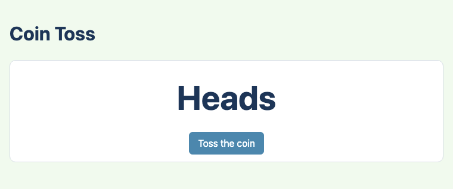
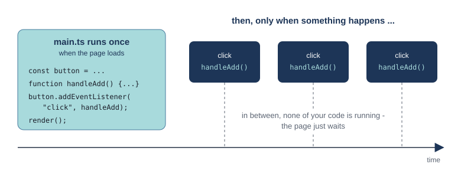
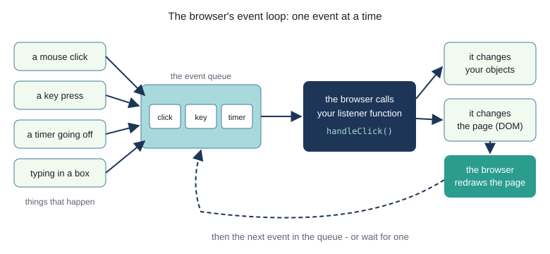
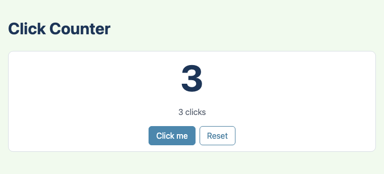
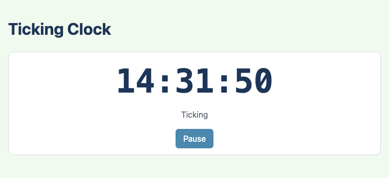
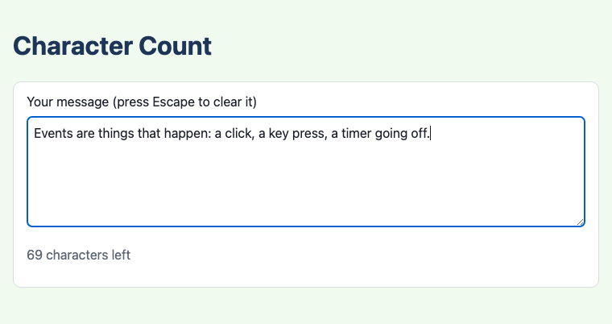

# Chapter 2 - Events: clicks, keys and timers

The pages in Chapter 1 did their work once, when they loaded, and then sat still. Real pages
respond: you click a button, type in a box, or wait for a clock to tick, and the page changes. This
chapter explains how that works - the browser's **event model** - and how to write TypeScript that
responds to events. Along the way you write your first TypeScript **class**.



## What you will learn

- how event-driven programs differ from programs that run from top to bottom
- the browser's event loop: events, the event queue, and listener functions
- responding to clicks with `addEventListener`, and passing a function without calling it
- a first TypeScript class, next to the same class in Java
- the pattern used all through this book: an object holds the state, events change it, and a
  `render` function shows it
- timer events: `setInterval`, `clearInterval` and `setTimeout`
- typing and key presses: the `input` and `keydown` events, and the event object
- keeping the parts you cannot predict (random numbers, the time) out of the code you test

## The projects

| Project | What it shows |
|---|---|
| [ch02_project01_coin_toss](projects/ch02_project01_coin_toss/) | a click listener; a random number passed into a function so it can be tested |
| [ch02_project02_click_counter](projects/ch02_project02_click_counter/) | a first class, `Counter`; two buttons; a `render` function |
| [ch02_project03_ticking_clock](projects/ch02_project03_ticking_clock/) | a timer that ticks every second, and a button that pauses and resumes it |
| [ch02_project04_character_count](projects/ch02_project04_character_count/) | the `input` and `keydown` events, and the event object |

## Programs that wait

The Java programs you started with ran from the top of `main` to the bottom, and then stopped. If
they needed input, they stopped and waited for it (`scanner.nextLine()`), and nothing else could
happen in the meantime.

A web page cannot work like that. The user might click any button, in any order, or type, or do
nothing at all while a clock ticks. So a page is **event-driven**: its code runs when something
happens. An **event** is anything that happens that a page might care about: a click, a key press,
the text in a box changing, a timer going off, the page finishing loading.

This changes how `main.ts` works. It still runs from top to bottom - **once**, when the page loads.
Its job is to set things up: find the elements, and tell the browser which function to call when
each event happens. Then it finishes. From then on, your code only runs when an event calls it.



If you have written a Java Swing or JavaFX program with buttons, you have seen this before: you
built the window, attached `ActionListener`s or `setOnAction` handlers, and the framework called
them when the user clicked.

### The event loop

Inside the browser, events are handled one at a time:



1. Things happen - the user clicks, a timer goes off - and each one is put at the back of a queue
   of events.
2. The browser takes the event at the front of the queue, and calls the function your code
   registered for it - the **listener** (also called a handler).
3. Your listener runs to the end. It changes your objects, and the page.
4. The browser redraws the page, so the user sees the change. Then it takes the next event, or
   waits for one.

Two things follow from this:

- **Only one listener runs at a time.** You never have to worry about two clicks being handled at
  once.
- **A slow listener freezes the page.** While a listener runs, nothing else can happen - the page
  cannot even redraw. So listeners should do their job quickly and finish. (In this book they always
  do; the risk comes with long calculations or loops that never end.)

## Project 1: Responding to a click


`src/main.ts`
```ts
import { coinFace } from "./coin.ts";

const tossButton = document.querySelector<HTMLButtonElement>("#toss");
const result = document.querySelector<HTMLElement>("#result");

/** Called by the browser each time the button is clicked. */
function handleToss(): void {
  // Math.random() gives a different number from 0 up to (but not including) 1 every time.
  const face = coinFace(Math.random());
  if (result !== null) {
    result.textContent = face;
  }
}

// "When this button is clicked, call handleToss." Note: handleToss, not handleToss() -
// we hand over the function itself, for the button to call later.
if (tossButton !== null) {
  tossButton.addEventListener("click", handleToss);
}
```

`querySelector<HTMLButtonElement>("#toss")` has something new in angle brackets: the kind of element
we expect to find. It tells TypeScript that `tossButton` is a button, so it knows what a button can
do (for example, be disabled). Each kind of element has a type: `HTMLButtonElement`,
`HTMLInputElement`, `HTMLTextAreaElement`, and `HTMLElement` for any element at all.

`addEventListener("click", handleToss)` is the key line. It says: *when a `"click"` event happens
on this button, call `handleToss`*. Look carefully: it says `handleToss`, **not** `handleToss()`.

- `handleToss()` - with brackets - **calls** the function, now, and gives its result (nothing).
- `handleToss` - without brackets - is **the function itself**, as a value, handed over to be called
  later.

In TypeScript a function is a value, like a number or a string: you can store it in a variable, or
pass it to another function. That is how a listener is registered. If you write the brackets by
mistake, TypeScript refuses, with an error that ends
`Argument of type 'void' is not assignable to parameter of type ...`.

`handleToss` has the return type `void`, as in Java: it returns nothing. It is called by the
browser, which ignores any result anyway.

> **Try it** - open `ch02_project01_coin_toss` and toss the coin a few times.

### Keeping random numbers out of the tested code

How would you test a coin toss? The answer is random, so a test cannot know what to expect. The
trick is to keep the random part out of the function that decides:

`src/coin.ts`
```ts
const HALF = 0.5;

/** "Heads" for a random number below 0.5, and "Tails" for 0.5 and above (Math.random() gives 0 to 1). */
export function coinFace(random: number): string {
  if (random < HALF) {
    return "Heads";
  }
  return "Tails";
}
```

`main.ts` makes the random number, with `Math.random()`, and passes it in. The tests pass in numbers
they choose, so they know the right answer:

`tests/coin.test.ts`
```ts
Deno.test("a small random number gives heads", () => {
  assertEquals(coinFace(0.2), "Heads");
});

Deno.test("exactly a half gives tails", () => {
  assertEquals(coinFace(0.5), "Tails");
});
```

The same idea works for anything you cannot predict - the time of day was the same problem in
Chapter 1, and `greeting(hour)` solved it the same way. Book 2 takes it further.

## Project 2: A first class



The second project counts your clicks. The counting is done by a **class**. Here it is, next to the
same class in Java:

`src/Counter.ts`
```ts
export class Counter {
  // A field, with its type. It starts at zero for every new Counter.
  private count: number = 0;

  /** Adds one to the count. */
  public increment(): void {
    this.count++;
  }

  /** Sets the count back to zero. */
  public reset(): void {
    this.count = 0;
  }

  /** The current count. */
  public getCount(): number {
    return this.count;
  }
}
```

`Counter.java`
```java
public class Counter {
    private int count = 0;

    public void increment() {
        count++;
    }

    public void reset() {
        count = 0;
    }

    public int getCount() {
        return count;
    }
}
```

They are nearly the same. The differences:

- `export class` instead of `public class` - `export` is what lets other files import it
- types come after names: `count: number`, `getCount(): number`
- a method starts with its visibility and name - not with its return type
- **`this.` is compulsory.** In Java you can write `count++` inside a method, and Java works out you
  mean the field. In TypeScript you must write `this.count++`. Forgetting `this.` is the most common
  mistake in the first weeks; the error is
  `Cannot find name 'count'. Did you mean the instance member 'this.count'?`
- `public` is the default in TypeScript, so it could be left out. This book always writes it, so
  that visibility is clear

Objects are made with `new`, as in Java, and the class is imported from its file like anything else:

`src/main.ts`
```ts
import { Counter } from "./Counter.ts";
import { describeCount } from "./messages.ts";

const counter = new Counter();
```

The file is named after the class (`Counter.ts`), one class per file, as in Java. Chapter 5 covers
classes properly: constructors, `toString`, and more.

### Object, event, render

`src/main.ts`
```ts
const addButton = document.querySelector<HTMLButtonElement>("#add");
const resetButton = document.querySelector<HTMLButtonElement>("#reset");
const countDisplay = document.querySelector<HTMLElement>("#count");
const message = document.querySelector<HTMLParagraphElement>("#message");

/** Makes the page show the counter's current state. Called after every change. */
function render(): void {
  if (countDisplay !== null) {
    countDisplay.textContent = `${counter.getCount()}`;
  }
  if (message !== null) {
    message.textContent = describeCount(counter.getCount());
  }
}

function handleAdd(): void {
  counter.increment();
  render();
}

function handleReset(): void {
  counter.reset();
  render();
}

if (addButton !== null) {
  addButton.addEventListener("click", handleAdd);
}
if (resetButton !== null) {
  resetButton.addEventListener("click", handleReset);
}

render();
```

This is a pattern you will use in every project in the book:

1. an **object** (`counter`) holds the state
2. each **event** (a click) changes the object, and then calls `render()`
3. **`render()`** makes the page show the object's current state

The page never keeps its own copy of the count; it always shows what the `Counter` says. That keeps
the two from getting out of step, and it means the logic - in `Counter` - can be tested without the
page. `render()` is also called once at the end of `main.ts`, so the page is right from the start.

`describeCount` is a plain function, in `src/messages.ts`, that turns the count into words ("No clicks
yet", "1 click", "5 clicks"). Not everything has to be in a class.

`tests/Counter.test.ts` tests the class:

```ts
Deno.test("three increments make three", () => {
  const counter = new Counter();
  counter.increment();
  counter.increment();
  counter.increment();
  assertEquals(counter.getCount(), 3);
});

Deno.test("reset goes back to zero", () => {
  const counter = new Counter();
  counter.increment();
  counter.increment();
  counter.reset();
  assertEquals(counter.getCount(), 0);
});
```

Each test makes its own new `Counter`, so the tests cannot affect each other. The pattern -
**arrange** (make the object), **act** (call methods), **assert** (check the result) - is the
shape of most tests.

## Project 3: Timer events



Not every event comes from the user. The browser can call a function **after a delay**, or **again
and again**:

| Function | What it does |
|---|---|
| `setTimeout(fn, ms)` | calls `fn` once, after `ms` milliseconds |
| `setInterval(fn, ms)` | calls `fn` every `ms` milliseconds, until stopped |
| `clearInterval(id)` | stops an interval; `id` is the number `setInterval` gave back |

(1000 milliseconds is one second. As with `addEventListener`, you pass the function itself, without
brackets.) A timer going off is just another event in the queue.

`src/main.ts`
```ts
import { formatTime } from "./time_format.ts";

const ONE_SECOND_MS = 1000;

// The id of the running interval, or null when the clock is paused. let, because it changes.
let timerId: number | null = null;

/** Shows the time now. Called once a second by the timer. */
function showTime(): void {
  const now = new Date();
  if (clock !== null) {
    clock.textContent = formatTime(now.getHours(), now.getMinutes(), now.getSeconds());
  }
}

function start(): void {
  showTime(); // straight away, rather than waiting a second
  timerId = setInterval(showTime, ONE_SECOND_MS);
  // ... the button now says "Pause"
}

function pause(): void {
  if (timerId !== null) {
    clearInterval(timerId);
    timerId = null;
  }
  // ... the button now says "Resume"
}

/** The button pauses a ticking clock, and resumes a paused one. */
function handlePause(): void {
  if (timerId === null) {
    start();
  } else {
    pause();
  }
}
```

`timerId: number | null` is a new kind of type: a **union**. It means "a number, *or* null". Java
lets any object variable be `null`; TypeScript does not, unless the type says so. Here, `null`
means "not running" - so `handlePause` can tell whether the clock is ticking by checking it. You will
see a lot more of union types; they are one of TypeScript's most useful ideas.

`timerId` is declared **outside** the functions, with `let`, so that every function in the file can
see it and change it, and it keeps its value between events.

### Testing the formatting

The time itself cannot be tested (it keeps changing!), but turning hours, minutes and seconds into
`"09:05:03"` can be:

`src/time_format.ts`
```ts
/** A number as two digits: 7 becomes "07", 42 stays "42". */
export function twoDigits(value: number): string {
  // padStart adds "0"s to the front of the string until it is 2 characters long.
  return `${value}`.padStart(2, "0");
}

/** For example, formatTime(9, 5, 3) is "09:05:03". */
export function formatTime(hours: number, minutes: number, seconds: number): string {
  return `${twoDigits(hours)}:${twoDigits(minutes)}:${twoDigits(seconds)}`;
}
```

`` `${value}` `` turns the number into a string, and the string's `padStart` method does the rest.
The tests check single digits, double digits, zero, and the last second of the day.

## Project 4: Typing and keys



`src/main.ts`
```ts
import { charactersLeft, describeLeft, LIMIT } from "./characters.ts";

const box = document.querySelector<HTMLTextAreaElement>("#message");
const counter = document.querySelector<HTMLElement>("#counter");

/** Shows how many characters are left, in red when there are too many. */
function render(): void {
  if (box === null || counter === null) {
    return;
  }
  const left = charactersLeft(box.value, LIMIT);
  counter.textContent = describeLeft(left);
  counter.classList.toggle("bad", left < 0);
}

function handleInput(): void {
  render();
}

/** Escape clears the box. Every key press comes here, so check which key it was. */
function handleKey(event: KeyboardEvent): void {
  if (event.key === "Escape" && box !== null) {
    box.value = "";
    render();
  }
}

if (box !== null) {
  box.addEventListener("input", handleInput);
  box.addEventListener("keydown", handleKey);
}

render();
```

- The **`input`** event happens whenever the text in the box changes - typing, deleting, pasting.
  `box.value` is the text in it.
- The **`keydown`** event happens whenever a key is pressed. Its listener takes a parameter: the
  **event object**, a `KeyboardEvent`, which says which key it was (`event.key` is `"Escape"`,
  `"Enter"`, `"a"`, ...). Every listener is given an event object; `handleInput` simply does not
  ask for it. A click listener could take a `MouseEvent`, with the mouse position.
- `counter.classList.toggle("bad", left < 0)` adds the CSS class `bad` (red text) when there are too
  many characters, and removes it otherwise.
- `render()` starts with a check: if either element is missing, `return` - there is nothing to do.
  After that check, TypeScript knows neither is `null`, so the rest of the function needs no more
  `if`s.

The counting is done by two small, tested functions in `src/characters.ts`: `charactersLeft(text,
limit)` and `describeLeft(left)`, which gets "1 character left" and "3 too many" right.

## Common events

| Event | Happens when ... | Usually on |
|---|---|---|
| `click` | an element is clicked (or a button is pressed with the keyboard) | buttons, any element |
| `dblclick` | an element is double-clicked | any element |
| `input` | the value of a text box changes | `<input>`, `<textarea>` |
| `change` | a value is committed: a drop-down choice, a checkbox ticked | `<select>`, checkboxes |
| `keydown`, `keyup` | a key is pressed, released | text boxes, or `document` for the whole page |
| `mouseenter`, `mouseleave` | the mouse moves onto, off, an element | any element |
| `submit` | a form is submitted | `<form>` |
| `DOMContentLoaded` | the page has finished loading | `document` |

## Java and TypeScript

| Java (Swing / JavaFX) | TypeScript in a web page |
|---|---|
| `button.addActionListener(listener)` / `button.setOnAction(...)` | `button.addEventListener("click", handleClick)` |
| an `ActionListener` object, or a lambda | a function, passed by name (without brackets) |
| `ActionEvent e`, `KeyEvent e` | `event: MouseEvent`, `event: KeyboardEvent` |
| `javax.swing.Timer`, `Timeline` | `setInterval(fn, ms)`, `setTimeout(fn, ms)` |
| any object variable can be `null` | only if its type says so: `number \| null` |
| `this.count` or just `count` in a method | `this.count` - always |

## Summary

- A web page is **event-driven**: `main.ts` runs once to set things up, and then your listener
  functions run when events happen
- The browser handles one event at a time, from a queue: it calls your listener, then redraws the
  page. Listeners should be quick
- `element.addEventListener("click", handleClick)` registers a listener. Pass the function -
  `handleClick` - do not call it
- TypeScript classes look like Java's, but `this.` is compulsory and types come after names
- **Object, event, render**: an object holds the state, each event changes it and calls `render()`,
  and `render()` shows the state on the page
- `setInterval`/`clearInterval` and `setTimeout` make timer events
- the `input` event fires as text changes; `keydown` gives a `KeyboardEvent` saying which key
- `number | null` is a union type: one or the other
- keep things you cannot predict (random numbers, the time) outside the functions you test, and pass
  them in

## Challenges

Each challenge says which project to start from. Write the tests first.

### 1. Roll a die

*Start from `ch02_project01_coin_toss`.* Add a second button that rolls a six-sided die and shows 1
to 6. Write a function `dieFace(random: number): number` in a new file `src/die.ts`, test first: 0
gives 1, 0.999 gives 6, and the edges - just under 1/6 gives 1, exactly 1/6 gives 2.

*Hint:* `Math.floor(random * 6) + 1`. `Math.floor` rounds down, like casting to `int` in Java.

### 2. Take one away

*Start from `ch02_project02_click_counter`.* Add a **-1** button. Give `Counter` a `decrement()`
method that takes one away - but never goes below zero. Tests first: "decrement takes one away" and
"decrement never goes below zero".

### 3. Step size

*Start from `ch02_project02_click_counter`.* Add a drop-down list (`<select>`) so the user can count
in 1s, 5s or 10s. Change `increment` to take the step: `increment(step: number = 1)`. The `= 1` is a
**default parameter**: `increment()` with no argument still adds one. (Java would need two methods,
`increment()` and `increment(int step)`; TypeScript does not allow two methods with the same name.)
Tests first: "increment(5) adds five", and "increment() with no step still adds one".

*Hint:* a `<select>`'s chosen value is a string, in `select.value`; `Number(select.value)` turns it
into a number. Read it inside the click listener, so you always get the latest choice.

### 4. Stopwatch

*Start from `ch02_project03_ticking_clock`.* Make a stopwatch: **Start**, **Stop** and **Reset**
buttons, and a display that counts up in tenths of a second - "0:07.3", "1:02.0". Write and test a
function `formatElapsed(ms: number): string` first: 0 is "0:00.0", 7300 is "0:07.3", 62000 is
"1:02.0".

*Hint:* use `setInterval(tick, 100)`, and add 100 to the elapsed time on each tick. Inside
`formatElapsed`: `Math.floor(ms / 60000)` is the minutes, `Math.floor(ms / 1000) % 60` the seconds,
and `Math.floor(ms / 100) % 10` the tenths.

### 5. Getting close

*Start from `ch02_project04_character_count`.* Turn the counter orange when there are fewer than 20
characters left, and red when there are too many. Write a function `status(left: number): string`
that returns `"ok"`, `"warning"` or `"over"`, test first (including the edges: 20, 19, 0 and -1),
and use its result as the counter's CSS class.

*Hint:* `counter.className = status(left);` replaces all the element's classes with that one. Add
`.ok`, `.warning` and `.over` rules to `styles.css`.

### 6. Ten-second challenge

*Start from `ch02_project02_click_counter`.* Turn the counter into a game: a **Start** button begins a
10-second round, clicks only count during the round, and when the time is up the click button is
disabled and the page shows the score and the best so far, for example "Time's up! 23 clicks. Best:
31". Starting a new round resets the count but keeps the best.

Keep the timing in `main.ts`, but put the scoring logic in `Counter`, and test it: for example a
`finishRound()` method that updates the best score, and a `getBest()` method. Tests such as "the best
score starts at zero", "a higher score sets a new best", and "a lower score does not change the
best".

*Hint:* `setTimeout(endRound, 10000);` calls `endRound` once, ten seconds later.
`button.disabled = true;` greys a button out.

---

Next: [Chapter 3 - Arrow functions](../ch03_arrow_functions/README.md)
