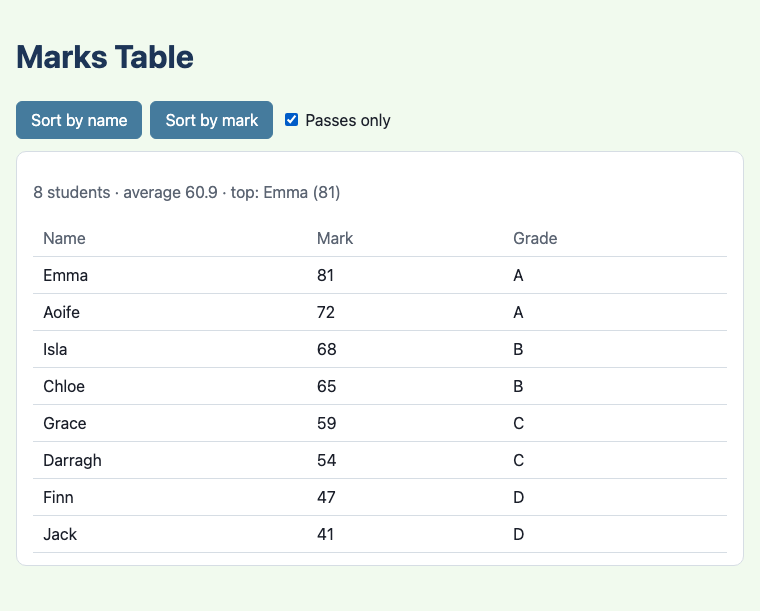
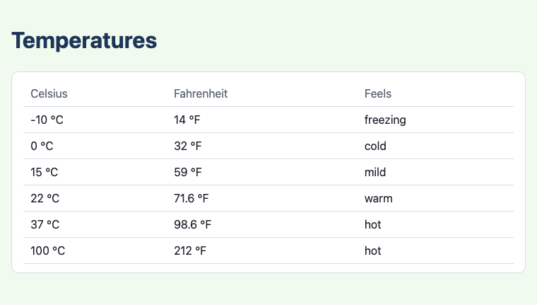
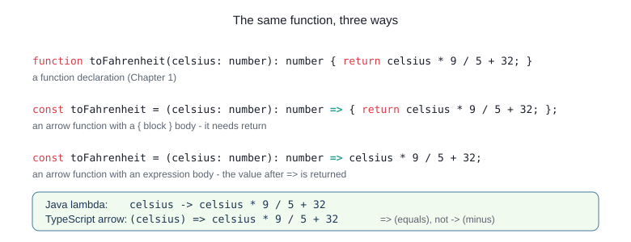
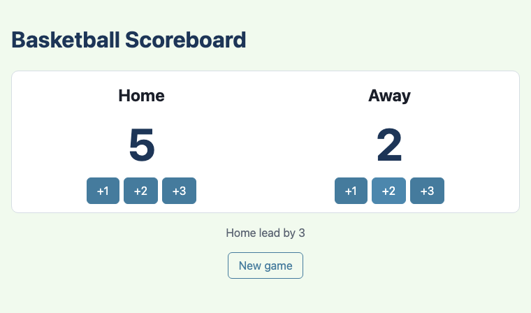
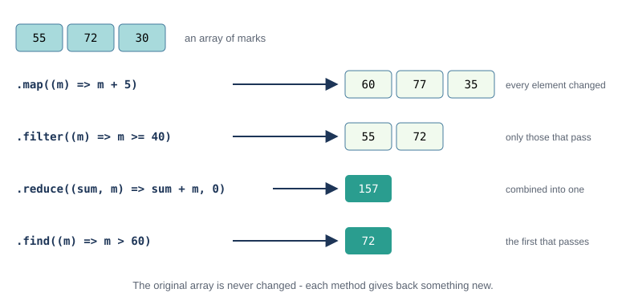
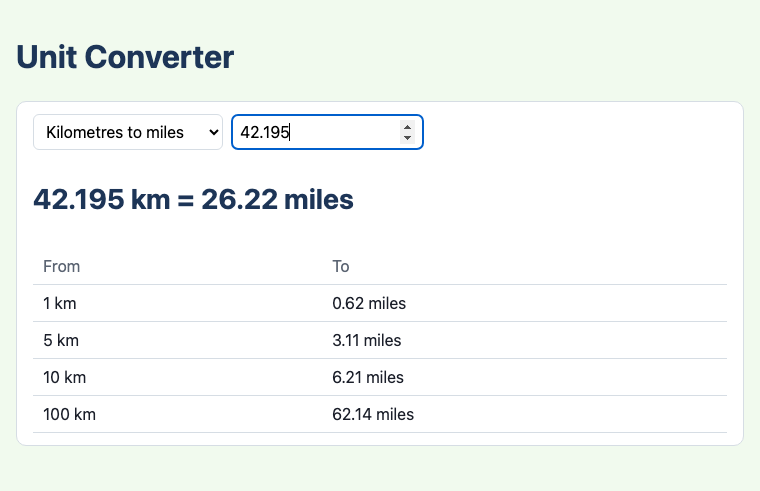

# Chapter 3 - Arrow functions

You have written `() => { ... }` in every test since Chapter 1, and read it as "the test's code". It
is an **arrow function**: TypeScript's version of a Java lambda. This chapter explains arrow
functions properly, and shows what they make easy: writing listeners right where they are used,
working through arrays with `map`, `filter` and `reduce`, and choosing which function to run while
the program is running.



## What you will learn

- how to write an arrow function, and how it compares with a Java lambda and a `function`
- testing numbers with decimal places, with `assertAlmostEquals`
- arrow functions as event listeners, and how each one remembers the variables around it
- `?.`, a shorter way to write "if it is not null"
- the `this` trap: why a method must not be passed as a listener on its own
- the array methods `map`, `filter`, `reduce`, `find` and `toSorted`
- giving a type a name with `type`, and function types such as `(value: number) => number`
- storing functions in objects, and choosing one while the program runs

## The projects

| Project | What it shows |
|---|---|
| [ch03_project01_temperatures](projects/ch03_project01_temperatures/) | small functions written as arrow functions, and `assertAlmostEquals` |
| [ch03_project02_scoreboard](projects/ch03_project02_scoreboard/) | buttons made from an array, each with an arrow-function listener that remembers its team and points |
| [ch03_project03_marks_table](projects/ch03_project03_marks_table/) | `map`, `filter`, `reduce`, `find` and `toSorted` on data from a JSON file |
| [ch03_project04_unit_converter](projects/ch03_project04_unit_converter/) | functions stored in objects, function types, and choosing a function from a drop-down list |

## Functions are values

Chapter 2 showed that a function is a value. `addEventListener("click", handleToss)` hands the
function `handleToss` to the button, to call later; `handleToss()`, with brackets, would call it
straight away. A value can be stored in a variable, put in an array or an object, passed to another
function, and returned from one - and so can a function.

Arrow functions make this easy, because they let you write a function anywhere a value can go,
without giving it a name first.

## Project 1: Arrow functions



Here is the same function written three ways:



`src/temperature.ts`
```ts
/** Celsius to Fahrenheit. A one-line arrow function: the value after => is returned. */
export const toFahrenheit = (celsius: number): number => celsius * 9 / 5 + 32;

/** Fahrenheit to Celsius. */
export const toCelsius = (fahrenheit: number): number => (fahrenheit - 32) * 5 / 9;
```

Read `toFahrenheit` from left to right:

- `const toFahrenheit =` - a constant, as in Chapter 1. Its value is a function
- `(celsius: number)` - the parameters, in brackets, with their types
- `: number` - the return type (optional - TypeScript can work it out - but this book writes it)
- `=>` - the arrow: "gives". Read the whole thing as "celsius gives celsius times 9 over 5, plus 32"
- `celsius * 9 / 5 + 32` - the **body**. When the body is a single expression, its value is
  returned: no `return`, no braces

When a function needs more than one line, give it a body in braces - and then it needs `return`,
just like a `function`:

```ts
/** How a temperature in Celsius feels. An arrow function with a { block } body needs a return. */
export const describe = (celsius: number): string => {
  if (celsius < 0) {
    return "freezing";
  }
  if (celsius < 10) {
    return "cold";
  }
  // ...
  return "hot";
};
```

(Note the `;` after the closing brace: the whole line is a `const` declaration.)

An arrow function stored in a `const` is called, exported and imported exactly like a function
declared with `function`; `main.ts` cannot tell the difference:

`src/main.ts`
```ts
import { describe, roundToTenth, toFahrenheit } from "./temperature.ts";
```

### Java lambdas and TypeScript arrows

If you have written a Java lambda, arrow functions will look familiar:

| Java | TypeScript |
|---|---|
| `c -> c * 9 / 5 + 32` | `(c) => c * 9 / 5 + 32` |
| `(a, b) -> a + b` | `(a, b) => a + b` |
| `() -> System.out.println("hi")` | `() => console.log("hi")` |
| `x -> { ... return y; }` | `(x) => { ... return y; }` |
| the type is an interface: `Function<Double, Double>` | the type is written as a function type: `(c: number) => number` |
| a lambda can only use variables that are effectively final | an arrow can use - and change - any variable it can see |

The arrow is `=>` (an equals sign), not Java's `->` (a minus sign). Brackets round a single
parameter are optional in TypeScript, but the formatter, and this book, always write them.

### Which to use?

Both kinds of function work. This book uses `function` for the listeners and helpers it has met
so far, and from now on uses arrow functions for small functions and anything passed to another
function - which is most of the time. One difference is worth knowing: a `function` declaration
can be called from code *above* it in the file, but an arrow function stored in a `const` cannot be
used until the line that creates it has run - the same as any other `const`.

### Exercise 3.1 - Rewrite a function

Rewrite `twoDigits` from Chapter 2 (`ch02_project03_ticking_clock/src/time_format.ts`) as an arrow
function. Try it before reading on.

```ts
// before
export function twoDigits(value: number): string {
  return `${value}`.padStart(2, "0");
}
```

Here is one way:

```ts
export const twoDigits = (value: number): string => `${value}`.padStart(2, "0");
```

The tests do not change, and they still pass: they call `twoDigits(7)` either way.

### Tests are arrow functions too

Look at a test again:

`tests/temperature.test.ts`
```ts
Deno.test("water boils at 212 °F", () => {
  assertEquals(toFahrenheit(100), 212);
});
```

`Deno.test` is a function that takes two arguments: the test's name, and an arrow function with no
parameters - the test's code. Deno stores the function, and calls it when it runs the tests. It is
the same idea as `addEventListener`: you hand over a function, to be called later.

### Testing numbers with decimal places

A normal body temperature, 36.6 °C, should be 97.88 °F. But the test
`assertEquals(toFahrenheit(36.6), 97.88)` fails:

```text
    [Diff] Actual / Expected

-   97.88000000000001
+   97.88
```

Computers store numbers with decimal places in binary, and most decimals (like 0.1, or 36.6) cannot
be stored exactly, so a calculation can come out a tiny amount wrong - Java's `double` has exactly
the same problem (in either language, `0.1 + 0.2` is `0.30000000000000004`). So numbers that come out of
calculations are compared with `assertAlmostEquals`, which passes if they are very close:

```ts
import { assertAlmostEquals, assertEquals } from "@std/assert";

Deno.test("36.6 °C is about 97.88 °F", () => {
  assertAlmostEquals(toFahrenheit(36.6), 97.88);
});
```

For showing on the page, `roundToTenth` rounds to one decimal place:
`Math.round(value * 10) / 10`.

## Project 2: Arrow functions as listeners



A scoreboard needs six buttons: +1, +2 and +3 for each team. In Chapter 2 each button's listener was
a named function - that would be six functions here, all nearly the same. With arrow functions, the
buttons and their listeners can be made in a loop:

`src/main.ts`
```ts
const POINTS: number[] = [1, 2, 3];

/** Puts a +1, +2 and +3 button for `team` into the element with id `containerId`. */
const addButtons = (team: Team, containerId: string): void => {
  const container = document.querySelector<HTMLElement>(containerId);
  if (container === null) {
    return;
  }
  for (const points of POINTS) {
    const button = document.createElement("button");
    button.textContent = `+${points}`;
    // The listener is written right here, as an arrow function. It can use `team` and `points`,
    // and it remembers them: each button gets its own team and its own number of points.
    button.addEventListener("click", () => {
      team.addPoints(points);
      render();
    });
    container.appendChild(button);
  }
};

addButtons(home, "#home-buttons");
addButtons(away, "#away-buttons");
```

The listener `() => { team.addPoints(points); render(); }` is written right where it is needed. It
uses two variables from outside itself: `team` (a parameter of `addButtons`) and `points` (the loop
variable). The listener runs much later - when the button is clicked, long after `addButtons` has
finished - and yet it still knows which team and how many points. An arrow function **remembers the
variables it could see when it was made**. (The function together with the variables it remembers
is called a **closure**.) Each time round the loop a new arrow function is made, so each button
remembers its own `points`; and each call of `addButtons` has its own `team`.

`Team` is a small class like Chapter 2's `Counter`, with a constructor (constructors work as in
Java; Chapter 5 says more):

`src/Team.ts`
```ts
export class Team {
  private name: string;
  private score: number = 0;

  // A constructor, as in Java - but always called "constructor". Chapter 5 has more.
  constructor(name: string) {
    this.name = name;
  }

  /** Adds a basket: 1, 2 or 3 points. */
  public addPoints(points: number): void {
    this.score += points;
  }
  // ... getName(), getScore(), reset()
}
```

and `leader(home, away)`, in `src/leader.ts`, works out "Home lead by 3" or "All square". Both are
tested.

### Exercise 3.2 - An arrow listener

In Chapter 2's coin toss (`ch02_project01_coin_toss`), replace the named function `handleToss`
with an arrow function written inside the `addEventListener` call. Try it before reading on.

Here is one way:

```ts
if (tossButton !== null) {
  tossButton.addEventListener("click", () => {
    if (result !== null) {
      result.textContent = coinFace(Math.random());
    }
  });
}
```

Which is better? For a listener of a few lines that is used once, the arrow function keeps the
code together. For a long listener, or one used by several buttons, a named function is clearer.

### `?.` - a shorter null check

You have written a lot of `if (button !== null) { ... }`. When all you want to do is call one method
on something that might be `null`, there is a shorter way:

```ts
resetButton?.addEventListener("click", () => {
  home.reset();
  away.reset();
  render();
});
```

`resetButton?.addEventListener(...)` means: *if `resetButton` is `null` (or `undefined`), do
nothing; otherwise, call `addEventListener`*. The `?.` is called **optional chaining**. The marks
table and the unit converter use it for their listeners.

### The `this` trap

`Team` has a `reset()` method. It is tempting to pass it straight to the reset button:

```ts
resetButton?.addEventListener("click", home.reset);   // wrong!
```

TypeScript accepts it, the linter accepts it, the tests pass - and the button does nothing. No
error appears anywhere; the home score just stays as it was.

The reason is `this`. Inside a method, `this` means "the object the method was called **on**":
in `home.reset()`, it is `home`. But `home.reset` without brackets is just the function, cut off
from `home`. When the browser later calls a listener, it sets `this` to the *element* that was
clicked - so `reset` runs `this.score = 0` on the button, quietly giving the button a property called
`score`, and leaves `home` alone. (Java has no equivalent: a Java method reference like `home::reset`
always remembers its object.)

The fix is to wrap the call in an arrow function, which calls the method *on* the object:

```ts
resetButton?.addEventListener("click", () => home.reset());   // right
```

The rule: **never pass a method on its own as a listener (or to any other function) - wrap it in an
arrow function**. Arrow functions have no `this` of their own, so inside one, `this` means whatever
it meant outside - which is one reason they suit listeners.

## Project 3: Working through arrays


Arrays have methods that take a function and apply it to the elements. They replace most of the
`for` loops you would write in Java (and do the job of Java's streams):



| Method | Gives back | The function you pass ... |
|---|---|---|
| `map(f)` | a new array, every element changed by `f` | turns one element into its new value |
| `filter(f)` | a new array, only the elements for which `f` is true | answers true or false for one element |
| `reduce(f, start)` | one value, built up element by element | combines the value so far with one element |
| `find(f)` | the first element for which `f` is true - or `undefined` | answers true or false for one element |
| `toSorted(f)` | a sorted copy | compares two elements: negative, zero or positive |

None of them changes the original array.

The marks come from a JSON file, as in Chapter 1, and each student has a name and a mark:

`src/marks.ts`
```ts
/** One student and their mark. `type` gives a name to a type, so it can be used again. */
export type Student = { name: string; mark: number };
```

`type Student = ...` gives the object type a **name**, so the code can say `Student[]` instead of
`{ name: string; mark: number }[]` everywhere. (Chapter 10 compares `type` with `interface`.)

### map, filter, reduce, find

`src/marks.ts`
```ts
/** Just the marks: [72, 38, 65, ...]. */
export const marksOf = (students: Student[]): number[] => students.map((student) => student.mark);

/** Only the students who passed. */
export const passed = (students: Student[]): Student[] => students.filter((student) => student.mark >= PASS_MARK);

/** The student with this name, or undefined if there is none. */
export const findStudent = (students: Student[], name: string): Student | undefined =>
  students.find((student) => student.name === name);
```

Each is one line, with an arrow function saying what to do with *one* student. Compare `passed`
with the Java you would write:

```java
List<Student> passed = new ArrayList<>();
for (Student student : students) {
    if (student.getMark() >= PASS_MARK) {
        passed.add(student);
    }
}
```

`find` gives back `Student | undefined` - a union, like `number | null` in Chapter 2. If no student
matches, the answer is `undefined` (JavaScript's other "nothing", meaning "no value here"), and
TypeScript makes sure the code checks for it.

`reduce` takes two things: a function, and a starting value. The function is given the total so far
and the next element, and returns the new total:

```ts
const total = marks.reduce((sum, mark) => sum + mark, 0);
```

With the marks `[50, 60, 70]`, it works out `0 + 50`, then `50 + 60`, then `110 + 70`: 180.

### Average, test first

`average` divides the total by the number of marks. Before writing it, think about the edges. What
is the average of no marks at all? A test makes you decide - we will say 0:

`tests/marks.test.ts`
```ts
Deno.test("the average of no marks is 0, not NaN", () => {
  assertEquals(average([]), 0);
});
```

Without any special handling, `average([])` would work out `0 / 0`, which in JavaScript is `NaN`
("not a number"), and this test is red:

```text
-   NaN
+   0
```

So the function checks first:

`src/marks.ts`
```ts
/** The average of some marks - 0 if there are none. */
export const average = (marks: number[]): number => {
  if (marks.length === 0) {
    return 0;
  }
  const total = marks.reduce((sum, mark) => sum + mark, 0);
  return total / marks.length;
};
```

Green. Without the test, the page would one day have shown "average NaN" - the first time the
"passes only" box was ticked on a class where everybody failed.

### Sorting

`src/marks.ts`
```ts
/** A copy, highest mark first. (toSorted leaves the original array as it was.) */
export const byMark = (students: Student[]): Student[] => students.toSorted((a, b) => b.mark - a.mark);

/** A copy, in alphabetical order of name. */
export const byName = (students: Student[]): Student[] => students.toSorted((a, b) => a.name.localeCompare(b.name));
```

The function passed to `toSorted` is a **comparator**, exactly like Java's `Comparator`: given two
elements `a` and `b`, it returns a negative number if `a` should come first, a positive number if
`b` should come first, or zero if it does not matter. `b.mark - a.mark` is positive when `b` has the
higher mark, so higher marks come first. Strings have a `localeCompare` method that does the same
job for alphabetical order (like Java's `compareTo`).

> **Note** - Arrays also have a `sort` method, but it sorts the array **in place** - it changes the
> original. `toSorted` makes a sorted copy and leaves the original alone, which avoids surprises: the
> test "sorting leaves the original array as it was" checks it.

### Chaining, and building the page

`src/main.ts`
```ts
const render = (): void => {
  const chosen = passesOnly ? passed(STUDENTS) : STUDENTS;
  const shown = sortByMark ? byMark(chosen) : byName(chosen);

  if (rows !== null) {
    // map turns each student into a row of HTML; join puts the rows together into one string.
    rows.innerHTML = shown
      .map((student) => `<tr><td>${student.name}</td><td>${student.mark}</td><td>${gradeFor(student.mark)}</td></tr>`)
      .join("");
  }
  // ... the summary line
};
```

`map` can turn the students into strings of HTML just as easily as into numbers, and `join("")`
glues an array of strings into one string. One statement builds the whole table - no
`createElement` loop. Because each method returns a new array, they can be **chained**: one after
another, each working on the result of the last.

`render` decides what to show from two booleans, `sortByMark` and `passesOnly`, and the buttons and
checkbox only change those and call `render()` - the object, event, render pattern from Chapter 2,
with plain variables as the state.

### Exercise 3.3 - Count the fails

Write a function `failedCount(students: Student[]): number` that says how many students failed.
Write the test first. Try it before reading on.

Here is one way:

```ts
Deno.test("one student in the made-up class failed", () => {
  assertEquals(failedCount(CLASS), 1);
});

export const failedCount = (students: Student[]): number =>
  students.filter((student) => student.mark < PASS_MARK).length;
```

`filter` gives a new array; `.length` counts it.

## Project 4: Functions in data



The unit converter can convert temperatures, distances, weights and lengths. Instead of an `if` for
each kind of conversion, each conversion is an object that **holds its own function**:

`src/converters.ts`
```ts
/** The type of a conversion function: it takes a number and gives back a number. */
export type ConvertFunction = (value: number) => number;

/** One conversion: its name, the two units, and the function that does it. */
export type Converter = {
  name: string;
  from: string;
  to: string;
  convert: ConvertFunction;
};

export const CONVERTERS: Converter[] = [
  { name: "Celsius to Fahrenheit", from: "°C", to: "°F", convert: (celsius) => celsius * 9 / 5 + 32 },
  { name: "Kilometres to miles", from: "km", to: "miles", convert: (km) => km * 0.621371 },
  { name: "Kilograms to pounds", from: "kg", to: "lb", convert: (kg) => kg * 2.20462 },
  { name: "Metres to feet", from: "m", to: "ft", convert: (metres) => metres * 3.28084 },
];
```

`(value: number) => number` is a **function type**: "a function that takes a number and returns a
number". It looks like an arrow function, but it is a type - it describes functions, the way
`string[]` describes arrays. `ConvertFunction` gives it a name.

Notice that the arrow functions in the array do not say what type their parameters are -
`(celsius) => ...`, not `(celsius: number) => ...`. They do not need to: TypeScript knows that
`convert` must be a `ConvertFunction`, so it knows `celsius` is a number. (Try `(celsius) =>
celsius.length` - it is an error.)

The page puts the converters' names in a drop-down list, and when the choice changes it finds the
chosen converter and calls *its* function:

`src/main.ts`
```ts
const converter = findConverter(choice.value);
if (converter === undefined) {
  return;
}
result.textContent = describeConversion(Number(input.value), converter);

const converted = convertAll(EXAMPLES, converter.convert);
```

`converter.convert` - without brackets - is the chosen function itself, handed to `convertAll`:

`src/converters.ts`
```ts
/** Applies any conversion function to every value. The function is passed in, like a listener. */
export const convertAll = (values: number[], convert: ConvertFunction): number[] => values.map(convert);
```

`values.map(convert)` passes the function straight to `map`. Because `convertAll` takes *any*
function, the test can hand it a simple one of its own, and know exactly what to expect:

`tests/converters.test.ts`
```ts
Deno.test("convertAll applies the function to every value", () => {
  assertEquals(convertAll([1, 2, 3], (x) => x * 10), [10, 20, 30]);
});
```

To add a new conversion, you add one object to `CONVERTERS` - nothing else in the program changes.
The code that *uses* conversions does not need to know what conversions exist. Choosing which
function (or object) to use while the program runs is the idea behind the **Strategy** pattern,
which the design patterns book (Book 3) begins with.

## Java and TypeScript

| Java | TypeScript |
|---|---|
| `c -> c * 9 / 5 + 32` | `(c) => c * 9 / 5 + 32` |
| `Function<Double, Double>`, `Predicate<Student>`, ... | `(c: number) => number`, `(s: Student) => boolean` |
| `list.stream().map(f).collect(toList())` | `array.map(f)` |
| `list.stream().filter(p)` | `array.filter(p)` |
| `list.stream().reduce(0, Integer::sum)` | `array.reduce((sum, x) => sum + x, 0)` |
| `list.stream().filter(p).findFirst()` (an `Optional`) | `array.find(p)` (the element, or `undefined`) |
| `list.sort(comparator)` (changes the list) | `array.toSorted(comparator)` (a copy); `array.sort(...)` changes it |
| `home::reset` (remembers `home`) | `() => home.reset()` - never `home.reset` on its own |
| `if (button != null) button.addListener(...)` | `button?.addEventListener(...)` |
| a class or record for a simple data shape | `type Student = { name: string; mark: number };` |

## Summary

- an arrow function is `(parameters) => body`; with an expression body its value is returned, with a
  `{ block }` body it needs `return`
- arrow functions can be written anywhere a value can go - as listeners, as arguments to `map`, in
  objects
- an arrow function remembers the variables it could see when it was made (a closure), so a listener
  made in a loop remembers its own values
- `assertAlmostEquals` compares numbers that may not be exact
- `x?.method()` calls the method only if `x` is not `null` or `undefined`
- never pass a method on its own as a listener: wrap it, `() => object.method()`
- `map`, `filter`, `reduce`, `find` and `toSorted` replace most loops, and leave the original array
  alone; `find` may give `undefined`
- `type Name = ...` names a type; `(value: number) => number` is a function type
- functions can be stored in objects and chosen while the program runs

## Challenges

Each challenge says which project to start from. Write the tests first, and use arrow functions.

### 1. Kelvin

*Start from `ch03_project01_temperatures`.* Scientists use the Kelvin scale: 0 °C is 273.15 K. Add
an arrow function `toKelvin(celsius: number): number`, test first (0 °C, 100 °C, and absolute zero,
-273.15 °C, which is 0 K), and add a Kelvin column to the table.

### 2. Free throw and undo

*Start from `ch03_project02_scoreboard`.* Add an **Undo** button for each team that takes away the
last basket scored. Give `Team` a method `undo()` and test it first: after +2 and +3, undo leaves 2;
undo with no baskets does nothing.

*Hint:* `Team` can keep an array of the baskets (`private baskets: number[] = [];`). `push` adds one
to the end and `pop` removes the last one. The score is then the sum of the baskets - a job for
`reduce`.

### 3. Highest and lowest

*Start from `ch03_project03_marks_table`.* Add a `bottomStudent` function, and show "Top: ...
Bottom: ..." in the summary. Test first, including an empty class (`undefined`).

### 4. Grade counts

*Start from `ch03_project03_marks_table`.* Under the table, show how many students got each grade:
"A: 2 · B: 2 · C: 2 · D: 2 · F: 2". Write a function `countGrade(students: Student[], grade:
string): number`, test first.

*Hint:* `filter` then `.length`. To build the line, `map` over `["A", "B", "C", "D", "F"]` and
`join(" · ")`.

### 5. New conversions, no new code

*Start from `ch03_project04_unit_converter`.* Add three conversions: miles to kilometres, pounds to
kilograms, and litres to pints (1 litre is 1.75975 pints). Tests first. You should only need to add
to `CONVERTERS` and to the tests - check that nothing else had to change. Then fix the test that
checked there were four converters: what is a better way to test that list?

### 6. Search as you type

*Start from `ch03_project03_marks_table`.* Add a search box: as you type, the table shows only the
students whose names contain what you have typed, ignoring upper and lower case ("em" finds Emma).
It should work together with sorting and "passes only". Write `searchByName(students: Student[],
text: string): Student[]`, test first - including an empty search, which matches everybody.

*Hint:* `name.toLowerCase().includes(text.toLowerCase())`. Listen for the `input` event (Chapter 2),
keep the search text in a variable like `passesOnly`, and apply the search in `render`.

---

Next: [Chapter 4 - Test first, properly](../ch04_test_first/README.md)
