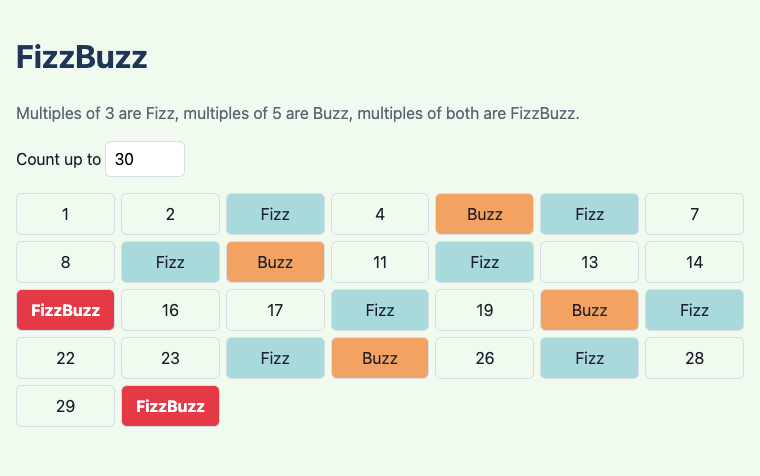
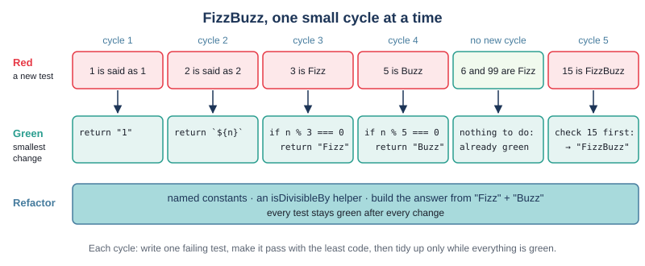
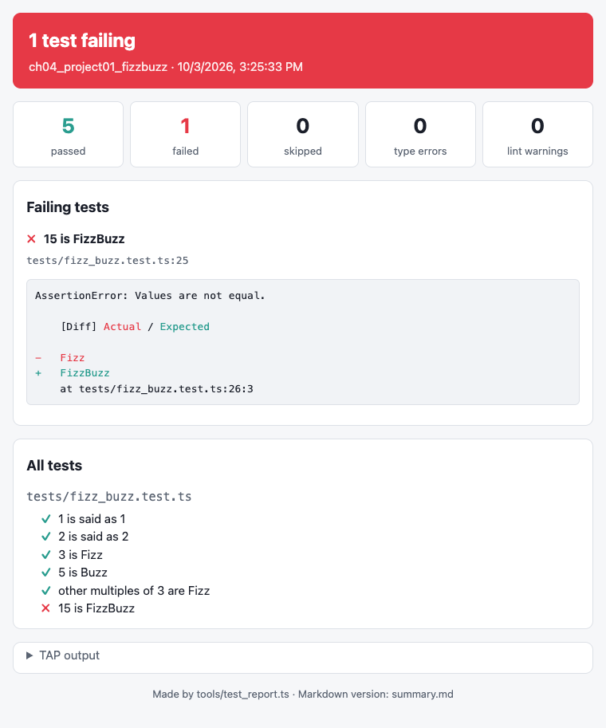
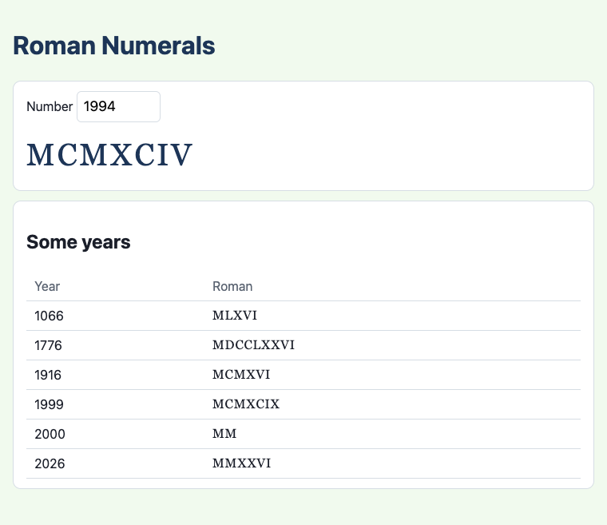
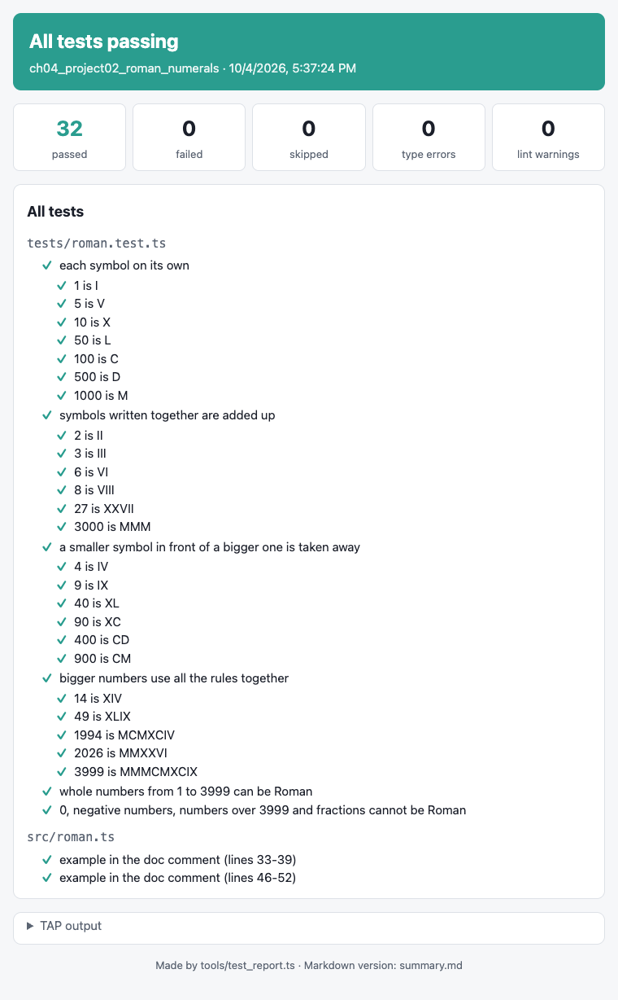
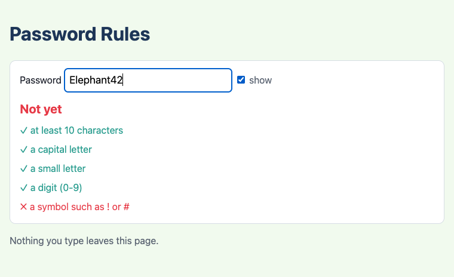
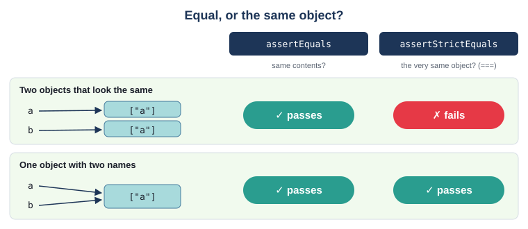
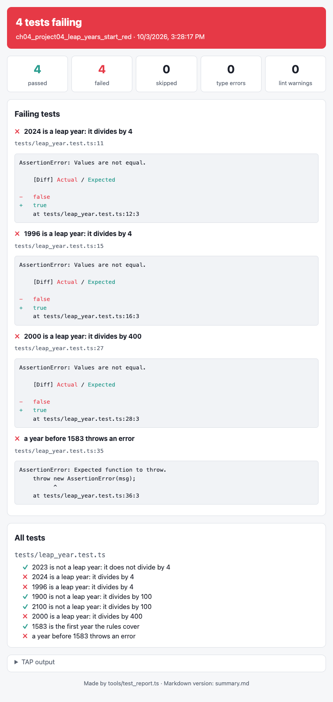

# Chapter 4 - Test first, properly

Chapter 1 showed you test-driven development once, on a small function. From this chapter on, it is
how every feature in the book is built: a failing test first, then just enough code, then a tidy-up.
This chapter makes that a habit. You will work through three classic exercises one small step at a
time, and pick up the tools that make tests easier to write and easier to read: `assertThrows`,
`assertStrictEquals`, steps, and helper functions.



## What you will learn

- red-green-refactor in really small steps, and why small is the point
- naming tests as sentences, and laying each one out as arrange / act / assert
- refactoring - changing how code is written without changing what it does - while the tests stay green
- throwing an error with `throw new Error(...)`, and testing it with `assertThrows`
- the difference between `assertEquals` (the same contents) and `assertStrictEquals` (the very same object)
- grouping related cases into steps with `t.step`
- helper functions that give every test a fresh start
- katas, and "start red" exercises where the tests are written for you
- what goes in a doc comment example, and what goes in a test file

## The projects

| Project | What it shows |
|---|---|
| [ch04_project01_fizzbuzz](projects/ch04_project01_fizzbuzz/) | the FizzBuzz kata built one red-green-refactor cycle at a time; test names as sentences; arrange / act / assert; examples and tests |
| [ch04_project02_roman_numerals](projects/ch04_project02_roman_numerals/) | refactoring a pile of `if`s into a table and a loop, with the tests green throughout; steps with `t.step` |
| [ch04_project03_password_rules](projects/ch04_project03_password_rules/) | throwing errors and `assertThrows`; `assertStrictEquals`; a helper that makes a fresh object for each test |
| [ch04_project04_leap_years_start_red](projects/ch04_project04_leap_years_start_red/) | a "start red" kata: the tests are written, and four of them fail until you write the code |

## The cycle, again

Here is the cycle from Chapter 1:

1. **Red** - write one test for the next small thing the code should do. Run it and watch it fail.
2. **Green** - write the least code that makes every test pass.
3. **Refactor** - tidy up the code (and the tests) while everything is green.

Two words in there matter more than they look: **one** test, and the **least** code. It feels slow
if you have programmed before. It is not: a small step that goes wrong is fixed in seconds, because
you know exactly which two lines you just changed. A big step that goes wrong can cost an afternoon.

Watching the test fail matters too. A test you have never seen fail might not be testing anything:
it might call the wrong function, or check the wrong thing, and pass whatever the code does. Seeing
it go red, for the reason you expected, proves the test can catch a mistake.

## Project 1: FizzBuzz, cycle by cycle

FizzBuzz is a counting game. Count from 1, but for a multiple of 3 say "Fizz", for a multiple of 5
say "Buzz", and for a multiple of both say "FizzBuzz". So: 1, 2, Fizz, 4, Buzz, Fizz, 7, 8, Fizz,
Buzz, 11, Fizz, 13, 14, FizzBuzz ...

We want a function `fizzBuzz(n: number): string` that gives the answer for one number. Before any
code, write a **test list**: the examples you expect to need, simplest first. It is a plan on a
scrap of paper, not code:

- 1 is "1"
- 2 is "2"
- 3 is "Fizz"
- 5 is "Buzz"
- 6 is "Fizz" (and other multiples of 3)
- 15 is "FizzBuzz"

Each line will become one cycle. Here they all are, before we go through them one by one:



### Cycle 1: 1 is "1"

**Red.** Make `tests/fizz_buzz.test.ts` with one test:

`tests/fizz_buzz.test.ts`
```ts
import { assertEquals } from "@std/assert";
import { fizzBuzz } from "../src/fizz_buzz.ts";

Deno.test("1 is said as 1", () => {
  assertEquals(fizzBuzz(1), "1");
});
```

Save. There is no `src/fizz_buzz.ts` yet, so the tests cannot even load:

```text
error: Module not found "src/fizz_buzz.ts".
    at tests/fizz_buzz.test.ts:2:26

Tests: the tests could not run (see above)  ->  test_output/index.html
```

That is red.

**Green.** The least code that passes is this:

`src/fizz_buzz.ts`
```ts
export const fizzBuzz = (n: number): string => "1";
```

Yes, really. It passes the only test there is, and that is all we can ask. The linter warns that
`n` is never used - fine for a minute; the next test will need it.

### Cycle 2: 2 is "2"

**Red.** Add the next test from the list:

```ts
Deno.test("2 is said as 2", () => {
  assertEquals(fizzBuzz(2), "2");
});
```

```text
not ok 2 - 2 is said as 2
  ---
  message: |-
    AssertionError: Values are not equal.

        [Diff] Actual / Expected

    -   1
    +   2
        at tests/fizz_buzz.test.ts:9:3
```

Remember how to read the diff: `-` is what the code **actually** gave, `+` is what the test
**expected**.

**Green.** Now the function has to use `n`:

```ts
export const fizzBuzz = (n: number): string => `${n}`;
```

Why not jump straight to this in cycle 1? Because with only one example, `"1"` was just as correct,
and less code. The second example *forced* the general version. This is called
**triangulation**: you only generalise when a second test makes you.

### Cycles 3 and 4: Fizz and Buzz

**Red.** `"3 is Fizz"` fails with `- 3` and `+ Fizz`. **Green:**

```ts
export const fizzBuzz = (n: number): string => {
  if (n % 3 === 0) {
    return "Fizz";
  }
  return `${n}`;
};
```

(`%` is the remainder, as in Java: `n % 3 === 0` means "n divides by 3 exactly".) The expression body
had to become a block body with a `return` - Chapter 3's two kinds of arrow function.

**Red.** `"5 is Buzz"` fails with `- 5` and `+ Buzz`. **Green:** a second `if`, the same shape.

### A test that passes straight away

The next line of the test list is "other multiples of 3 are Fizz":

```ts
Deno.test("other multiples of 3 are Fizz", () => {
  assertEquals(fizzBuzz(6), "Fizz");
  assertEquals(fizzBuzz(99), "Fizz");
});
```

Save - and it passes first time. That is not a cycle; there is nothing to make green. Is the test
useless, then? No: it records something we believe about the code, and it will catch anyone who
later "simplifies" the function to `if (n === 3)`. Keep tests like this when they say something new.
But be suspicious when a test you *expected* to fail passes: check it is calling what you think.

### Cycle 5: FizzBuzz

**Red.**

```ts
Deno.test("15 is FizzBuzz", () => {
  assertEquals(fizzBuzz(15), "FizzBuzz");
});
```

15 divides by 3, so the first `if` answers "Fizz" and never looks any further:



**Green.** The least code is one more check, put **first** so that it wins:

```ts
export const fizzBuzz = (n: number): string => {
  if (n % 15 === 0) {
    return "FizzBuzz";
  }
  if (n % 3 === 0) {
    return "Fizz";
  }
  if (n % 5 === 0) {
    return "Buzz";
  }
  return `${n}`;
};
```

Every test passes. The function works. Now - and only now - we tidy it.

### Refactor

**Refactoring** means changing how code is written without changing what it does. The tests are what
make it safe: run them after every small change, and if one goes red, undo the last change.

What is untidy here? The numbers 3, 5 and 15 are magic numbers. "Divides exactly" is written out
three times. And 15 is only there because it is 3 times 5: if the rules changed to Fizz for 4, someone
would have to remember to change 15 to 20. So, one change at a time, saving and checking after each:

1. name the numbers `FIZZ_DIVISOR` and `BUZZ_DIVISOR`
2. pull out a small helper, `isDivisibleBy`
3. build the answer up - "Fizz", then "Buzz" on the end - so a multiple of 15 needs no check of its own

`src/fizz_buzz.ts`
```ts
const FIZZ_DIVISOR = 3;
const BUZZ_DIVISOR = 5;

/** True if `n` divides exactly by `divisor` (nothing left over). */
const isDivisibleBy = (n: number, divisor: number): boolean => n % divisor === 0;

/** What to say for one number: "Fizz", "Buzz", "FizzBuzz", or the number itself. */
export const fizzBuzz = (n: number): string => {
  // Build the answer up: a multiple of 15 collects both words, so it needs no check of its own.
  let answer = "";
  if (isDivisibleBy(n, FIZZ_DIVISOR)) {
    answer += "Fizz";
  }
  if (isDivisibleBy(n, BUZZ_DIVISOR)) {
    answer += "Buzz";
  }
  return answer === "" ? `${n}` : answer;
};
```

`isDivisibleBy` is not exported: it is a detail of this file. It is still tested - through
`fizzBuzz`, whose tests would fail if it were wrong.

The third step is the risky one, and the tests earn their keep. Put the two `if`s the other way
round by mistake, and the moment you save:

```text
not ok 6 - 15 is FizzBuzz
  ...
    -   BuzzFizz
    +   FizzBuzz
```

Without that test, "BuzzFizz" might have sat on the page for weeks.

> **Note** - Refactor on green only. If a test is red, you do not know whether a change broke
> something or the code was broken already. Get to green first - even by undoing - then tidy.

### Test names are sentences

Look at the names of the tests so far:

```text
ok 1 - 1 is said as 1
ok 2 - 2 is said as 2
ok 3 - 3 is Fizz
ok 4 - 5 is Buzz
ok 5 - other multiples of 3 are Fizz
```

Read down the list and you have the rules of the game. That is deliberate. A test name is the first
thing you see when a test fails - often all you see - so it should say what the code *should do*,
as a sentence, in the words of the problem. Compare:

| Not like this | Like this |
|---|---|
| `test1` | `1 is said as 1` |
| `testFizz` | `3 is Fizz` |
| `fizzBuzz works` | `15 is FizzBuzz` |
| `edge case` | `no answers up to 0` |

"`fizzBuzz works`" failing tells you nothing; "`15 is FizzBuzz`" failing tells you exactly what is
broken before you have opened a file.

### Arrange, act, assert

Most tests have three parts, always in this order:

1. **Arrange** - set up what the test needs: values, objects
2. **Act** - do the one thing being tested
3. **Assert** - check the result

The FizzBuzz tests are so short that all three fit on one line. The test for `fizzBuzzUpTo`, which
gives the answers from 1 up to a count, spells them out:

`tests/fizz_buzz.test.ts`
```ts
Deno.test("the first five answers, in order", () => {
  // Arrange: how many answers we want
  const count = 5;

  // Act: get them
  const answers = fizzBuzzUpTo(count);

  // Assert: check them
  assertEquals(answers, ["1", "2", "Fizz", "4", "Buzz"]);
});
```

You will not usually write the comments - a blank line between the parts is enough - but keep the
shape. A test that acts, asserts, acts again and asserts again is really two tests; split it, so
that each failure points at one thing.

`fizzBuzzUpTo` uses the counting `for` loop, which is the same as Java's:

`src/fizz_buzz.ts`
```ts
export const fizzBuzzUpTo = (count: number): string[] => {
  const answers: string[] = [];
  for (let n = 1; n <= count; n++) {
    answers.push(fizzBuzz(n));
  }
  return answers;
};
```

(`let`, not `const`, because `n` changes.) Its edge is a count of 0, tested by `"no answers up to 0"`.
The page in `main.ts` just calls `fizzBuzzUpTo` with the number in the box and gives each answer a
CSS class for its colour.

### Examples and tests

In Chapter 1, `greeting` had an example in its doc comment, and Deno ran it as a check. Now that
`fizzBuzz` is finished, it gets one too. This is the last step, after the refactor:

`src/fizz_buzz.ts`
```ts
/**
 * What to say for one number: "Fizz", "Buzz", "FizzBuzz", or the number itself.
 *
 * @example
 * ```ts
 * import { assertEquals } from "@std/assert";
 *
 * assertEquals(fizzBuzz(3), "Fizz");
 * assertEquals(fizzBuzz(5), "Buzz");
 * assertEquals(fizzBuzz(15), "FizzBuzz");
 * assertEquals(fizzBuzz(7), "7");
 * ```
 */
export const fizzBuzz = (n: number): string => {
```

`fizzBuzzUpTo` has one too: `assertEquals(fizzBuzzUpTo(5), ["1", "2", "Fizz", "4", "Buzz"]);`.

Why add the example last, and not first? Because the tests and the example do different jobs. The
tests **drove** the code: each one was the next small step, and together they pin down every rule
and every edge. Most of them are not much use to someone who just wants to *call* `fizzBuzz`. The
example is for that person: four calls that show what the function is for. It is written once the
function has settled, and it stays true, because Deno checks it on every save.

You can see the difference when something breaks. Make the refactor mistake from above - put the
two `if`s the other way round - and save:

```text
not ok 7 - 15 is FizzBuzz
  ...
not ok 8 - other multiples of 15 are FizzBuzz
  ...
# src/fizz_buzz.ts
not ok 11 - example in the doc comment (lines 14-22)
  ---
  message: |-
    AssertionError: Values are not equal.

        [Diff] Actual / Expected

    -   BuzzFizz
    +   FizzBuzz
        at src/fizz_buzz.ts (example at lines 14-22)
```

The two tests say *what* is broken, by name. The example only says *where* it is: line 14 to 22 of
`fizz_buzz.ts`. And the example stopped at its first failure, so `fizzBuzz(7)` was never checked at
all. That is fine for an example - its job is to show, not to diagnose - but it is why the checks
that matter live in the test file.

| | A doc comment example | A test file |
|---|---|---|
| Written for | someone **using** the function | someone **changing** it |
| What goes in it | one to four typical calls | every rule, every edge, every refused input |
| Its name | none - "example in the doc comment (lines 14-22)" | a sentence saying what should be true |
| When one check fails | the rest of the example is not run | every other test still runs |
| When it is written | once the function has settled | before the code, one test at a time |

From here on, the book's projects use both: tests for everything the code must do, and an example
on each exported function or class whose use is not obvious from its name.

### Exercise 4.1 - What about 0?

`fizzBuzzUpTo` starts at 1, but nothing stops someone calling `fizzBuzz(0)`. What does it give? Work
it out from the code, then write a test that records the answer. Try it before reading on.

Here is one way. 0 divided by anything leaves nothing over, so 0 divides by 3 *and* by 5:

```ts
Deno.test("0 is FizzBuzz, because 0 divides by both 3 and 5", () => {
  assertEquals(fizzBuzz(0), "FizzBuzz");
});
```

It passes straight away - but now the surprising answer is written down, and the test name explains
it. If you decided 0 should be "0" instead, you would write that test, watch it go red, and change
the code.

## Project 2: Roman numerals - refactoring as you go



The Romans wrote numbers with seven letters: I (1), V (5), X (10), L (50), C (100), D (500) and
M (1000). Symbols are added up, biggest first: VIII is 5 + 1 + 1 + 1 = 8. But four of the same
symbol in a row is not allowed, so a smaller symbol written *in front of* a bigger one is taken
away: IV is 4, IX is 9, XL is 40, XC is 90, CD is 400, CM is 900. So 1994 is M CM XC IV: MCMXCIV.

The goal is `toRoman(n: number): string`. This kata is good practice for the **refactor** step,
because the code goes through some ugly stages on the way to a neat one.

### The first numbers

The first cycles go as FizzBuzz did: "1 is I" (green with `return "I"`), "2 is II" (green with
`"I".repeat(n)`), "4 is IV", "5 is V", "9 is IX". After nine numbers, the code looks like this - and
passes every test:

```ts
export const toRoman = (n: number): string => {
  if (n === 4) {
    return "IV";
  }
  if (n === 9) {
    return "IX";
  }
  if (n >= 5) {
    return "V" + "I".repeat(n - 5);
  }
  return "I".repeat(n);
};
```

**Red.** Then "10 is X":

```text
    -   VIIIII
    +   X
```

### The pile of ifs

Getting the tens green, then 14, 19, 27, 39, gives this:

```ts
export const toRoman = (n: number): string => {
  let result = "";
  let rest = n;
  while (rest >= 10) {
    result += "X";
    rest -= 10;
  }
  if (rest >= 9) {
    result += "IX";
    rest -= 9;
  }
  if (rest >= 5) {
    result += "V";
    rest -= 5;
  }
  if (rest >= 4) {
    result += "IV";
    rest -= 4;
  }
  while (rest >= 1) {
    result += "I";
    rest -= 1;
  }
  return result;
};
```

(`while` is the same as in Java.) Every test is green, so it is time to refactor - and this time
there is real repetition to remove. Five blocks all do the same thing: *if what is left is at least
this big, write this symbol and take its value away*. Only two things change from block to block:
the value and the symbol. When blocks differ only in their data, the data can go in a table, and one
loop can replace them all. (Two blocks use `if` rather than `while`, but a `while` would do the same
there: 9 can never fit twice into what is left.)

### The table

`src/roman.ts`
```ts
/** One numeral and its value. */
type Numeral = { value: number; symbol: string };

// Biggest first. The pairs like CM (900) and IV (4) are the "take away" numerals: listing them as
// numerals of their own means the loop below never needs a special case for them.
const NUMERALS: Numeral[] = [
  { value: 1000, symbol: "M" },
  { value: 900, symbol: "CM" },
  { value: 500, symbol: "D" },
  // ... 400 CD, 100 C, 90 XC, 50 L, 40 XL, 10 X, 9 IX, 5 V
  { value: 4, symbol: "IV" },
  { value: 1, symbol: "I" },
];

export const toRoman = (n: number): string => {
  let result = "";
  let rest = n;
  // Take the biggest numeral that fits, as many times as it fits, then move on to the next one.
  for (const numeral of NUMERALS) {
    while (rest >= numeral.value) {
      result += numeral.symbol;
      rest -= numeral.value;
    }
  }
  return result;
};
```

Do it in small steps: first a table with just X, IX, V, IV and I, replacing the blocks you have, and
check the tests; *then* add L, XL and the rest - each new row with a test that needed it ("50 is L"
red, add the row, green). The finished loop handles 1994 and 3999 without a single new line of
logic.

This is the same idea as Chapter 3's unit converter: when the code differs only by data, put the
data in an array and let one piece of code work through it.

### When a refactor goes wrong

Suppose that while typing the table you put IV above V. Save, and:

```text
# Subtest: each symbol on its own
    ok 1 - 1 is I
    not ok 2 - 5 is V
      ...
        -   IVI
        +   V
    ok 3 - 10 is X
    ...
# Subtest: symbols written together are added up
    ok 1 - 2 is II
    ok 2 - 3 is III
    not ok 3 - 6 is VI
    not ok 4 - 8 is VIII
    not ok 5 - 27 is XXVII
```

Every failing number has a 5 in it, and 5 came out as IVI: the loop took 4 (IV) before it ever looked
at 5. The test output pointed straight at the problem. Notice how the output is laid out: groups,
with numbered cases inside them. Those are **steps**.

### Grouping with `t.step`

The Roman numeral tests fall into natural groups: single symbols, symbols added together, symbols
taken away, and bigger numbers. Each group is one `Deno.test`, and each case in it is a **step**:

```ts
Deno.test("a smaller symbol in front of a bigger one is taken away", async (t) => {
  await t.step("4 is IV", () => {
    assertEquals(toRoman(4), "IV");
  });
  await t.step("9 is IX", () => {
    assertEquals(toRoman(9), "IX");
  });
  // ...
});
```

The test function is now given a parameter, `t` (its type is `Deno.TestContext`), and `t.step(name,
fn)` runs one named case inside the test. A failing step does not stop the others, and the report
shows every step by name, so you see *all* the numbers that went wrong, not just the first:



Two new keywords come with steps: `async` and `await`. A step does not finish instantly the way a
function call does - Deno starts it and finishes it a little later. `await` means "wait here until
this step is finished", and a function that uses `await` must be marked `async`. Book 2 says more
about waiting; for now, the rule is simple: **write `async (t)`, and put `await` in front of every
`t.step`**. Forget an `await`, and Deno tells you plainly:

```text
    not ok 2 - 1 is I
      ---
      message: |-
        Didn't complete before parent. Await step with `await t.step(...)`.
```

Writing `await t.step(...)` thirty times would be dull, so the project uses a **helper function**
that turns a list of examples into steps:

`tests/roman.test.ts`
```ts
/** One example: a number and the numeral it should become. */
type Example = { n: number; numeral: string };

/** Runs one step per example, each named like "4 is IV". A helper keeps every group short. */
const checkExamples = async (t: Deno.TestContext, examples: Example[]): Promise<void> => {
  for (const example of examples) {
    await t.step(`${example.n} is ${example.numeral}`, () => {
      assertEquals(toRoman(example.n), example.numeral);
    });
  }
};

Deno.test("a smaller symbol in front of a bigger one is taken away", async (t) => {
  await checkExamples(t, [
    { n: 4, numeral: "IV" },
    { n: 9, numeral: "IX" },
    { n: 40, numeral: "XL" },
    // ...
  ]);
});
```

The helper is `async` too, so it is awaited as well. Its return type, `Promise<void>`, is what an
`async` function that returns nothing gives back - read it as "something you can `await`, with no
answer at the end". The names of the steps are made from the data with a template literal, so they
are still sentences: "4 is IV".

> **Note** - Steps suit many cases of the same kind, like a table of examples. Cases about different
> behaviour are clearer as separate `Deno.test`s.

### Numbers that cannot be Roman

What is `toRoman(0)`? The loop never runs, so it is `""` - which is wrong, but quietly wrong. The
Romans had no zero, and nothing above 3999 can be written with these seven letters. So the project
has a second function, tested on its own:

`src/roman.ts`
```ts
/**
 * True if `n` can be written in Roman numerals: a whole number from 1 to 3999.
 *
 * @example
 * ```ts
 * import { assertEquals } from "@std/assert";
 *
 * assertEquals(canBeRoman(1994), true);
 * assertEquals(canBeRoman(0), false);
 * ```
 */
export const canBeRoman = (n: number): boolean => Number.isInteger(n) && n >= SMALLEST && n <= LARGEST;
```

(`Number.isInteger(2.5)` is `false`.) The tests check its edges: 1 and 3999 are fine; 0, -5, 4000
and 2.5 are not. The page calls `canBeRoman` before `toRoman`, and shows a message instead of a
numeral when the answer is no. Another choice would be for `toRoman` itself to refuse, by throwing an
error - which is exactly what the next project does.

Both functions have an example in their doc comment. `toRoman`'s comment used to say, in words, that 4
is `"IV"` and 1994 is `"MCMXCIV"`. Now it says so in two `assertEquals` lines, so if a change to the table
ever broke 1994, the documentation would go red along with the tests.

### Exercise 4.2 - A group of your own

Add a group of steps called "famous years" to `tests/roman.test.ts`, with 1066 (MLXVI), 1776
(MDCCLXXVI) and 1916 (MCMXVI). Try it before reading on.

Here is one way:

```ts
Deno.test("famous years", async (t) => {
  await checkExamples(t, [
    { n: 1066, numeral: "MLXVI" },
    { n: 1776, numeral: "MDCCLXXVI" },
    { n: 1916, numeral: "MCMXVI" },
  ]);
});
```

All green, and three new lines in the report. Adding a case is now adding one line of data.

## Project 3: Password rules



The third project checks passwords against a list of rules: at least 10 characters, a capital
letter, a small letter, a digit and a symbol. As you type, each rule is ticked or crossed.

Each rule is an object holding a description and a function - functions in data, as in Chapter 3's
converters:

`src/rules.ts`
```ts
/** One rule: a description for people, and a test for the computer. */
export type Rule = {
  description: string;
  isMetBy: (password: string) => boolean;
};

export const HAS_DIGIT: Rule = {
  description: "a digit (0-9)",
  isMetBy: (password) => containsAny(password, DIGITS),
};

// If making the password lower case changes it, it must have had a capital letter in it.
export const HAS_UPPER_CASE: Rule = {
  description: "a capital letter",
  isMetBy: (password) => password.toLowerCase() !== password,
};
```

Each rule was written test first, with a password that meets it and one that does not, and the
edges: "a minimum length rule accepts a password of exactly that length" and "... rejects a password
one character short". The capital and small letter rules use a trick - a password has a capital
letter if making it lower case changes it - and a trick deserves a test that tries to fool it: "digits
and symbols are neither capital nor small letters" checks that "123!" has neither.

### Throwing an error

The length rule is made by a function, because the length can vary:

`src/rules.ts`
```ts
export const minLength = (length: number): Rule => {
  if (!Number.isInteger(length) || length < 1) {
    throw new Error(`a minimum length must be a whole number of at least 1, not ${length}`);
  }
  return {
    description: `at least ${length} characters`,
    isMetBy: (password) => password.length >= length,
  };
};
```

What should `minLength(0)` do? A rule that every password meets is never what anyone meant. It is
not a problem with a password - it is a mistake in the *program*, and the best thing the code can do
is stop, loudly, at once, so the programmer finds it. That is what `throw` is for.

`throw new Error("...")` works as it does in Java: the function stops at once, nothing is returned,
and the error travels back up through every function call until something catches it - or, if
nothing does, the program (or the test) stops with the message. Two differences from Java:

- TypeScript has no checked exceptions and no `throws` clause. Nothing in `minLength`'s type says it
  can throw - so say so in its comment
- you will nearly always throw a plain `Error`, with a message saying what was wrong and the value
  that was wrong. (Book 2 shows how to make your own kinds of error, and how to catch them)

### Testing that something throws

The test comes first, as always:

`tests/rules.test.ts`
```ts
Deno.test("a minimum length of 0 is a mistake, and throws", () => {
  assertThrows(() => minLength(0));
});
```

`assertThrows` takes a **function**, calls it, and passes only if the function throws. Before the
`if` and the `throw` were written, the test was red:

```text
not ok 1 - a minimum length of 0 is a mistake, and throws
  ---
  message: |-
    AssertionError: Expected function to throw.
```

Notice the `() =>`. It is tempting to write `assertThrows(minLength(0))` - but that calls
`minLength(0)` *before* `assertThrows` starts, the error flies out of the test itself, and the test
fails with the very error it was supposed to expect:

```text
not ok 1 - no arrow
  ---
  message: |-
    Error: a minimum length must be a whole number of at least 1, not 0
```

The type checker spots it as well: `Argument of type 'Rule' is not assignable to parameter of type
'() => unknown'.` - `assertThrows` wanted a function, and was given the rule that `minLength`
would have returned. Wrapping the call in an arrow function hands `assertThrows` something it can
call when it is ready - the same idea as `() => home.reset()` in Chapter 3.

`assertThrows` can also check what kind of error was thrown and what its message says. The second
argument is the kind (`Error`), and the third is some text the message must **include**:

```ts
Deno.test("a minimum length that is not a whole number throws, and says why", () => {
  assertThrows(() => minLength(2.5), Error, "must be a whole number");
});
```

Checking part of the message, not all of it, keeps the test from breaking every time someone
rewords the message - but still catches the wrong error being thrown. If the text does not match,
the failure says what the message really was:

```text
    AssertionError: Expected error message to include "must be a positive number", but got "a minimum length must be a whole number of at least 1, not 2.5".
```

### The checker class

`PasswordChecker` is given its list of rules when it is made, so the same class can check a strict
password or a relaxed one. Its constructor throws too: a checker with no rules would accept anything.

`src/PasswordChecker.ts`
```ts
export class PasswordChecker {
  private rules: Rule[];

  // A checker with no rules would accept anything, which is never what was meant: fail loudly.
  constructor(rules: Rule[]) {
    if (rules.length === 0) {
      throw new Error("a password checker needs at least one rule");
    }
    this.rules = rules;
  }

  /** The rules this password does not meet - the very same rule objects the checker was given. */
  public failedRules(password: string): Rule[] {
    return this.rules.filter((rule) => !rule.isMetBy(password));
  }

  /** What is missing, in words, ready to show on the page. */
  public problems(password: string): string[] {
    return this.failedRules(password).map((rule) => `needs ${rule.description}`);
  }

  /** True if the password meets every rule. */
  public isAcceptable(password: string): boolean {
    return this.failedRules(password).length === 0;
  }
}
```

A constructor that throws is tested the same way: `assertThrows(() => new PasswordChecker([]),
Error, "at least one rule")`.

A class can have an example too, in the doc comment just above `export class`. It shows how to make
an object and what to call on it:

`src/PasswordChecker.ts`
```ts
/**
 * Checks passwords against the rules it was made with.
 *
 * @example
 * ```ts
 * import { assertEquals } from "@std/assert";
 * import { HAS_DIGIT, minLength } from "./rules.ts";
 *
 * const checker = new PasswordChecker([minLength(8), HAS_DIGIT]);
 * assertEquals(checker.isAcceptable("open sesame 2"), true);
 * assertEquals(checker.problems("sesame"), [
 *   "needs at least 8 characters",
 *   "needs a digit (0-9)",
 * ]);
 * ```
 */
export class PasswordChecker {
```

Deno imports `PasswordChecker` for you, because the example is in its file - but only that file's own
exports. The rules come from `rules.ts`, so the example imports them, with a path relative to
`PasswordChecker.ts` (`./rules.ts`), just as the file's own imports are.

### A fresh object for every test

Nearly every checker test needs a checker. In JUnit you would make it in a `@BeforeEach` method and
keep it in a field. `Deno.test` has no `beforeEach`; instead, write a small **helper function** and
call it at the start of each test:

`tests/PasswordChecker.test.ts`
```ts
/** A fresh checker with three simple rules - the "arrange" step most tests share. */
const makeChecker = (): PasswordChecker => new PasswordChecker([minLength(8), HAS_DIGIT, HAS_UPPER_CASE]);

Deno.test("a password that meets every rule is acceptable", () => {
  // Arrange
  const checker = makeChecker();

  // Act
  const acceptable = checker.isAcceptable("Elephant42");

  // Assert
  assertEquals(acceptable, true);
});

Deno.test("the problems list every rule that is broken, in order", () => {
  const checker = makeChecker();
  assertEquals(checker.problems("cat"), ["needs at least 8 characters", "needs a digit (0-9)", "needs a capital letter"]);
});
```

This is better than a shared object in two ways. Every test gets a **new** checker, so nothing one
test does can leak into the next - tests that pass alone but fail together are miserable to track
down. And the helper's call is right there in the test, so you can see the whole arrange step
without scrolling up to find a hidden setup method. (Deno does have a `describe`/`it`/`beforeEach`
style, in `@std/testing/bdd`; this book does not need it.)

### Equal, or the same object?

`failedRules` promises to give back "the very same rule objects the checker was given". How do you
test *the very same*? `assertEquals` is no good: it checks that two values have the same
**contents** - it compares arrays element by element and objects property by property, which is
why `assertEquals(checker.problems("Elephant42"), [])` works even though the two empty arrays are
different arrays. Java programmers know this as the difference between `equals` and `==`.

`assertStrictEquals` checks that the two values are **the same object** (it uses `===`):



`tests/PasswordChecker.test.ts`
```ts
Deno.test("the failed rules are the very same objects the checker was given", () => {
  const checker = makeChecker();
  const failed = checker.failedRules("Elephants");
  assertEquals(failed.length, 1);
  // Not just a rule that looks like HAS_DIGIT: HAS_DIGIT itself.
  assertStrictEquals(failed[0], HAS_DIGIT);
});
```

Give it two lookalike objects and it fails, with a message that tells you exactly that:

```text
    AssertionError: Values have the same structure but are not reference-equal.

        {
          description: "a digit (0-9)",
          isMetBy: [Function: isMetBy],
        }
```

(That was `assertStrictEquals({ ...HAS_DIGIT }, HAS_DIGIT)`; `{ ...HAS_DIGIT }` makes a copy -
Chapter 9 explains it.)

For numbers, strings and booleans the two assertions behave the same, because `===` compares their
values. The difference only shows with objects and arrays. Use `assertEquals` almost always - you
usually care what is in a result, not where it lives - and `assertStrictEquals` when *identity* is
the point.

One surprise: `assertEquals(minLength(8), minLength(8))` **fails**. The two rules have the same
description, but each call makes a new `isMetBy` arrow function, and two functions are only equal
if they are the same function. Compare what you can see - `minLength(8).description` - or test the
behaviour, by calling `isMetBy`.

### Exercise 4.3 - Negative lengths

Is `minLength(-3)` tested? Write the test. Should it be red or green when you first run it? Try it
before reading on.

Here is one way:

```ts
Deno.test("a negative minimum length throws", () => {
  assertThrows(() => minLength(-3), Error, "at least 1");
});
```

It is green at once: `length < 1` already covers it. That is fine - the test records that negative
lengths were thought about.

## Project 4: Start red

The last project is different: the tests are already written, and most of them fail.



A leap year has 366 days. The rules, from the comment at the top of `src/leap_year.ts`:

- a year that divides by 4 is a leap year,
- except a year that divides by 100, which is not,
- except a year that divides by 400, which is.

The rules began in 1583, so asking about an earlier year should throw an error. `isLeapYear` is
written - it always says `false` - and the eight tests in `tests/leap_year.test.ts` are waiting. Four
of them pass already (every year that is *not* a leap year), and four fail. Your job is to make
them all pass, which is Challenge 2.

A "start red" exercise is how you might join a team: someone has written down what the code must do,
as tests, and you make it true. Work it like any TDD exercise:

- **pick one failing test** - the simplest - and make it pass with the least code. Ignore the others
- run the tests after every small change: one more green, none newly red?
- refactor on green
- never change a test to make it pass. The tests are the specification. (If you are sure a test is
  wrong, that is a conversation with whoever wrote it.)

(The project has a file `.book-check.json` saying "this project is meant to have 4 failing tests";
it is for the book's own checking tool, and you can ignore it.)

## Katas

FizzBuzz, Roman numerals and leap years are **katas**. In karate, a kata is a set of moves practised
over and over until they come without thinking. A coding kata is a small, well-known problem you
solve again and again - not to get the answer, which you already know, but to practise the *way* you
get there: small steps, red first, refactor on green. Do FizzBuzz again next week from an empty
folder, and see if your steps get smaller and your tests read better.

Other well-known katas: the **string calculator** (Challenge 5), **word wrap**, the **bowling game**,
and **Gilded Rose** (messy working code to refactor without breaking it).

## The habit, from here on

Every later chapter builds its features this way. In short:

1. write a test list before writing code
2. one test at a time: see it fail, for the right reason
3. make it pass with the least code
4. refactor on green - the code *and* the tests
5. name tests as sentences; arrange, act, assert
6. test the edges: 0, empty, one, the boundary and one either side of it, and the input that should
   be refused
7. once a function has settled, give it a doc comment example: a few typical calls, for the next
   person who uses it

## Java and TypeScript

| Java (JUnit 5) | TypeScript (Deno) |
|---|---|
| `@Test void fifteenIsFizzBuzz() { ... }` | `Deno.test("15 is FizzBuzz", () => { ... });` |
| `@DisplayName("15 is FizzBuzz")` | the name *is* the sentence |
| `assertEquals(expected, actual)` | `assertEquals(actual, expected)` - the other way round! |
| `assertSame(expected, actual)` | `assertStrictEquals(actual, expected)` |
| `assertThrows(IllegalArgumentException.class, () -> make(0))` | `assertThrows(() => make(0), Error, "part of the message")` |
| `throw new IllegalArgumentException("...")` | `throw new Error("...")` |
| checked exceptions, `throws` in the method signature | no checked exceptions; say "throws" in a comment |
| a Javadoc `@code` sample, never run | a doc comment `@example`, run and checked with the tests |
| `@BeforeEach` and a field | a helper function called at the start of each test |
| `@Nested` classes, `@ParameterizedTest` | steps with `t.step`, and a helper looping over a table of examples |
| `for (int i = 1; i <= n; i++)` | `for (let i = 1; i <= n; i++)` |

## Summary

- test first, in small steps: one failing test, the least code, then refactor on green
- watch every new test fail before making it pass; a test that passes straight away still has value
  if it records something new
- generalise only when a second example forces you (triangulation)
- refactoring changes how code is written, not what it does; when blocks differ only by data, put the
  data in a table and loop over it
- test names are sentences that state the rule; each test is arrange, act, assert
- `throw new Error("message")` for mistakes that should stop the program; test it with
  `assertThrows(() => ..., Error, "part of the message")` - always with the `() =>`
- `assertEquals` checks contents; `assertStrictEquals` checks it is the very same object
- `t.step` groups cases inside a test: `async (t)` and `await t.step(...)`
- helper functions replace `beforeEach`: a fresh object for every test, made where you can see it
- a doc comment example shows a few typical calls and is checked on every save; it has no name and
  stops at its first failure, so the rules and edges belong in test files
- katas are practice problems, done again and again; in a "start red" exercise, the tests are the
  specification

## Challenges

Each challenge says which project to start from. All of them are test first: write a failing test,
see it fail, then write the code.

### 1. Fizz, Buzz, Whizz

*Start from `ch04_project01_fizzbuzz`.* Add a new word: multiples of 7 are "Whizz". 21 is
"FizzWhizz", 35 is "BuzzWhizz", and 105 is "FizzBuzzWhizz". Write the test list first, then go one
cycle at a time. How much did the refactored `fizzBuzz` make this easier than the version with
`n % 15` would have?

### 2. Make it green

*Start from `ch04_project04_leap_years_start_red`.* Make all eight tests pass, one at a time, without
changing any test. Keep a note of the order you made them pass in, and what the code looked like
after each. Then refactor: named constants for 4, 100, 400 and 1583, and the shortest clear version
of the rule you can find. The page should then list the leap years from 2020 to 2060.

### 3. More password rules

*Start from `ch04_project03_password_rules`.* Add two rules, each test first: `NO_SPACES` (a password
must not contain a space) and `notContaining(word: string)`, which makes a rule that the password
must not contain `word`, ignoring upper and lower case (so `notContaining("password")` rejects
"MyPassword1!"). `notContaining("")` makes no sense, so it should throw. Add `NO_SPACES` and
`notContaining("password")` to the page's rules.

### 4. Back from Roman

*Start from `ch04_project02_roman_numerals`.* Write `fromRoman(numeral: string): number`, test first,
with its own groups of steps: single symbols, symbols added up, symbols taken away, bigger numbers.
Add a second box to the page that turns a numeral back into a number.

*Hint:* the `NUMERALS` table works backwards too. While the numeral starts with a symbol from the
table (`numeral.startsWith(symbol, position)` checks from a position), add its value and move past
it. Then add a group that checks every number from 1 to 3999 survives the round trip:
`fromRoman(toRoman(n))` is `n` - a loop of 3999 `assertEquals` calls in one test (not 3999 steps!).

### 5. The string calculator kata

*Start from a copy of `ch04_project04_leap_years_start_red`* (delete its source and tests, and its
`.book-check.json`). Write `add(numbers: string): number`, one rule at a time, a test for each:

1. an empty string gives 0
2. one number gives that number: `"4"` gives 4
3. two numbers, separated by a comma: `"1,2"` gives 3
4. any amount of numbers: `"1,2,3,4"` gives 10
5. new lines work as separators too: `"1\n2,3"` gives 6
6. a negative number throws an error whose message lists **all** the negatives: `"1,-2,-3"` throws
   "negatives not allowed: -2, -3"

Give it a page with a text box and the answer.

*Hint:* `numbers.split(",")` gives an array of strings, and `Number("4")` gives 4. For new lines, one
way is to replace them with commas first: `numbers.replaceAll("\n", ",")`. For rule 6, `filter` out
the negatives and `join(", ")` them into the message. Refactor after every green - by rule 6 the
code should still be short.

### 6. Strict Roman

*Start from your solution to Challenge 4.* Made the way the hint suggests, `fromRoman` happily reads "IIII" (4), "VX"
(5) and "IIX" (2) - none of which a Roman would write - and turns "HELLO" into 0. Make
`fromRoman` throw an error, with a message naming the numeral, for anything that is not a proper
Roman numeral. Test first: a group of steps for numerals that must be refused (empty string, lower
case, other letters, "IIII", "VV", "IC", "MMMM") and make sure all the valid ones still work. Show the
error's message on the page instead of a number.

*Hint:* you do not need a rule for every kind of mistake. There is exactly one proper way to write
each number - and `toRoman` already knows it. Work the number out, turn it back into a numeral with
`toRoman`, and compare. On the page, `try { ... } catch (error) { ... }` works as in Java; inside the
`catch`, `error instanceof Error ? error.message : String(error)` gets the message.

---

Next: [Chapter 5 - Classes, objects and constructors](../ch05_classes/README.md)
