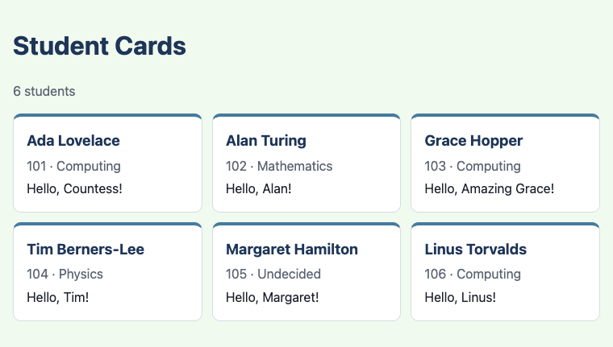
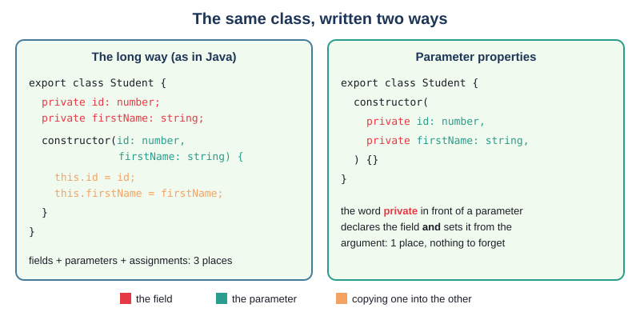
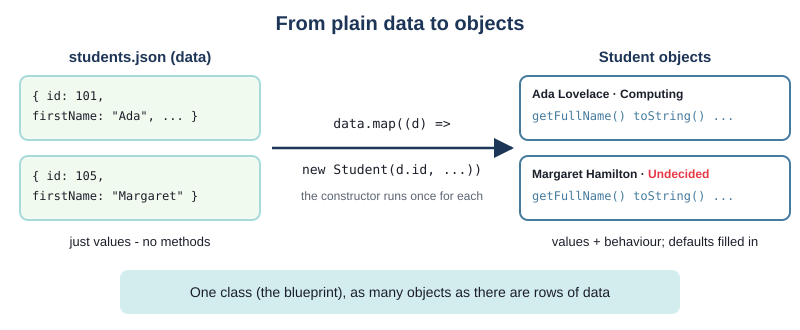
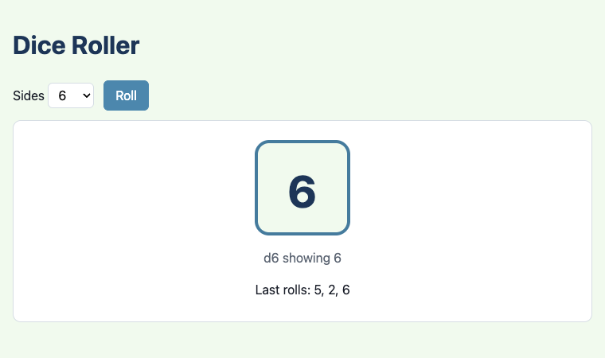
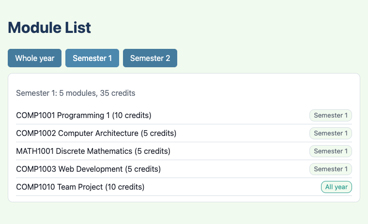

# Chapter 5 - Classes, objects and constructors

You have already written small classes: `Counter` in Chapter 2 and `Team` in Chapter 3. This chapter
looks at classes properly, as you knew them in Java - objects, constructors and `toString()` - and
shows where TypeScript does things its own way: constructors that declare their fields for you,
default and optional parameters instead of several constructors, and turning plain data from a JSON
file into real objects. Every class is built test first.



## What you will learn

- classes and objects in TypeScript, compared with Java
- writing a constructor, and the shorter way: **parameter properties**
- default parameters (`course: string = "Undecided"`) and optional parameters (`nickname?: string`)
- why a TypeScript class has only one constructor, and what replaces Java's overloading
- writing `toString()`, and where TypeScript calls it for you
- making objects from JSON data with `map((d) => new Student(...))`
- what to test about a constructor, and about `toString()`
- keeping randomness out of a class by passing the random number in

## The projects

| Project | What it shows |
|---|---|
| [ch05_project01_student_cards](projects/ch05_project01_student_cards/) | a `Student` class with parameter properties, a default and an optional parameter, and `toString()`; students made from JSON data |
| [ch05_project02_die](projects/ch05_project02_die/) | a `Die` with any number of sides, built in small red-green steps; the random number is passed in |
| [ch05_project03_module_list](projects/ch05_project03_module_list/) | a course's `Module` objects, filtered by semester and added up; `toString()` inside template literals and `join` |

## Classes and objects

A quick reminder of the words, which mean the same as in Java:

- a **class** is a blueprint: it says what data each object holds (its **fields**, also called
  properties) and what it can do (its **methods**)
- an **object** (an **instance** of the class) is one thing made from that blueprint, with its own
  values in the fields
- a **constructor** is the code that runs when an object is made with `new`, to set up its fields

From Chapter 2 you also know the differences you will see on every line: `export class` instead of
`public class`, types written after names (`count: number`), `this.` always written in front of a
field, and methods with `public` and a return type written out.

The constructor is where TypeScript differs most from Java, so that is where this chapter begins.

## Project 1: Student cards


The first project shows a card for each student in a JSON file. Each card is made from a `Student`
object. We build the class test first, as in Chapter 4.

### The first test

The first thing a student must do is remember their name. The test says how a `Student` is made, and
what it should give back:

`tests/Student.test.ts`
```ts
import { assertEquals } from "@std/assert";
import { Student } from "../src/Student.ts";

Deno.test("a new student has the full name it was given", () => {
  const student = new Student(101, "Ada", "Lovelace", "Computing");

  assertEquals(student.getFullName(), "Ada Lovelace");
});
```

There is no `src/Student.ts` yet, so this is as red as it gets - the tests cannot even start:

```text
TS2307 [ERROR]: Cannot find module 'src/Student.ts'.
    at tests/Student.test.ts:4:25

error: Module not found "src/Student.ts".
    at tests/Student.test.ts:4:25

Tests: the tests could not run (see above)  ->  test_output/index.html
```

### The long way

Here is the class written the way you would write it in Java: fields declared at the top, a
constructor that takes the values as parameters, and a line for each field to copy the parameter in:

`src/Student.ts` (first version)
```ts
export class Student {
  private id: number;
  private firstName: string;
  private surname: string;
  private course: string;

  constructor(id: number, firstName: string, surname: string, course: string) {
    this.id = id;
    this.firstName = firstName;
    this.surname = surname;
    this.course = course;
  }

  public getFullName(): string {
    return `${this.firstName} ${this.surname}`;
  }
}
```

Compared with Java:

- the constructor is always called `constructor`, not the name of the class
- like a Java constructor, it has no return type
- `this.id = id;` works exactly as in Java: `this.id` is the field, `id` is the parameter. In
  TypeScript `this.` is never optional, so the field and the parameter can share a name with no
  confusion

Save, and the test is green:

```text
ok 1 - a new student has the full name it was given

Tests: 0 failed, 1 passed, 0 skipped, 0 type errors, 0 lint warnings  ->  test_output/index.html
```

> **Note** - Forget the `this.` and TypeScript tells you what you meant:
> `Cannot find name 'firstName'. Did you mean the instance member 'this.firstName'?`

### Refactor: parameter properties

That class says everything three times. `firstName` is declared as a field, then again as a
parameter, and then one is copied into the other. With four fields that is twelve lines of
paperwork, and it is easy to add a field and forget one of the three.

TypeScript has a shorter way. Put `private` in front of a constructor parameter, and that parameter
**is** the field: TypeScript declares the field and copies the argument into it for you. This is
called a **parameter property**:



`src/Student.ts`
```ts
export class Student {
  constructor(
    private id: number,
    private firstName: string,
    private surname: string,
    private course: string,
  ) {}

  public getFullName(): string {
    return `${this.firstName} ${this.surname}`;
  }
}
```

The constructor's body is empty - `{}` - because there is nothing left to do. The class has exactly
the same four private fields as before, and the methods use them in the same way, with `this.`. The
parameters are written one per line, with a comma after the last, so that adding one later is a
one-line change.

This is a **refactor**: the code changed, the behaviour did not. The test proves it - it is still
green, without being touched. From now on, this book writes constructors this way whenever the
constructor's job is just to store its arguments.

> **Note** - The word in front matters. A parameter with no `private` (or `public`, `protected`, or
> `readonly`) in front is just a parameter, gone when the constructor ends. Write
> `constructor(name: string) {}` and then `this.name` in a method, and TypeScript says
> `Property 'name' does not exist on type 'Student'.`

### Exercise 5.1 - Shorten Team

Chapter 3's `Team` (in `ch03_project02_scoreboard/src/Team.ts`) declares a field and copies it in
the constructor:

```ts
export class Team {
  private name: string;
  private score: number = 0;

  constructor(name: string) {
    this.name = name;
  }
  // ...
}
```

Rewrite it with a parameter property. Try it before reading on.

Here is one way:

```ts
export class Team {
  private score: number = 0;

  constructor(private name: string) {}
  // ...
}
```

`score` stays a normal field: it does not come from the constructor's arguments, it always starts
at 0. A class can mix both kinds. Its tests pass unchanged.

### A default parameter, test first

Not every student has chosen a course when they are added. Java would give you a second
constructor for that. In TypeScript, we start with a test that says what should happen:

`tests/Student.test.ts`
```ts
Deno.test("a student with no course given is Undecided", () => {
  const student = new Student(102, "Alan", "Turing");

  assertEquals(student.getCourse(), "Undecided");
});
```

(`getCourse()` is a one-line method that returns `this.course`.) Two things go wrong, and both are
useful. The type checker complains that the constructor wants four arguments:

```text
TS2554 [ERROR]: Expected 4 arguments, but got 3.
  const student = new Student(102, "Alan", "Turing");
                  ~~~~~~~~~~~~~~~~~~~~~~~~~~~~~~~~~~
    at tests/Student.test.ts:13:19

    An argument for 'course' was not provided.
```

and the test itself runs (tests run even with type errors, so you can see them go red) and fails,
because a missing argument in JavaScript is simply `undefined`:

```text
not ok 2 - a student with no course given is Undecided
  ---
  message: |-
    AssertionError: Values are not equal.

        [Diff] Actual / Expected

    -   undefined
    +   "Undecided"
```

The fix is a **default parameter** - a value written after the type with `=`, used when no
argument is given:

`src/Student.ts`
```ts
/** The course a student is on until they choose one. */
const DEFAULT_COURSE = "Undecided";
```

```ts
    private course: string = DEFAULT_COURSE, // a default: used when no course (or undefined) is given
```

Both problems go away: the type checker now knows that `course` may be left out, and when it is,
the field gets `"Undecided"`. Green.

Default parameters work in any function or method, not only constructors - `roll(random: number,
times: number = 1)` would be fine too.

### Optional parameters

Some students have a nickname they would rather be called by. Most do not. For a value that may
simply be missing, with no sensible default, write `?` after the parameter's name:

`src/Student.ts`
```ts
  constructor(
    private id: number,
    private firstName: string,
    private surname: string,
    private course: string = DEFAULT_COURSE, // a default: used when no course (or undefined) is given
    private nickname?: string, // optional: may be left out, and is then undefined
  ) {}
```

`nickname?: string` makes the field's type `string | undefined` - the same kind of union as `Student
| undefined` from `find` in Chapter 3 - and TypeScript makes sure you check before using it:

```ts
  /** The name to greet the student by: their nickname if they have one, otherwise their first name. */
  public getGreetingName(): string {
    if (this.nickname === undefined) {
      return this.firstName;
    }
    return this.nickname;
  }
```

Both cases get a test:

`tests/Student.test.ts`
```ts
Deno.test("a student with a nickname is greeted by it", () => {
  const student = new Student(101, "Ada", "Lovelace", "Computing", "Countess");

  assertEquals(student.getGreetingName(), "Countess");
});

Deno.test("a student with no nickname is greeted by their first name", () => {
  const student = new Student(102, "Alan", "Turing", "Mathematics");

  assertEquals(student.getGreetingName(), "Alan");
});
```

Arguments are matched to parameters by position, so to give a nickname but no course, you pass
`undefined` for the course - and a default parameter treats `undefined` exactly like a missing
argument:

```ts
Deno.test("passing undefined for the course also gives the default", () => {
  const student = new Student(105, "Margaret", "Hamilton", undefined, "Maggie");

  assertEquals(student.getCourse(), "Undecided");
});
```

That `undefined` in the middle is a little ugly. It is fine for one or two optional values; when a
constructor collects many of them, there is a better design (Challenge 6 asks you to find it).

### One constructor, not several

In Java you might have written three constructors for `Student`: one with every value, one without
the course, one without anything. That is **overloading** - several methods with the same name and
different parameter lists - and Java picks one by the arguments you pass.

A TypeScript class has **one** constructor. Try to write two and you get:

```text
TS2392 [ERROR]: Multiple constructor implementations are not allowed.
```

The reason is that types vanish when TypeScript is turned into JavaScript, so at run time there is
nothing to choose between constructors with. Default and optional parameters do the same job, in
one place:

| Java | TypeScript |
|---|---|
| `Student(int id, String first, String surname, String course)` | `new Student(101, "Ada", "Lovelace", "Computing")` |
| `Student(int id, String first, String surname)` calling `this(id, first, surname, "Undecided")` | `new Student(102, "Alan", "Turing")` - the default fills in the course |
| a fifth constructor for the nickname | `new Student(101, "Ada", "Lovelace", "Computing", "Countess")` |

The rule for the parameter list: **required parameters first, then the ones with defaults or `?`**.
An optional parameter followed by a required one is an error -
`A required parameter cannot follow an optional parameter.` - because there would be no way to
leave the optional one out.

> **Note** - TypeScript does have a way to declare overloads (several signatures above one
> implementation), but the one implementation still has to sort out the arguments itself. Defaults
> and optional parameters are simpler, and are what this book uses.

### toString, test first

When you print an object in Java, `toString()` decides what you see. TypeScript (really
JavaScript) has the same idea. Here is the test for the summary we want:

`tests/Student.test.ts`
```ts
Deno.test("toString gives the id, full name and course", () => {
  const student = new Student(101, "Ada", "Lovelace", "Computing");

  assertEquals(student.toString(), "(Student) 101 Ada Lovelace, Computing");
});
```

Before writing the method, run it. You might expect a type error - `Student` has no `toString` - but
there is none. Every object already has a `toString()`, just as every Java object inherits one from
`Object`. The test fails with the built-in version's answer, which is even less helpful than Java's
`Student@6d06d69c`:

```text
not ok 3 - toString gives the id, full name and course
  ---
  message: |-
    AssertionError: Values are not equal.

        [Diff] Actual / Expected

    -   [object Object]
    +   (Student) 101 Ada Lovelace, Computing

Tests: 1 failed, 2 passed, 0 skipped, 0 type errors, 0 lint warnings  ->  test_output/index.html
```

Now write our own:

`src/Student.ts`
```ts
  /** A short summary of the student, for showing or logging - like Java's toString(). */
  public toString(): string {
    return `(Student) ${this.id} ${this.getFullName()}, ${this.course}`;
  }
```

Green. As in Java, `toString()` **returns** a string; it does not print anything. What happens to
the string is up to the code that asked for it.

The point of `toString()` is that you rarely call it yourself. JavaScript calls it whenever an
object has to become a string - in a template literal, for example:

```ts
Deno.test("a template literal uses toString", () => {
  const student = new Student(102, "Alan", "Turing");

  assertEquals(`${student}`, "(Student) 102 Alan Turing, Undecided");
});
```

`"" + student`, `String(student)` and `join` on an array of students all call it too. One thing does
not: `console.log(student)` shows the object's fields instead - in Deno, `Student { id: 102,
firstName: "Alan", ... }`. To log your summary, log `` `${student}` ``, as `main.ts` does.

> **Note** - In Java you would write `@Override` above `toString()`. TypeScript's `override` keyword
> is only for classes that `extend` another class, which `Student` does not; Chapter 11 uses it.

### From JSON data to objects

The students come from a JSON file, as the marks did in Chapter 3. Some have no course, and most have
no nickname:

`src/students.json`
```json
[
  { "id": 101, "firstName": "Ada", "surname": "Lovelace", "course": "Computing", "nickname": "Countess" },
  { "id": 102, "firstName": "Alan", "surname": "Turing", "course": "Mathematics" },
  ...
  { "id": 105, "firstName": "Margaret", "surname": "Hamilton" },
  ...
]
```

Importing the file gives an array of **plain objects** - values, with no methods. In Chapter 3 that
was all we needed. Now we want `Student` objects, with `getGreetingName()`, `toString()` and the
default course. `map` turns each piece of data into an object by calling the constructor:



`src/students.ts`
```ts
/** The shape of one student in students.json. course and nickname may be missing. */
export type StudentData = {
  id: number;
  firstName: string;
  surname: string;
  course?: string;
  nickname?: string;
};

/** One Student object for each piece of data. A missing course becomes the default. */
export const studentsFrom = (data: StudentData[]): Student[] =>
  data.map((d) => new Student(d.id, d.firstName, d.surname, d.course, d.nickname));
```

The `?` works in a `type` too: `course?: string` means the property may be missing. A missing
property reads as `undefined`, so `d.course` passes `undefined` to the constructor - and the default
parameter turns that into `"Undecided"`. The data and the class fit together with no `if`.

The tests use a small array of their own, and check one thing the diagram promises - that the data
has no methods of its own, and the objects do:

`tests/students.test.ts`
```ts
Deno.test("the objects made have the class's methods - plain data does not", () => {
  const students = studentsFrom(DATA);

  assertEquals(students[0].toString(), "(Student) 1 Ada Lovelace, Computing");
  assertEquals(`${DATA[0]}`, "[object Object]");
});
```

`main.ts` makes the objects once, then builds a card from each object's methods:

`src/main.ts`
```ts
import data from "./students.json" with { type: "json" };
import { studentsFrom } from "./students.ts";

const STUDENTS = studentsFrom(data);
```

```ts
  for (const student of STUDENTS) {
    const card = document.createElement("article");
    card.className = "card student";

    const name = document.createElement("h2");
    name.textContent = student.getFullName();
    // ... the id and course, and "Hello, Countess!"

    // toString is for logging: open the browser's console to see one line per student.
    console.log(`${student}`);
  }
```

> **Try it** - Open `dist/index.html` in a browser and open the developer tools' console: six lines,
> one per student, each from `toString()`. Then change the log to `console.log(student)` and compare.

### Testing constructors

What should you test about a constructor? Not that TypeScript can copy a value into a field - that
would be testing TypeScript. Test what **your** code decides:

- that the values given come back out (through the methods that use them, such as `getFullName()`)
- every default - "a student with no course given is Undecided"
- every optional parameter, both given and left out
- `toString()`, exactly, because other code (and people) rely on what it says

Many mistakes never reach a test, because the type checker catches them first:

| Mistake | What TypeScript says |
|---|---|
| `new Student(101)` | `Expected 3-5 arguments, but got 1.` |
| `new Student("101", "Ada", "Lovelace")` | `Argument of type 'string' is not assignable to parameter of type 'number'.` |
| `Student(101, "Ada", "Lovelace")` - no `new` | `Value of type 'typeof Student' is not callable. Did you mean to include 'new'?` |

Notice the "3-5": TypeScript counts the required parameters and the ones that may be left out.

**Two objects with the same values.** Chapter 4 showed that `assertEquals` compares what things
contain, while `assertStrictEquals` asks whether they are the very same thing. With objects made by
a constructor:

```ts
assertEquals(new Student(1, "Ada", "Lovelace"), new Student(1, "Ada", "Lovelace"));       // passes
assertStrictEquals(new Student(1, "Ada", "Lovelace"), new Student(1, "Ada", "Lovelace")); // fails
```

The second fails with `Values have the same structure but are not reference-equal.` - two `new`s
make two objects, just as in Java, where `==` would be `false`. `assertEquals` also checks the class:
a `Student` is not equal to a plain object with the same fields (the diff shows `-   Student {` and
`+   {`). Chapter 9 says much more about objects and references.

## Project 2: A die



Board games use dice with 4, 6, 8, 10, 12 or 20 sides. A `Die` class needs to know how many sides
it has - six, unless you say otherwise - and to roll.

Rolling is random, and random code is hard to test: what would the test expect? Chapter 2's coin
toss solved this by passing the random number **in**. The die does the same: `roll(random)` is given
a number from 0 up to (but not including) 1 - the kind `Math.random()` gives - and the page passes
`Math.random()`, while the tests pass numbers they choose.

### The constructor

`src/Die.ts`
```ts
/** The ordinary die has six sides. */
const DEFAULT_SIDES = 6;

export class Die {
  // What the die shows: null until it has been rolled for the first time.
  private value: number | null = null;

  constructor(private sides: number = DEFAULT_SIDES) {}

  public getSides(): number {
    return this.sides;
  }
```

A parameter property with a default: `new Die()` has six sides, `new Die(20)` has twenty. The class
also has an ordinary field, `value`, which does not come from the constructor: every new die starts
"not rolled yet", which `number | null` says honestly (a die showing 0, or 1, before anyone rolled
it would be a small lie). Its tests:

`tests/Die.test.ts`
```ts
Deno.test("a die has six sides unless you say otherwise", () => {
  assertEquals(new Die().getSides(), 6);
});

Deno.test("a die can have any number of sides", () => {
  assertEquals(new Die(20).getSides(), 20);
});

Deno.test("a new die has not been rolled", () => {
  assertEquals(new Die().getValue(), null);
});
```

### Rolling, in small steps

Chapter 4's habit: one small test, the least code that passes it, then the next test. The smallest
random number is 0, and it should roll a 1:

`tests/Die.test.ts`
```ts
Deno.test("the lowest random number rolls a 1", () => {
  const die = new Die();

  assertEquals(die.roll(0), 1);
});
```

Red - with a type error, and a test that fails because there is no such method yet:

```text
TS2339 [ERROR]: Property 'roll' does not exist on type 'Die'.
  assertEquals(die.roll(0), 1);
                   ~~~~
    at tests/Die.test.ts:15:20

not ok 3 - the lowest random number rolls a 1
  ---
  message: |-
    TypeError: die.roll is not a function
```

The least code that passes:

```ts
  public roll(random: number): number {
    return 1;
  }
```

Green - but the console also says `1 lint warnings`. The linter has noticed what we know: `` `random`
is never used ``. That is a good sign that the next test is needed. The highest random numbers, just
below 1, should roll a 6:

```ts
/** Just below 1: the largest number Math.random() can give is a tiny bit less than 1. */
const ALMOST_ONE = 0.999999;

Deno.test("a random number just below 1 rolls a 6", () => {
  const die = new Die();

  assertEquals(die.roll(ALMOST_ONE), 6);
});
```

```text
not ok 4 - a random number just below 1 rolls a 6
  ---
  message: |-
    AssertionError: Values are not equal.

        [Diff] Actual / Expected

    -   1
    +   6
```

Now "always 1" will not do. Multiplying the random number by the number of sides gives a number from
0 up to (not including) 6; `Math.floor` cuts off the decimals, giving 0 to 5; adding 1 gives 1 to 6.
And the die should remember what it rolled:

`src/Die.ts`
```ts
  public roll(random: number): number {
    this.value = Math.floor(random * this.sides) + 1;
    return this.value;
  }
```

Green, with no lint warning. More tests pin down the rest: 0.5 rolls a 4, a twenty-sided die can
roll a 20, and after a roll `getValue()` gives what was rolled. Each one passes straight away - which
is fine: they record what the die promises, so that a later change cannot quietly break it.

### Two kinds of toString

`toString` has two cases, so it has two tests:

`src/Die.ts`
```ts
  /** For example "d6 showing 4", or "d20 (not rolled yet)". */
  public toString(): string {
    if (this.value === null) {
      return `d${this.sides} (not rolled yet)`;
    }
    return `d${this.sides} showing ${this.value}`;
  }
```

("d6" and "d20" are how gamers write dice.)

### Making objects while the page runs

The page starts with a six-sided die. Choosing a different number of sides does not change the
die - it makes a **new** one:

`src/main.ts`
```ts
let die = new Die();
let history: number[] = [];
```

```ts
sidesChoice?.addEventListener("change", () => {
  die = new Die(Number(sidesChoice.value));
  history = [];
  render();
});

rollButton?.addEventListener("click", () => {
  // The only place Math.random() is called: the Die is given the number, so it can be tested.
  const value = die.roll(Math.random());
  history.push(value);
  render();
});
```

`die` is a `let`, because it is replaced. The old die is simply forgotten (JavaScript, like Java,
cleans up objects nothing refers to any more). `render()` shows `${die}` - its `toString()` - under
the big number.

### Exercise 5.2 - A coin is a die

A coin is a die with two sides. Write two tests: a two-sided die rolls a 1 for 0.4, and a 2 for 0.6.
Do you need to change `Die`? Try it before reading on.

Here is one way:

```ts
Deno.test("a two-sided die rolls a 1 for 0.4 and a 2 for 0.6", () => {
  const coin = new Die(2);

  assertEquals(coin.roll(0.4), 1);
  assertEquals(coin.roll(0.6), 2);
});
```

No change is needed - both pass straight away. The constructor made the number of sides a value, not
a fixed 6, so one class covers every die.

## Project 3: A module list



The last project lists the modules of a course year, with buttons to show one semester at a time
and the total credits. It brings the chapter together: a class with a default and an optional
parameter, objects made from JSON, and `toString()` doing quiet work.

### The Module class

Most modules are worth 5 credits. Most run in one semester, but a few - such as a team project - run
all year:

`src/Module.ts`
```ts
/** Most modules are worth this many credits. */
const DEFAULT_CREDITS = 5;

export class Module {
  constructor(
    private code: string,
    private title: string,
    private credits: number = DEFAULT_CREDITS,
    private semester?: number, // optional: undefined means the module runs all year
  ) {}
```

Here `undefined` is not just "not given" - it has a meaning, and the class gives that meaning a name,
so no other code needs to know how it is stored:

```ts
  /** True when the module has no semester, because it runs all year. */
  public isYearLong(): boolean {
    return this.semester === undefined;
  }

  /** Does this module run in the given semester? A year-long module runs in both. */
  public runsIn(semester: number): boolean {
    return this.isYearLong() || this.semester === semester;
  }

  /** For example "COMP1001 Programming 1 (10 credits)". */
  public toString(): string {
    return `${this.code} ${this.title} (${this.credits} credits)`;
  }
```

The tests cover the default ("a module is worth 5 credits unless you say otherwise"), the optional
semester both ways, and `runsIn` for both kinds of module:

`tests/Module.test.ts`
```ts
Deno.test("a year-long module runs in both semesters", () => {
  const module = new Module("COMP1010", "Team Project", 10);

  assertEquals(module.runsIn(1), true);
  assertEquals(module.runsIn(2), true);
});
```

### Functions that work on objects

The list of modules is made from JSON exactly as the students were, and two small functions answer
the page's questions. They are the array methods from Chapter 3, now working on objects and calling
their methods:

`src/modules.ts`
```ts
/** One Module object for each piece of data. Missing credits become the default. */
export const modulesFrom = (data: ModuleData[]): Module[] =>
  data.map((d) => new Module(d.code, d.title, d.credits, d.semester));

/** The modules that run in a semester - including the year-long ones. */
export const modulesIn = (modules: Module[], semester: number): Module[] =>
  modules.filter((module) => module.runsIn(semester));

/** The credits of all the modules added together. */
export const totalCredits = (modules: Module[]): number =>
  modules.reduce((total, module) => total + module.getCredits(), 0);
```

Not everything has to be a method. `totalCredits` is about a *list* of modules, not one module, so
it is a plain function. (A `Course` class that holds its modules is a good idea too - that is
composition, in Chapter 9.)

### toString doing quiet work

Each line of the list is just the module, in a template literal:

`src/main.ts`
```ts
      const item = document.createElement("li");
      item.textContent = `${module}`; // toString: "COMP1001 Programming 1 (10 credits)"
```

and `join`, which glues an array into one string, calls `toString()` on each element:

`tests/modules.test.ts`
```ts
Deno.test("toString makes joining a list of modules easy", () => {
  const modules = modulesFrom(DATA).slice(0, 2);

  assertEquals(modules.join("; "), "A1 Alpha (10 credits); B2 Beta (5 credits)");
});
```

(`slice(0, 2)` is a copy of the first two elements.) The page's state is one variable, `semester`,
which is a number or `null` for "the whole year"; the three buttons set it and call `render()` - the
pattern from Chapters 2 and 3.

### Exercise 5.3 - Year-long credits

Write a function `yearLongCredits(modules: Module[]): number` that adds up the credits of the
year-long modules only. Write the test first, using the made-up `DATA` in `tests/modules.test.ts`.
Try it before reading on.

Here is one way:

```ts
Deno.test("only the year-long module's credits are counted", () => {
  assertEquals(yearLongCredits(modulesFrom(DATA)), 5);
});

export const yearLongCredits = (modules: Module[]): number =>
  totalCredits(modules.filter((module) => module.isYearLong()));
```

It reuses `totalCredits` instead of writing another `reduce`, and asks each module `isYearLong()`
instead of checking `getSemester() === undefined` itself.

### A class or a type?

Chapter 3 described a student with a `type`: `type Student = { name: string; mark: number }`. This
chapter uses classes. When is each right?

- a **`type`** describes the **shape** of plain data - what comes out of a JSON file, for example. It
  has no constructor and no methods, and it vanishes when the code is compiled
- a **class** is for things with **behaviour**: defaults decided in one place (the constructor),
  methods such as `getGreetingName()` and `runsIn()`, and private fields that other code cannot
  reach

This chapter uses both, side by side: `StudentData` is the shape of the data in the file;
`Student` is the object the program works with. `studentsFrom` is the bridge between them.

## Java and TypeScript

| Java | TypeScript |
|---|---|
| `public Student(int id) { this.id = id; }` | `constructor(private id: number) {}` - a parameter property |
| the constructor is named after the class | the constructor is always called `constructor` |
| several overloaded constructors | one constructor, with default (`= "Undecided"`) and optional (`?`) parameters |
| `this(id, first, surname, "Undecided")` to call another constructor | a default parameter |
| a missing argument is a compile error | a missing argument is `undefined` at run time - and a type error, so you see it |
| `@Override public String toString()` | `public toString(): string` (`override` only when the class `extends` another) |
| `"" + student`, `println(student)` call `toString()` | `` `${student}` ``, `String(student)`, `join` call `toString()`; `console.log(student)` does not |
| default `toString()`: `Student@6d06d69c` | default `toString()`: `[object Object]` |
| `a == b` on objects: the same object? | `assertStrictEquals` (and `===`): the same object; `assertEquals`: the same contents |

## Summary

- a class is a blueprint; `new` makes an object from it and runs the constructor
- the constructor is called `constructor`; `this.` is always needed for fields
- a **parameter property** - `private` in front of a constructor parameter - declares the field and
  sets it in one go; use it when the constructor just stores its arguments
- a class has only one constructor; **default parameters** (`= value`) and **optional parameters**
  (`name?: type`, which may be `undefined`) replace Java's overloading. Required parameters come first
- passing `undefined` to a parameter with a default gives the default
- write `toString()` to return a useful summary; template literals, `String()` and `join` call it,
  `console.log` does not
- plain data from JSON has no methods; `data.map((d) => new Student(...))` turns it into objects
- test what your constructor decides: values kept, defaults, optional parameters, and `toString()`
  exactly
- pass anything random into a method, so that tests can choose it

## Challenges

Each challenge says which project to start from. Write the tests first, and watch each one fail
before you make it pass.

### 1. Initials

*Start from `ch05_project01_student_cards`.* Give `Student` a method `getInitials()` that returns the
first letters of the first name and surname, such as `"AL"` for Ada Lovelace. Write the tests first
(including a surname with a hyphen, Tim Berners-Lee, which should still give `"TB"`), then show the
initials in a circle at the top of each card.

### 2. Critical roll

*Start from `ch05_project02_die`.* Give `Die` a method `isMaximum(): boolean`, true when the die
shows its highest number. Test first: a d20 that rolled 20; a d20 that rolled 19; a die that has not
been rolled yet (false). On the page, show "Maximum!" and give the number a different colour when
`isMaximum()` is true.

### 3. Who teaches it?

*Start from `ch05_project03_module_list`.* Add an optional `lecturer` to `Module`, and to some (not
all) of the modules in `modules.json`. `toString()` should add " - taught by Dr Byrne" only when there
is a lecturer. Write a test for each case first. Where must the new parameter go in the constructor,
and why?

### 4. Enough credits?

*Start from `ch05_project03_module_list`.* A full year is 60 credits. Write a function
`creditCheck(modules: Module[], target: number = 60): string` that gives `"60 credits - complete"`,
`"55 credits - 5 short"` or `"65 credits - 5 over"`. Write the tests first, for all three cases and
for a different target (a part-time year of 30). Show the result under the list when the whole year
is shown.

*Hint:* use `totalCredits`. A default parameter works in a plain function exactly as in a
constructor.

### 5. A cup of dice

*Start from `ch05_project02_die`.* Many games roll two or three dice and add them up. Write a class
`DiceCup` whose constructor takes how many dice and how many sides each has (six unless you say
otherwise), and makes that many `Die` objects. `roll(random: () => number): number` rolls every die
and returns the total, and `toString()` gives, for example, `"2d6: 3 + 5 = 8"`. Write the tests first.
Add a choice of 1, 2 or 3 dice to the page.

*Hint:* the constructor can fill a private `Die[]` with a `for` loop and `push`. `roll` takes a
*function* (a function type, Chapter 3) because each die needs its own random number: the page
passes `Math.random` itself (no brackets); a test passes a fake that hands out numbers it chose,
one per call - for example an arrow function that returns the next number from an array each time.

### 6. Too many arguments

*Start from `ch05_project01_student_cards`.* Students also need a year of study (1 unless you say
otherwise) and an optional email address. Adding two more parameters to the end of the constructor
would mean calls like `new Student(105, "Margaret", "Hamilton", undefined, undefined, 2)`. Change the
design so that the constructor takes **one** argument, a `StudentData` object, and `studentsFrom`
becomes `data.map((d) => new Student(d))`. Rewrite the tests first, so that they show how much
easier the new calls are to read. Add the year to `toString()` and to the cards.

*Hint:* the constructor can no longer use parameter properties for each value. Keep private fields,
and set them in the constructor's body from the object, using the default when a value is
`undefined`. Think about what is better and what is worse about the new design - is it clearer what
a `Student` needs?

---

Next: [Chapter 6 - Encapsulation](../ch06_encapsulation/README.md)
