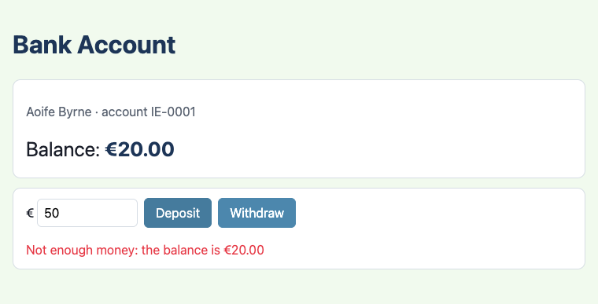
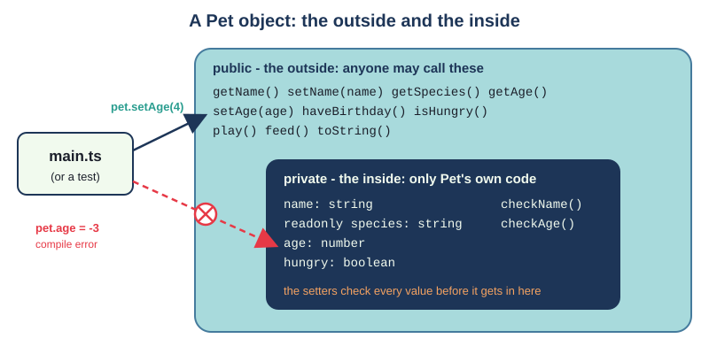
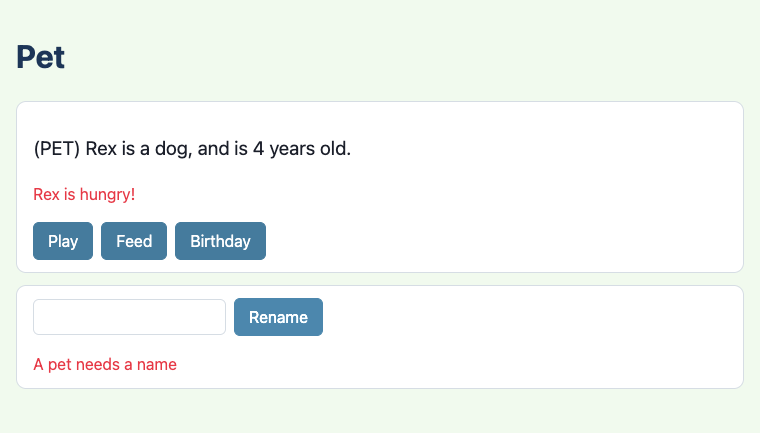
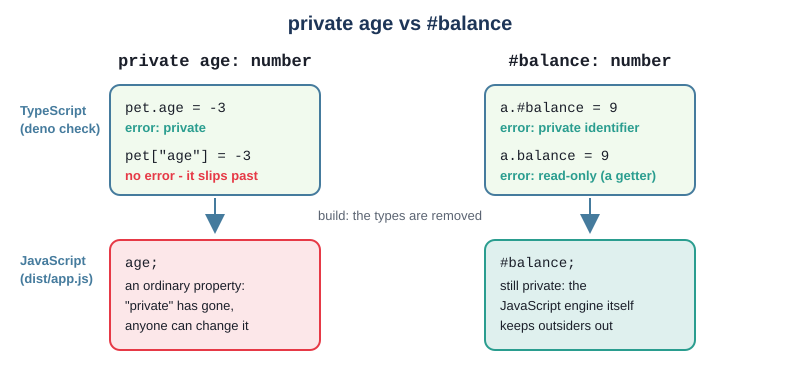
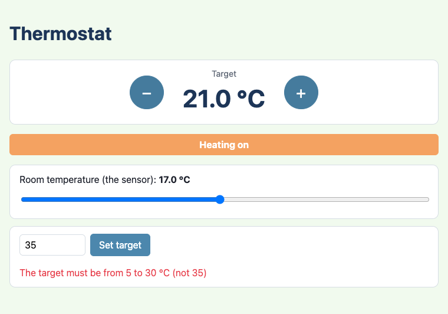
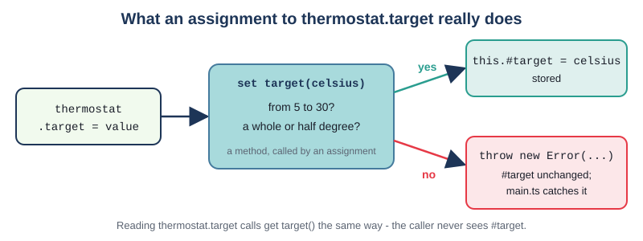

# Chapter 6 - Encapsulation

An object should look after its own data. If any code anywhere can set a pet's age to -3 or a bank
balance to a million, then every bug anywhere can do it too. **Encapsulation** means hiding an
object's data behind methods that check every change, so the object is always in a sensible state.
You know the idea from Java; this chapter shows how TypeScript does it - which is mostly the same,
with two twists: a second kind of `private`, and `get`/`set` accessors.



## What you will learn

- why data is hidden, and what "the outside" and "the inside" of a class are
- `private` fields and methods, and why TypeScript's `private` is only checked by the compiler
- `#private` fields and methods, which stay private while the program runs
- `readonly` fields, which are set once and never changed
- `getX()`, `isX()` and `setX()` methods, the Java way, and `get`/`set` accessors, the TypeScript way
- making setters and constructors refuse bad values by throwing an `Error`, and catching it on the page
- invariants: rules an object keeps true all the time
- testing refused input with `assertThrows`, and checking that a refusal changes nothing

## The projects

| Project | What it shows |
|---|---|
| [ch06_project01_pet](projects/ch06_project01_pet/) | the Java Pet exercise: `private` and `readonly` fields, getters, setters that check their values, `isHungry()`, `try`/`catch` on the page |
| [ch06_project02_bank_account](projects/ch06_project02_bank_account/) | a `#private` balance, a `get` accessor with no setter, deposit and withdraw rules, the invariant "never below zero" |
| [ch06_project03_thermostat](projects/ch06_project03_thermostat/) | a `get`/`set` pair whose setter checks the value, a computed property, and when a plain public field is fine |

## The outside and the inside

Chapter 2's `Counter` was already encapsulated, though nobody said so. Its `count` field was
`private`, and the only ways to change it were `increment()` and `reset()`. So there was no way
for `main.ts` to set the count to -7 or 2.5. The class promised that the count was always a whole
number, 0 or more - and it could keep that promise because nobody else could touch the field.

Every class has two parts:

- **the outside** - its `public` methods (and any public fields). This is what other code can use.
  It is a promise: change it, and other code breaks
- **the inside** - its `private` fields and helper methods. Only the class's own code can use them.
  You can change them whenever you like, and as long as the outside behaves the same, nothing else
  notices



Hiding the inside does two jobs. It **protects** the data: if every change goes through a method,
the method can check it, and bad values never get in. And it **frees** you to change the inside:
in Chapter 3's challenge 2, the scoreboard's `Team` changed from storing a score to storing a list
of baskets, and not one test had to change, because the tests only used the outside.

That second point matters for testing too. A test that only calls public methods tests what the
class *does*, not how it does it - so you can refactor the inside with the tests staying green.
This chapter's tests never reach inside an object.

## Project 1: The pet



The first project is the Pet exercise from the Java course: a pet with a name, a species and an age
(5 if none is given), private fields, getters and setters, and a `toString()`. This version adds
one thing the Java exercise left out: the setters **check** what they are given.

### Private fields, getters and setters

`src/Pet.ts`
```ts
const DEFAULT_AGE = 5;

export class Pet {
  private name: string;
  // readonly: set once, in the constructor, and never again. A dog stays a dog.
  private readonly species: string;
  private age: number;
  private hungry: boolean = false;

  constructor(name: string, species: string, age: number = DEFAULT_AGE) {
    // The constructor uses the same checks as the setters, so a Pet cannot start life invalid either.
    this.name = this.checkName(name);
    this.species = species;
    this.age = this.checkAge(age);
  }

  public getName(): string {
    return this.name;
  }

  /** Renames the pet. Throws an Error (and keeps the old name) if the new name is blank. */
  public setName(name: string): void {
    this.name = this.checkName(name);
  }
  // ...
}
```

This is the Java pattern, written in TypeScript: every field `private`, a `getX()` to read it, a
`setX()` to change it. Try to reach a private field from `main.ts`:

```ts
const pet = new Pet("Rex", "dog", 3);
pet.age = -3;
```

and the compiler stops you:

```text
TS2341 [ERROR]: Property 'age' is private and only accessible within class 'Pet'.
pet.age = -3;
    ~~~
```

Private methods work the same way. `checkName` and `checkAge` are helpers for the class's own use;
`pet.checkAge(3)` in `main.ts` gives `Property 'checkAge' is private and only accessible within
class 'Pet'.` Keeping helpers private keeps the outside small: fewer methods for other code to know
about, and fewer to keep working forever.

> **Note** - In TypeScript, a member with no visibility written is `public` (in Java it would be
> "package-private"). This book always writes `public` anyway, so that you can see the choice was
> made on purpose.

### `isX()` for booleans

`hungry` is a boolean, so its getter follows the same convention as in Java: `isHungry()`, not
`getHungry()`. It reads as a question, which is how it is used:

`src/main.ts`
```ts
mood.textContent = pet.isHungry() ? `${pet.getName()} is hungry!` : `${pet.getName()} is happy.`;
```

There is no `setHungry(true)`. Instead there are `play()` and `feed()`, which say what happens to
the pet rather than which field changes. A setter for every field is a habit worth questioning:
only add the ways of changing an object that make sense for it.

### `readonly`

A pet's species never changes, so `species` is `readonly`. A `readonly` field must be given its
value where it is declared or in the constructor, and can never be changed after that - not even by
the class's own methods. Add a method that tries:

```ts
public adopt(): void {
  this.species = "cat";
}
```

and the compiler says:

```text
TS2540 [ERROR]: Cannot assign to 'species' because it is a read-only property.
    this.species = "cat";
         ~~~~~~~
```

`readonly` is TypeScript's version of a Java `final` field. As there is nothing a setter could do,
`Pet` has a `getSpecies()` and no `setSpecies()`. (Like Java's `final`, `readonly` only stops the
field being pointed at something else. If a readonly field holds an array, the array itself can
still be changed - Chapter 9 explains why.)

### Setters that say no, test first

A setter that just copies its value into the field protects nothing: `setAge(-3)` would do exactly
what `pet.age = -3` would have done. The point of a setter is that it can **refuse**. Here is
`setAge` being made to refuse, red-green-refactor, starting from the plain version:

```ts
public setAge(age: number): void {
  this.age = age;
}
```

**Red.** First the test. It says what should happen to a negative age: an `Error` is thrown, and
the old age is still there.

`tests/Pet.test.ts`
```ts
Deno.test("setAge refuses a negative age", () => {
  const pet = new Pet("Rex", "dog", 3);

  assertThrows(() => pet.setAge(-1), Error, "Age must be a whole number");
  assertEquals(pet.getAge(), 3);
});
```

`assertThrows` (Chapter 4) calls the arrow function and passes only if it throws. The second and
third arguments say what kind of error and what its message must include. The plain setter throws
nothing, so the test is red:

```text
setAge refuses a negative age => ./tests/Pet.test.ts:58:6
error: AssertionError: Expected function to throw.
```

**Green.** The smallest change that passes:

```ts
public setAge(age: number): void {
  if (age < 0) {
    throw new Error(`Age must be a whole number, 0 or more (not ${age})`);
  }
  this.age = age;
}
```

The check comes **before** the change. If the age is refused, `throw` leaves the method at once, and
`this.age = age` never runs - so the old age is kept, and the second line of the test passes too.

**Red again.** An age of 2.5 makes no sense either. The next test,

```ts
Deno.test("setAge refuses an age that is not a whole number", () => {
  const pet = new Pet("Rex", "dog", 3);

  assertThrows(() => pet.setAge(2.5), Error, "Age must be a whole number");
});
```

fails with the same `Expected function to throw.`, and is made green by widening the check to
`!Number.isInteger(age) || age < 0`. (`Number.isInteger` is true for whole numbers only; it is false
for 2.5, and for `NaN`, which is what `Number("abc")` gives.)

**Red a third time.** The setter is safe, but the constructor is not: `new Pet("Rex", "dog", -1)`
still makes a pet aged -1. The test `assertThrows(() => new Pet("Rex", "dog", -1), Error, "Age must
be")` fails with `Expected function to throw.`

**Refactor.** Copying the `if` into the constructor would make it pass, but then the rule would be
written twice, and one day the copies would disagree. Instead, the check moves into a private helper
that both use:

`src/Pet.ts`
```ts
  /** Changes the age. Throws an Error (and keeps the old age) unless it is a whole number, 0 or more. */
  public setAge(age: number): void {
    this.age = this.checkAge(age);
  }

  /** Gives back the age if it is allowed; throws an Error if not. */
  private checkAge(age: number): number {
    if (!Number.isInteger(age) || age < 0) {
      throw new Error(`Age must be a whole number, 0 or more (not ${age})`);
    }
    return age;
  }
```

and the constructor says `this.age = this.checkAge(age);`. All the tests are green, and the age
rule lives in one place.

Why does the constructor not just call `this.setAge(age)`? Try it, with the name:

```ts
constructor(name: string, species: string, age: number = DEFAULT_AGE) {
  this.setName(name);
  // ...
```

```text
TS2564 [ERROR]: Property 'name' has no initializer and is not definitely assigned in the constructor.
  private name: string;
          ~~~~
```

TypeScript checks that every field gets a value in the constructor, but it does not look inside the
methods the constructor calls. Assigning the field directly - `this.name = this.checkName(name)` -
keeps the check and lets the compiler see the assignment.

> **Note** - This is also why `Pet` does not use Chapter 5's parameter properties
> (`constructor(private name: string)`). A parameter property copies the argument into the field
> before the constructor's body runs, unchecked. They are perfect for values with no rules -
> Project 2's account owner - but a field with a rule needs a check on the way in.

### Wrong message? The test says so

`assertThrows` with a message checks the message as well. If `setAge` threw
`new Error("No negative ages")`, the test would still be red:

```text
error: AssertionError: Expected error message to include "Age must be a whole number", but got "No negative ages".
```

Is that too fussy? The message is part of the outside: the page shows it to the user. Check a
distinctive part of it, not every word, so that the wording can be improved without breaking tests.

### Catching the error on the page

When the user types a blank name and presses Rename, `setName` throws. If nothing catches the
error, the listener stops halfway, and the user sees nothing at all. `main.ts` catches it with
`try`/`catch`, which works as in Java:

`src/main.ts`
```ts
document.querySelector("#rename")?.addEventListener("click", () => {
  if (nameBox === null) {
    return;
  }
  // setName throws an Error if the name is blank. try/catch (as in Java) catches it, and the
  // page shows the Error's message instead of stopping.
  try {
    pet.setName(nameBox.value);
    showMessage("");
  } catch (error) {
    showMessage(error instanceof Error ? error.message : String(error));
  }
  render();
});
```

Two differences from Java. There is one `catch`, with no type in brackets: TypeScript cannot know
what was thrown (JavaScript lets you `throw` anything, even a string), so `error` has the type
`unknown`. And because it is `unknown`, the code must check what it is before using it:
`error instanceof Error` works as in Java, and after that check TypeScript knows `error.message`
exists. Book 2's chapter on errors goes much further; for now, this is the pattern to copy.

Notice who does what. `Pet` decides what is allowed and says why not. `main.ts` decides how to show
it. The rule is not written in `main.ts` at all - so it cannot be forgotten by the next page that
uses `Pet`.

### Exercise 6.1 - A species is needed too

`new Pet("Rex", "")` makes a pet with no species. Make the constructor refuse a blank species, with
the message "A pet needs a species". Write the test first. Try it before reading on.

Here is one way. The test:

```ts
Deno.test("a pet cannot be made with a blank species", () => {
  assertThrows(() => new Pet("Rex", " "), Error, "A pet needs a species");
});
```

is red (`Expected function to throw.`) until the constructor checks:

```ts
if (species.trim() === "") {
  throw new Error("A pet needs a species");
}
this.species = species;
```

As there is no setter for the species, the constructor is the only place this check is needed.

## How private is `private`?

There is a hole in `private`. The compiler rejects `pet.age = -3` - but it accepts this:

```ts
const pet = new Pet("Rex", "dog", 3);
pet["age"] = -3;
console.log(pet.toString());
```

`deno check` reports no error, the linter is happy, and it prints:

```text
(PET) Rex is a dog, and is -3 years old.
```

The reason is that TypeScript's types, including `private`, exist only while the code is being
checked. The build removes them. Here is the start of `Pet` in `dist/app.js`:

`dist/app.js`
```js
  var Pet = class {
    name;
    // readonly: set once, in the constructor, and never again. A dog stays a dog.
    species;
    age;
    hungry = false;
```

No `private`, no `readonly`, no types: just a JavaScript class with ordinary properties that any
code can change. TypeScript's `private` is a check the compiler makes for you, and the square
bracket form `pet["age"]` is a deliberate way round it (meant for tests and special cases). Java's
`private` is enforced by the JVM while the program runs, too; TypeScript's is not.

In practice, `private` is enough for nearly everything. Nobody writes `pet["age"]` by accident, and
in your own program, the compiler's check is what you need. But JavaScript has its own, real
privacy, and TypeScript supports it.

## Project 2: The bank account


### `#private` fields

A field whose name starts with `#` is private in JavaScript itself:

`src/BankAccount.ts`
```ts
export class BankAccount {
  // # makes the field private at run time too. No `private` keyword is needed (or allowed) with #.
  #balance: number = 0;

  // Parameter properties (Chapter 5): public, so anyone can read them; readonly, so nobody can change them.
  constructor(public readonly owner: string, public readonly accountNumber: string) {}
```

The `#` is part of the name: the field is `#balance`, and the class writes `this.#balance`
everywhere. Outside the class, the compiler rejects it:

```text
TS18013 [ERROR]: Property '#balance' is not accessible outside class 'BankAccount' because it has a private identifier.
account.#balance = 1000000;
```

And this time the privacy survives the build: the bundle still says `#balance;`, and the JavaScript
engine itself refuses access from outside the class. It does not even show up when the object is
listed. A short Deno script makes an account, deposits 2000 and prints it:

```ts
console.log(Object.keys(account));
console.log(account);
```

```text
[ "owner", "accountNumber" ]
BankAccount { owner: "Aoife", accountNumber: "IE-0001" }
```

The balance is in there, but nobody outside can see it. (Writing `private #balance` is an error -
`An accessibility modifier cannot be used with a private identifier.` - because `#` already says
it.)



**Which should you use?** Both are fine, and you will see both in other people's code. `private`
looks like Java and is what most TypeScript code still uses. `#` is real privacy, and is the
JavaScript standard. This book uses `private` for classes written the Java way, like `Pet`, and
`#` when a class uses `get`/`set` accessors, as in the next two sections - there it also solves a
naming problem. Pick one style per class; do not mix them for no reason.

### A getter with no setter

The balance needs to be read - the page shows it - but must never be set from outside. In Java
you would write `getBalance()`. TypeScript can do that too, but it also has **get accessors**:

`src/BankAccount.ts`
```ts
  /** The balance in cents. A get accessor: read it like a field, `account.balance` - but it cannot be set. */
  public get balance(): number {
    return this.#balance;
  }
```

`get balance()` is a method, but it is used **like a field**, without brackets:

`src/main.ts`
```ts
balance.textContent = formatEuro(account.balance);
```

Reading `account.balance` runs the method and gives its result. As there is no matching `set`,
the property is read-only from outside:

```text
TS2540 [ERROR]: Cannot assign to 'balance' because it is a read-only property.
account.balance = 1000000;
```

Here you can see the naming problem that `#` solves. The accessor is called `balance`, so the field
behind it cannot be called `balance` too. With `private`, you would have to invent a name (often
`_balance`). With `#`, the field is `#balance` and the accessor is `balance` - two different names
that obviously belong together.

The owner and account number have no rules and never change, so they are `public readonly`
parameter properties: readable as `account.owner`, and `account.owner = "Me"` is the same
`Cannot assign to 'owner' because it is a read-only property.` A public readonly field needs no
getter at all.

### Money in cents

`BankAccount` counts in whole **cents**. Chapter 3 showed that decimals like 0.1 cannot be stored
exactly; adding up euros as decimals would, sooner or later, give a balance like
`0.30000000000000004` (deposit €0.10, then €0.20). Whole numbers are exact. `src/money.ts` converts at the edges - `toCents(12.5)`
is 1250, `formatEuro(1250)` is `"€12.50"` - and everything in between is whole cents. Banks (and Java
programs, with `BigDecimal` or `long` cents) do the same.

### The invariant

The account has a rule that must be true for every account, all the time:

> the balance is a whole number of cents, and never below zero.

A rule like this is called an **invariant**. Encapsulation is what makes an invariant possible: the
balance starts at 0, which obeys the rule, and the only two methods that change it both check
before they change it. So it can never be broken - not by the page, not by a bug, not by anybody.

`src/BankAccount.ts`
```ts
  /** Adds money. Throws an Error if the amount is not a whole number of cents above zero. */
  public deposit(cents: number): void {
    this.#checkAmount(cents);
    this.#balance += cents;
  }

  /** Takes money out. Throws an Error, and changes nothing, if the amount is bad or too big. */
  public withdraw(cents: number): void {
    this.#checkAmount(cents);
    // Check first, change after: if the check fails, the balance has not been touched.
    if (cents > this.#balance) {
      throw new Error(`Not enough money: the balance is ${formatEuro(this.#balance)}`);
    }
    this.#balance -= cents;
  }

  // A #private method: a helper that only this class can call.
  #checkAmount(cents: number): void {
    if (!Number.isInteger(cents) || cents <= 0) {
      throw new Error(`An amount must be a whole number of cents, more than 0 (not ${cents})`);
    }
  }
```

Methods can be `#private` too: `#checkAmount` is called as `this.#checkAmount(...)`.

### Check first, change after

It is tempting to write `withdraw` the other way round - take the money out, then complain if the
balance went negative:

```ts
public withdraw(cents: number): void {
  this.#checkAmount(cents);
  this.#balance -= cents;
  if (this.#balance < 0) {
    throw new Error(`Not enough money: the balance is ${formatEuro(this.#balance)}`);
  }
}
```

It does throw. But this test catches the problem:

`tests/BankAccount.test.ts`
```ts
Deno.test("a refused withdrawal leaves the balance as it was", () => {
  const account = accountWith(2000);

  assertThrows(() => account.withdraw(3000));

  assertEquals(account.balance, 2000);
});
```

```text
a refused withdrawal leaves the balance as it was => ./tests/BankAccount.test.ts:55:6
error: AssertionError: Values are not equal.

    [Diff] Actual / Expected

-   -1000
+   2000
```

The error was thrown *after* the damage was done: the account is now at -1000, breaking the
invariant, and the page would go on to show it. (The message test fails too - the message now says
the balance is `€-0.01`.) A method that refuses should leave the object **exactly as it was**. So:
check everything first, change things last. Every refusal test in this chapter checks both halves -
that the error is thrown, and that nothing changed.

### Testing many bad values with `t.step`

Zero, negative amounts, fractions of a cent and `NaN` must all be refused, by both methods. Rather
than eight nearly identical tests, one test loops over the bad values, with a step (Chapter 4) for
each, so a failure says exactly which value got through:

`tests/BankAccount.test.ts`
```ts
Deno.test("bad amounts are refused, for deposits and withdrawals alike", async (t) => {
  const account = accountWith(2000);
  const badAmounts = [0, -500, 12.5, NaN];

  for (const amount of badAmounts) {
    await t.step(`deposit(${amount}) is refused`, () => {
      assertThrows(() => account.deposit(amount), Error, "An amount must be");
    });
    await t.step(`withdraw(${amount}) is refused`, () => {
      assertThrows(() => account.withdraw(amount), Error, "An amount must be");
    });
  }
  assertEquals(account.balance, 2000);
});
```

`accountWith(cents)` is a small helper at the top of the test file that makes a fresh account with
some money in it - Chapter 4's alternative to a `beforeEach`.

### Exercise 6.2 - Why refuse a negative withdrawal?

What would `account.withdraw(-500)` do if `withdraw` did not call `#checkAmount`? Write a test that
would catch it. Try it before reading on.

Here is one way. Without the check, `-500 > balance` is false, so the withdrawal goes ahead, and
`this.#balance -= -500` **adds** 500: a way to make money out of nothing. The `t.step` test above
already covers it (`withdraw(-500) is refused`). To see it go red, comment out the
`this.#checkAmount(cents);` line in `withdraw` and run the tests - then put it back.

### `try`/`catch`, once

The page has two buttons that can be refused, so `main.ts` has one helper that runs any change to
the account and shows either a success message or the refusal:

`src/main.ts`
```ts
/** Runs one change to the account; if the account refuses it, shows the refusal's message. */
const attempt = (change: () => void, done: string): void => {
  if (message === null) {
    return;
  }
  try {
    change();
    message.textContent = done;
    message.className = "good";
  } catch (error) {
    message.textContent = error instanceof Error ? error.message : String(error);
    message.className = "bad";
  }
  render();
};

document.querySelector("#withdraw")?.addEventListener("click", () => {
  const cents = amountInCents();
  attempt(() => account.withdraw(cents), `Withdrew ${formatEuro(cents)}`);
});
```

`attempt` takes the change as a function (`() => void`, Chapter 3), so the `try`/`catch` is written
once. The page does not check the amount itself: an empty box gives 0, letters give `NaN`, and the
account refuses both with its own message.

## Project 3: The thermostat



### Setters as properties

The bank account had a getter with no setter. The thermostat's target temperature needs both: the
page reads it, and the page sets it. In Java this would be `getTarget()` and `setTarget(...)`. In
TypeScript it can be a **get/set pair**:

`src/Thermostat.ts`
```ts
const MIN_TARGET = 5;
const MAX_TARGET = 30;
const STEP = 0.5;
const START_TARGET = 20;

export class Thermostat {
  #target: number = START_TARGET;

  // ...

  /** The temperature the heating aims for. */
  public get target(): number {
    return this.#target;
  }

  /** Runs on every `thermostat.target = ...`. Throws an Error, and changes nothing, if the value is not allowed. */
  public set target(celsius: number) {
    if (celsius < MIN_TARGET || celsius > MAX_TARGET) {
      throw new Error(`The target must be from ${MIN_TARGET} to ${MAX_TARGET} °C (not ${celsius})`);
    }
    if (!Number.isInteger(celsius / STEP)) {
      throw new Error(`The target must be a whole or half degree (not ${celsius})`);
    }
    this.#target = celsius;
  }
```

To other code, `target` looks exactly like a field:

```ts
thermostat.target = 21.5;          // runs set target(21.5)
console.log(thermostat.target);    // runs get target()
```

But every assignment runs the setter, and the setter can refuse:



This invariant is "the target is always from 5 to 30 °C, in half degrees". `Number.isInteger(celsius
/ STEP)` checks the half degrees: 21.5 / 0.5 is 43, a whole number; 21.3 / 0.5 is 42.6, not one.

### Testing a setter

A setter is called by an assignment, so the test puts an assignment inside `assertThrows`:

`tests/Thermostat.test.ts`
```ts
Deno.test("a target outside 5-30 °C is refused, and the old target is kept", async (t) => {
  const thermostat = new Thermostat(18);

  for (const celsius of [4.5, 30.5, -10, 100]) {
    await t.step(`${celsius} °C is refused`, () => {
      // Braces make it clear that the body is an assignment, run for what it does, not for a value.
      assertThrows(() => {
        thermostat.target = celsius;
      }, Error, "The target must be from 5 to 30 °C");
    });
  }
  assertEquals(thermostat.target, 20);
});
```

Look at the values: 4.5 and 30.5 are the first refused values on each side of the allowed range.
Another test checks that 5 and 30 themselves are accepted. Edges, as always (Chapter 1's
`ageGroup`): an off-by-one mistake, `<=` where `<` was meant, is caught by exactly these values.

### The class uses its own setter

The + and - buttons call `up()` and `down()`:

`src/Thermostat.ts`
```ts
  /** Half a degree warmer - but never above the maximum, so pressing + too often is harmless. */
  public up(): void {
    // Goes through the setter, so the rules are checked in one place only.
    this.target = Math.min(this.#target + STEP, MAX_TARGET);
  }
```

Two decisions are in there. First, pressing + at 30 °C is not an error - it is what people do with
thermostats - so `up` stops at the maximum (`Math.min` picks the smaller number) instead of
throwing. Typing 35 into the box *is* refused, because the user asked for something impossible.
The tests say so: "up stops at 30 °C instead of going past it".

Second, `up` writes `this.target = ...`, not `this.#target = ...`. Inside the class, assigning to
`this.target` runs the setter too. That way, even the class's own methods go through the one place
that checks the rules.

### A computed property

`src/Thermostat.ts`
```ts
  /** A get accessor with no field behind it: worked out fresh every time it is read. */
  public get heating(): boolean {
    return this.room < this.#target;
  }
```

There is no `heating` field. Every time `thermostat.heating` is read, it is worked out from the room
temperature and the target, so it can never be out of date. If `heating` were a field, every method
that changed `room` or `target` would have to remember to update it as well - and one day one would
forget. It is read-only, of course: `thermostat.heating = true` gives
`Cannot assign to 'heating' because it is a read-only property.`

(A boolean *property* is usually named without "is": `if (thermostat.heating)` reads well. A boolean
*method* gets the `is`: `isHungry()`.)

### Not everything needs hiding

The room temperature has no getter and no setter:

`src/Thermostat.ts`
```ts
  // `room` is the temperature the sensor reads. Any number is possible, so there is nothing to
  // check and nothing to hide: a public field is fine. If a rule turns up later, it can become a
  // get/set pair, and no code that uses it has to change.
  constructor(public room: number) {}
```

In Java, a public field is a decision you are stuck with. If you later need a check, you must
replace `t.room = 22` with `t.setRoom(22)` in every file that uses it - so Java programmers write
getters and setters for every field, just in case. In TypeScript, `room` can become a `get`/`set`
pair at any time, and `thermostat.room = 22` keeps working, now running the setter. So a field with
no rules can simply be public; you add the accessors when a rule appears, not before.

### Exercise 6.3 - A rule for the sensor

A sensor reading below -50 °C must be a fault. Make `room` refuse it, without changing `main.ts` or
any existing test. Write the test first. Try it before reading on.

Here is one way:

```ts
Deno.test("a room reading below -50 °C is refused", () => {
  const thermostat = new Thermostat(18);

  assertThrows(() => {
    thermostat.room = -51;
  }, Error, "sensor fault");
});
```

```ts
const LOWEST_READING = -50;

export class Thermostat {
  #target: number = START_TARGET;
  #room: number;

  constructor(room: number) {
    this.#room = room;
    this.room = room; // through the setter, so the first reading is checked too
  }

  public get room(): number {
    return this.#room;
  }

  public set room(celsius: number) {
    if (celsius < LOWEST_READING) {
      throw new Error(`Below ${LOWEST_READING} °C: a sensor fault (not ${celsius})`);
    }
    this.#room = celsius;
  }
  // ... the rest as before, still using this.room
```

The parameter property had to go (it would skip the check), and the constructor gives `#room` a
value directly first, so the compiler can see it is assigned. Everything that used `thermostat.room`
- `main.ts`, the old tests, `heating` - is unchanged.

## Accessors or methods?

You now have two ways to give the outside a value: `getBalance()` or `get balance()`. Both work,
and TypeScript code uses both. Some guidelines:

- use a **`get` accessor** for something that feels like a property of the object: cheap to work
  out, no parameters, no side effects, and the same answer if you read it twice in a row
  (`balance`, `target`, `heating`)
- use a **`set` accessor** when setting a value is all that happens, with a check (`target`)
- use a **method** for anything that *does* something or needs more than one value: `deposit(500)`,
  `withdraw(500)`, `haveBirthday()`, `feed()`. `account.balance = account.balance + 500` would hide
  the idea of a deposit; `account.deposit(500)` says it
- a getter should never be slow or surprising. `account.balance` looks like reading a field; if it
  secretly did a lot of work or changed something, the next person to read the code would be misled
- `getX()`/`isX()`/`setX()` methods, as in `Pet`, are never wrong - they are what a Java programmer
  expects - but in TypeScript accessors are usually neater

Whichever you choose, the setter or method that changes a value checks it first, and refuses
by throwing an `Error` before anything has changed.

## Java and TypeScript

| Java | TypeScript |
|---|---|
| `private int age;` - enforced by the compiler and the JVM | `private age: number;` - enforced by the compiler only |
| (no equivalent) | `#age: number;` - private in the running JavaScript too |
| no visibility written: package-private | no visibility written: `public` (this book writes it anyway) |
| `private final String species;` | `private readonly species: string;` |
| `public int getAge()` / `public void setAge(int age)` | either the same methods, or `public get age(): number` / `public set age(value: number)` |
| `public boolean isHungry()` | `public isHungry(): boolean`, or a `get hungry()` property |
| `pet.setAge(4)` | `pet.setAge(4)`, or `pet.age = 4` running a setter |
| change a public field to get/set: every caller must change | change a public field to `get`/`set`: no caller changes |
| `throw new IllegalArgumentException("...")` | `throw new Error("...")` |
| `catch (IllegalArgumentException e)` - typed, one per kind | `catch (error)` - one catch, `error` is `unknown`; check `error instanceof Error` |

## Summary

- encapsulation: keep an object's data on the inside, and let the outside change it only through
  methods that check every change
- `private` members are only checked by the compiler; `pet["age"]` gets round it, and the build
  removes it
- `#private` fields and methods (`#balance`, `this.#balance`) stay private while the program runs
- `readonly` fields are set once, in their declaration or the constructor, and never again
- getters are `getX()` or, for booleans, `isX()`; or a `get x()` accessor, read like a field
- a `get` with no `set` makes a read-only property; a `get` with no field behind it is computed
  fresh each time
- a `set x(value)` accessor runs on every assignment, so it can check and refuse
- refuse bad values with `throw new Error("...")`, checking **before** changing anything; the
  constructor uses the same checks as the setters
- an invariant is a rule that is true for every object at every moment; encapsulation is what
  makes it possible
- test refusals with `assertThrows(fn, Error, "part of the message")`, and check that the object did
  not change
- catch errors on the page with `try`/`catch` and `error instanceof Error`
- a field with no rules can be public: in TypeScript it can become a `get`/`set` pair later without
  changing its callers

## Challenges

Each challenge says which project to start from. Write the tests first - including tests for what
must be refused, and that a refusal changes nothing.

### 1. Tidy names

*Start from `ch06_project01_pet`.* Make the pet's names tidier: `setName("  Rex  ")` stores `"Rex"`
(the spaces at either end removed), and a name longer than 20 characters is refused with the message
"A name can have at most 20 characters". The same rules apply in the constructor. Test the edges:
exactly 20 characters is allowed, 21 is not.

### 2. Fahrenheit too

*Start from `ch06_project03_thermostat`.* Add a read-only property `targetFahrenheit` (20 °C is
68 °F) and show it on the page under the target, as "68.0 °F". Test it first, including after `up()`.
Should it have a field? Should it have a setter? Write down why or why not.

### 3. An overdraft

*Start from `ch06_project02_bank_account`.* Some accounts may go overdrawn, down to an agreed limit.
Give the constructor an optional third parameter, `overdraftLimit`, in cents (0 if not given).
`withdraw` may then take the balance down to minus the limit, but no further. Write the tests first:
an account with no overdraft behaves exactly as before; an account with a €100 overdraft can
withdraw down to -10000 cents but not -10001; a negative limit is refused by the constructor. What
is the account's invariant now?

### 4. Transfers

*Start from `ch06_project02_bank_account`.* Add `transferTo(other: BankAccount, cents: number)`,
which moves money from one account to another. It must be all or nothing: if the transfer is
refused, **neither** balance changes. Tests first, including a refused transfer (not enough money)
and a transfer to the same account (refuse it). Add a second account to the page with a Transfer
button.

*Hint:* `transferTo` can call `this.withdraw(cents)` and then `other.deposit(cents)` - think about
which order makes "all or nothing" easy. Like Java's `private`, `#private` belongs to the class, not
to one object: inside `BankAccount`'s code, `other.#balance` is allowed. Do you need it?

### 5. Pet, the TypeScript way

*Start from `ch06_project01_pet`.* Rewrite `Pet` with accessors instead of Java-style methods: `name`
and `age` as `get`/`set` pairs that still check their values, `species` as a `public readonly`
field, and `hungry` as a read-only `get` property. Change the tests first (`pet.getAge()` becomes
`pet.age`, `pet.setAge(-1)` becomes an assignment inside braces), watch them fail to compile, then
change the class and `main.ts`. Which version do you find easier to read, and why?

*Hint:* the fields behind the accessors need different names - `#name`, `#age` and `#hungry` solve
that. `haveBirthday()`, `play()` and `feed()` stay as methods: they do things.

### 6. Holiday mode

*Start from `ch06_project03_thermostat`.* Add a holiday mode for when nobody is home. While it is
on, the thermostat keeps the house at a frost-protection target of 7 °C: `target` reads 7, `heating`
uses 7, and setting the target, `up()` and `down()` are refused with an Error saying the thermostat
is on holiday. When the holiday ends, the target goes back to what it was before. Add methods
`startHoliday()` and `endHoliday()` and an `isOnHoliday()` method (or `onHoliday` property), and a
Holiday button on the page that switches between the two. Tests first: the target during and after
a holiday, every refused change, and starting a holiday twice.

*Hint:* keep the user's target in `#target` all the time, and a boolean `#holiday`. The `target`
getter then decides what to give back. Where should the "on holiday" check go so that it is
written only once? What should the page do with the - and + buttons during a holiday?

---

Next: [Chapter 7 - Model and view](../ch07_model_and_view/README.md)
