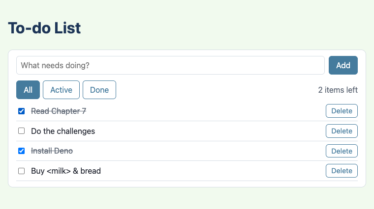
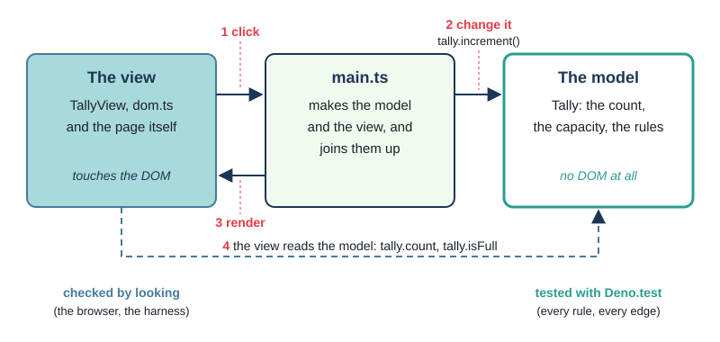
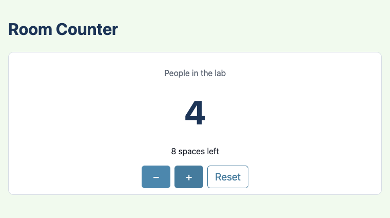
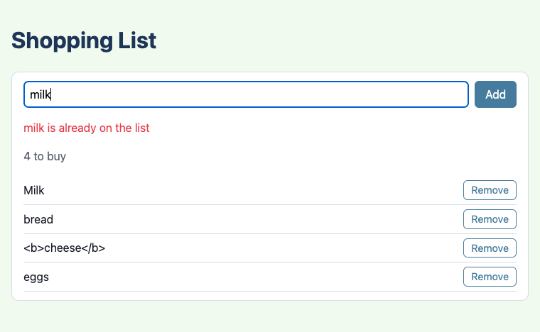
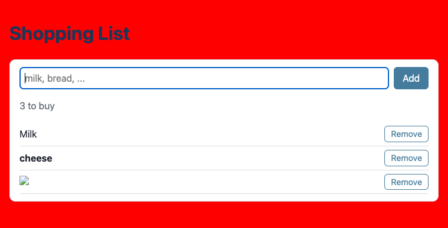
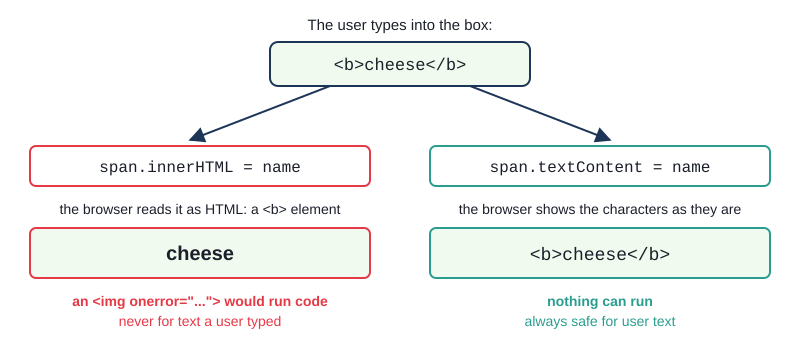

# Chapter 7 - Model and view

Since Chapter 2 your pages have followed one pattern: an object, an event, a render. As pages grow,
that pattern needs a firmer shape. This chapter splits every program into a **model** (classes that
hold the data and the rules, and know nothing about the page), a **view** (code that shows the
model, and does nothing else) and a thin `main.ts` that joins them. The model gets all the tests;
the view becomes so simple it hardly needs any.



## What you will learn

- what a model and a view are, and why the model must never touch the DOM
- writing a small view class whose `render` method copies the model onto the page
- `requireElement(selector)`: a helper that fails loudly, naming the element, when the page is
  missing one
- why `innerHTML` must never be given text a user typed, and how `textContent` keeps it safe
- passing functions (handlers) into a view, so the view can report clicks without changing the model
- event, model, render at a larger scale: many kinds of event, one path
- testing the model only, and why that is enough

## The projects

| Project | What it shows |
|---|---|
| [ch07_project01_tally_counter](projects/ch07_project01_tally_counter/) | a `Tally` model, a small `TallyView` class, `requireElement`, and the model developed test first |
| [ch07_project02_shopping_list](projects/ch07_project02_shopping_list/) | a model with rules about user input, a view that builds elements with `textContent`, and the `innerHTML` danger |
| [ch07_project03_todo_filters](projects/ch07_project03_todo_filters/) | two model classes, filters, a view given an object of handlers, and many events taking one path |

## Why split model and view?

Look back at Chapter 3's marks table. Its `main.ts` held the state (two booleans), the decisions
(which students to show, in which order) and the DOM code (building table rows), all in one file.
That worked because the page was small. Now imagine adding a search box, a second table and a chart.
Every new feature would touch the same file, and none of it could be tested, because tests run in
Deno, and Deno has no page.

The answer, used by almost every user interface ever written, is to split the program into parts
with different jobs:

- the **model** holds the data and the rules: "the count never goes below zero", "the same item
  cannot be added twice". It is made of ordinary classes and functions. It never touches the DOM -
  it does not know there *is* a page
- the **view** shows the model. It reads the model and copies what it finds onto the page. It makes
  no decisions about the data
- **`main.ts`** makes the model and the view and joins them, with listeners that change the model
  and then ask the view to render



Follow the numbers: (1) the user clicks; (2) the listener in `main.ts` changes the model; (3) it
calls the view's `render`; (4) the view reads the model and updates the page. Every event in this
chapter takes that path.

The payoff is on the right of the picture. Everything that can go wrong with the *data* lives in the
model, and the model can be tested with `Deno.test`, rule by rule and edge by edge. The view is left
with nothing to get wrong except "is it showing the right thing?" - which you can check by looking.

> **Note** - Up to now the rule has been "`main.ts` is the only file that touches the DOM". From this
> chapter on, the rule is: **model files never touch the DOM**. DOM code lives in `main.ts` and in
> view files - here `dom.ts` and the classes whose names end in `View`. That makes it easy to see
> which files are tested and which are not.

If you have met MVC (model-view-controller) in Java - Swing, or a web framework - this is the same
idea. `main.ts` plays the controller.

## Project 1: A tally counter



A lab has room for 12 people. A tally counter at the door counts them in and out: **+** when someone
comes in, **−** when someone leaves. The page shows how many are inside and how many spaces are left,
and says "Full" when nobody else may come in.

### The model, test first

Start with the model, and start with a test. The class is `Tally`; the first rules are that a new
tally starts at zero and that `increment` adds one. Those are quick to make pass. The interesting
rule is at the edge: if the room is empty and the **−** button is pressed, the count must not become
-1. Write that test before the code that makes it true:

`tests/Tally.test.ts`
```ts
Deno.test("decrement never goes below zero", () => {
  const tally = new Tally();
  tally.decrement();
  assertEquals(tally.count, 0);
});
```

With the simplest possible `decrement` - `this.current--;` - the test is red:

```text
decrement never goes below zero => ./tests/Tally.test.ts:18:6
error: AssertionError: Values are not equal.


    [Diff] Actual / Expected


-   -1
+   0
```

Make it green with the smallest change - do nothing when the room is empty. Then the other edge, the
capacity: a room for 2 must stop at 2.

```ts
Deno.test("increment stops at the room's capacity", () => {
  const tally = new Tally(2);
  tally.increment();
  tally.increment();
  tally.increment();
  assertEquals(tally.count, 2);
});
```

Red again (`-   3` / `+   2`), and green after one more guard. Then refactor: both guards ask a
question about the tally ("is it full?", "is it empty?"), and the view will want to ask the same
questions to switch its buttons off. So the questions become getters, and the methods use them:

`src/Tally.ts`
```ts
const DEFAULT_CAPACITY = 20;

export class Tally {
  private current: number = 0;

  // A parameter property (Chapter 5): `capacity` is a public, readonly field, set by the constructor.
  constructor(public readonly capacity: number = DEFAULT_CAPACITY) {
    if (capacity < 1) {
      throw new Error(`A room must hold at least 1 person, not ${capacity}`);
    }
  }

  /** How many people are in the room now. */
  public get count(): number {
    return this.current;
  }

  /** True when nobody else may come in. */
  public get isFull(): boolean {
    return this.current === this.capacity;
  }
  // ... isEmpty and spacesLeft are getters like these

  /** One more person comes in - unless the room is full. */
  public increment(): void {
    if (this.isFull) {
      return;
    }
    this.current++;
  }
  // ... decrement() and reset()
}
```

Everything here comes from the last two chapters: a parameter property with a default, `readonly`,
a field that is `private` and read through a `get` accessor, and an error thrown for a room that
could never be used. Notice what is *not* here: no `document`, no `HTMLElement`, no `textContent`.
The class would work just as well behind a command-line program or a phone app.

### Exercise 7.1 - A room for nobody

`new Tally(0)` makes no sense. Write a test that says so, using `assertThrows` (Chapter 4), and see
it fail before the check in the constructor exists. Try it before reading on.

Here is one way:

`tests/Tally.test.ts`
```ts
Deno.test("a room must hold at least one person", () => {
  assertThrows(() => new Tally(0), Error, "at least 1 person");
});
```

Without the `if` in the constructor, the red output is short:

```text
a room must hold at least one person => ./tests/Tally.test.ts:16:6
error: AssertionError: Expected function to throw.
```

The third argument checks that the error's message *contains* "at least 1 person", so the test
fails if the wrong error is thrown.

### requireElement: failing loudly

Before writing the view, deal with a problem that has been quietly waiting since Chapter 1. Every
`querySelector` so far has been followed by `if (x !== null)`, or by `x?.`. That keeps TypeScript
happy - but think about what it does when you mistype an id. `querySelector("#cuont")` gives `null`,
the `if` skips the code, and the page silently does nothing. No error, no message, nowhere to look.

For an element that the page *must* have, a missing element is a bug, and a bug should be loud.
Here is a helper that finds the element or throws an error that names it:

`src/dom.ts`
```ts
/**
 * The element that matches `selector` - or an error naming the selector, if there is none.
 * querySelector quietly gives null for a typo like "#cuont"; this makes the mistake loud,
 * in the browser's console, the moment the page starts.
 */
export const requireElement = <T extends HTMLElement>(selector: string): T => {
  const element = document.querySelector<T>(selector);
  if (element === null) {
    throw new Error(`No element matches "${selector}" - check index.html`);
  }
  return element;
};
```

The `<T extends HTMLElement>` is new. You have been *using* it since Chapter 1: in
`querySelector<HTMLButtonElement>("#add")`, the part in angle brackets tells the function which
kind of element to expect. `requireElement` simply passes that choice on. Read the first line as
"`requireElement` works for any type `T` that is some kind of `HTMLElement`; it takes a selector and
returns a `T`". So `requireElement<HTMLButtonElement>("#add")` returns an `HTMLButtonElement` - never
`null`, so no `if` is needed afterwards. (A function with a type in angle brackets is called
**generic**, like Java's `<T> T first(List<T> list)`. Book 2 covers generics properly; this is all
you need for now.)

If you leave out the `<HTMLButtonElement>`, `T` becomes plain `HTMLElement`, and the compiler stops
you using button-only properties:

```text
TS2339 [ERROR]: Property 'disabled' does not exist on type 'HTMLElement'.
```

To see the helper earn its keep, change `id="count"` to `id="cuont"` in `public/index.html` and
rebuild. The page stops at once, and the browser's console (in the developer tools) shows, in red:

```text
Error: No element matches "#count" - check index.html
    at requireElement (app.js:6:13)
    at <instance_members_initializer> (app.js:62:17)
    at new TallyView (app.js:61:19)
```

The message says what is missing and the stack says who wanted it. Compare that with a blank page
and no clue.

> **Note** - `requireElement` is not tested. It uses `document`, and Deno has no `document`: a test
> that makes a `TallyView` fails with `ReferenceError: document is not defined`. That is fine - it is
> four lines, and you have just checked it by hand. It is also exactly why the model must stay free
> of the DOM: one `document` in `Tally.ts` and none of its tests could run.

### The view class

The view's job is to make the page match the model. It needs the elements, and a method that copies
the model's state onto them:

`src/TallyView.ts`
```ts
import { requireElement } from "./dom.ts";
import type { Tally } from "./Tally.ts";

export class TallyView {
  private readonly countText = requireElement<HTMLElement>("#count");
  private readonly statusText = requireElement<HTMLElement>("#status");
  private readonly addButton = requireElement<HTMLButtonElement>("#add");
  private readonly removeButton = requireElement<HTMLButtonElement>("#remove");

  /** Makes the page match the tally. Safe to call as often as you like. */
  public render(tally: Tally): void {
    this.countText.textContent = `${tally.count}`;
    this.statusText.textContent = tally.isFull ? "Full - nobody else may come in" : `${tally.spacesLeft} spaces left`;
    this.statusText.classList.toggle("bad", tally.isFull);
    // The buttons that would do nothing are switched off, so the page shows the model's rules.
    this.addButton.disabled = tally.isFull;
    this.removeButton.disabled = tally.isEmpty;
  }
}
```

A few things to notice:

- The elements are found **once**, when `new TallyView()` runs: field initialisers run as part of
  the constructor, as in Java. If one is missing, the error comes immediately, not on the first click.
- The fields are `private readonly`: nothing outside can reach into the view's elements, and the
  view never swaps one for another.
- `import type` imports `Tally` for its *type* only - the view never makes a `Tally`, it is given
  one. (Chapter 9 says more about `import type`.)
- `render` asks the model questions (`count`, `isFull`, `spacesLeft`, `isEmpty`) and makes no
  decisions of its own about the data. "Is the room full?" is answered by `Tally`, which is tested.
  The view only decides how "full" *looks*: red text and a disabled button.
- `render` can be called any number of times, in any state, and always gives the right page. It
  does not "add one to the number on the screen"; it shows whatever the model says now.

`classList.toggle("bad", tally.isFull)` adds the class when the second argument is true and removes
it when it is false - one line instead of an `if` and an `else`. `button.disabled = true` greys a
button out and stops it being clicked.

### Joining them up

`main.ts` is now short, and every listener has the same shape:

`src/main.ts`
```ts
const ROOM_CAPACITY = 12;

const tally = new Tally(ROOM_CAPACITY);
const view = new TallyView();

const render = (): void => view.render(tally);

requireElement<HTMLButtonElement>("#add").addEventListener("click", () => {
  tally.increment();
  render();
});
requireElement<HTMLButtonElement>("#remove").addEventListener("click", () => {
  tally.decrement();
  render();
});
// ... #reset the same way

render();
```

Change the model, then render. The listener never touches the count on the screen, and the view
never changes the count in the model. And the final `render()` matters: without it the page would
show the placeholder text until the first click.

> **Try it** - In `main.ts`, comment out the `render();` inside the **+** listener and rebuild.
> Click **+** three times: the page still says 0, and **−** is still greyed out. The model has three
> people in it; the page just was not told. Forgetting to render is the commonest model-view bug,
> and no test of the model will catch it.

## Project 2: A shopping list



A tally only has buttons. A shopping list has an input box, which brings two new problems: the
model must decide what input it accepts, and the view must show text that a *user* typed.

### Rules about input

The model, `ShoppingList`, keeps the items in an array. Its rules: no blank items, no item twice
(ignoring case - "Milk" and "milk" are the same thing), and spaces round an item are removed.

When the user types something the list refuses, the page should say why. So the model has a method
that answers "what is wrong with this?" - a message, or `null` if nothing is:

`src/ShoppingList.ts`
```ts
export class ShoppingList {
  private readonly items: string[] = [];

  public problemWith(text: string): string | null {
    const name = text.trim();
    if (name === "") {
      return "Type an item first";
    }
    const lower = name.toLowerCase();
    if (this.items.some((item) => item.toLowerCase() === lower)) {
      return `${name} is already on the list`;
    }
    return null;
  }

  /** Adds an item, without the spaces round it. Throws if problemWith would complain. */
  public add(text: string): void {
    const problem = this.problemWith(text);
    if (problem !== null) {
      throw new Error(problem);
    }
    this.items.push(text.trim());
  }
  // ... remove(index), and the getters all and size
}
```

`some` is another array method, like `find` (Chapter 3): it is true if the function is true for at
least one element.

The duplicate rule was written test first, and the first attempt was too simple:
`this.items.includes(name)`. This test caught it:

`tests/ShoppingList.test.ts`
```ts
Deno.test("an item already on the list is a problem, whatever its case", () => {
  assertEquals(listOf(["Milk"]).problemWith("milk"), "milk is already on the list");
});
```

```text
an item already on the list is a problem, whatever its case => ./tests/ShoppingList.test.ts:32:6
error: AssertionError: Values are not equal.


    [Diff] Actual / Expected


-   null
+   "milk is already on the list"
```

`includes` compares strings exactly, and `"Milk" === "milk"` is false. Comparing lower-case copies
turns it green.

`listOf` is a helper in the test file that makes a list with some items already on it, so each test
can set itself up in one line (Chapter 4's "helper functions instead of `beforeEach`"):

```ts
const listOf = (names: string[]): ShoppingList => {
  const list = new ShoppingList();
  for (const name of names) {
    list.add(name);
  }
  return list;
};
```

Why both `problemWith` *and* a throwing `add`? They do different jobs. `problemWith` is for the view:
a polite answer to show the user. The `throw` in `add` guards the model's **invariant** (Chapter 6):
whatever code calls it, a blank or duplicate item can never get onto the list. A test checks both:

```ts
Deno.test("adding a problem item throws, and leaves the list alone", () => {
  const list = listOf(["milk"]);
  assertThrows(() => list.add("MILK"), Error, "already on the list");
  assertEquals(list.all, ["milk"]);
});
```

### Handing out a copy

The view needs the items, but it must not be able to change them. If `all` returned the model's own
array, any code could `push` onto it and skip every rule. So it returns a copy:

```ts
  /** A copy of the items, so code outside cannot change the list behind the model's back. */
  public get all(): string[] {
    return [...this.items];
  }
```

`[...this.items]` makes a new array with the same elements (the `...` spreads them out; Chapter 9
looks at copying in detail). A test proves the copy is a copy:

```ts
Deno.test("changing the copy from all does not change the list", () => {
  const list = listOf(["milk"]);
  list.all.push("cake");
  assertEquals(list.size, 1);
});
```

### innerHTML and textContent

Chapter 3's marks table built its rows in one statement, with `innerHTML` and a template literal. It
is tempting to do the same here:

```ts
// WRONG: the names were typed by the user, and innerHTML treats them as HTML.
this.listElement.innerHTML = items.map((name) => `<li><span>${name}</span><button class="secondary">Remove</button></li>`).join("");
```

It works for "milk". Now type `<b>cheese</b>` into the box. With this line, "cheese" appears in
bold - the browser did not show your text, it *obeyed* it. Then try this:

```text

```

The browser makes an image, fails to load `x`, runs the `onerror` code - and the whole page turns red:



Turning a page red is harmless. But that box would run *any* JavaScript, and on a real site the
"user" might be an attacker whose text is saved and later shown to other people: their code would
then run in every visitor's browser, able to read the page and send what it finds anywhere. This is
called **cross-site scripting** (XSS), and it is one of the most common security holes on the web.



The rule is simple:

- **`textContent`** puts characters on the page, exactly as they are. `<b>` is shown as the three
  characters `<`, `b`, `>`. Nothing is ever run. Use it for anything that came from a user, a file or
  another computer
- **`innerHTML`** is read as HTML. Use it only for HTML *you* wrote, with nothing typed by a user
  inside it - or not at all

Chapter 3's marks table was safe because its names came from your own JSON file. The shopping list is
not, so its view builds each item with `createElement` and `textContent`:

`src/ShoppingListView.ts`
```ts
  /** One <li>: the item's name, as text, and a Remove button. */
  private itemElement(name: string, index: number): HTMLLIElement {
    const item = document.createElement("li");
    const label = document.createElement("span");
    label.textContent = name; // text, never HTML: "<b>milk</b>" is shown just as it was typed
    const removeButton = document.createElement("button");
    removeButton.textContent = "Remove";
    removeButton.className = "secondary";
    // An arrow function, so `this` is still the view (Chapter 3's this trap), and `index` is remembered.
    removeButton.addEventListener("click", () => this.onRemove(index));
    item.append(label, removeButton);
    return item;
  }
```

`append` is like `appendChild`, but takes any number of children. The screenshot at the top of this
section shows the result: `<b>cheese</b>` on the list, exactly as typed.

### A view that reports clicks

The Remove buttons belong to the view - it makes them - but removing an item is a change to the
model, which is `main.ts`'s business. So the view is *given* a function to call when a Remove button
is clicked, in its constructor:

`src/ShoppingListView.ts`
```ts
/** What the view calls when a Remove button is clicked: main.ts decides what that means. */
export type RemoveHandler = (index: number) => void;

export class ShoppingListView {
  private readonly listElement = requireElement<HTMLUListElement>("#items");
  private readonly messageText = requireElement<HTMLElement>("#message");
  private readonly summaryText = requireElement<HTMLElement>("#summary");

  constructor(private readonly onRemove: RemoveHandler) {}

  /** Makes the page show these items. */
  public render(items: string[]): void {
    // Empty the list first. replaceChildren() with nothing in the brackets removes every child.
    this.listElement.replaceChildren();
    items.forEach((name, index) => this.listElement.appendChild(this.itemElement(name, index)));
    this.summaryText.textContent = items.length === 0 ? "Nothing on the list yet" : `${items.length} to buy`;
  }
  // ... showMessage(text), itemElement(name, index)
}
```

`RemoveHandler` is a function type (Chapter 3), and the constructor uses a parameter property to keep
it. `forEach` calls a function for every element, passing the element *and its index* - handy here,
because each Remove button needs to know which item it removes.

`render` starts by emptying the list and then builds every item again. That sounds wasteful, but for
a list of tens or hundreds of items it is instantly fast, and it means the page can never get out of
step with the model.

In `main.ts`, the handler is an arrow function: change the model, then render.

`src/main.ts`
```ts
const view = new ShoppingListView((index) => {
  list.remove(index);
  view.showMessage("");
  render();
});

const addItem = (): void => {
  // Ask the model first: if there is a problem, show it and change nothing.
  const problem = list.problemWith(input.value);
  if (problem !== null) {
    view.showMessage(problem);
    return;
  }
  list.add(input.value);
  view.showMessage("");
  input.value = "";
  render();
};
```

`addItem` is called by the Add button and by Enter in the input box (a `keydown` listener, as in
Chapter 2). It does not decide what counts as a problem - the model does - it only decides what to do
with the answer.

### Exercise 7.2 - An empty list

When the list is empty the page should say "Nothing on the list yet" rather than "0 to buy". Which
file changes, and does the model need a new test? Try it before reading on.

Here is one way: it is one line in the view's `render`, shown above -
`items.length === 0 ? "Nothing on the list yet" : ...`. The model does not change at all: it already
says how many items there are. Wording is the view's job. (If the wording ever grew real rules -
"1 thing to buy", "2 things to buy" - those rules would move out of the view into a function that can
be tested, as the next project shows.)

## Project 3: A to-do list with filters


The last project puts everything together at a larger scale. A to-do list has more kinds of event -
adding, ticking off, deleting, choosing a filter - and its state is more than one object. But every
event still takes the same path.

### Two model classes

One to-do is a small class:

`src/Todo.ts`
```ts
export class Todo {
  private isDone: boolean = false;

  constructor(public readonly id: number, public readonly text: string) {}

  /** True once the to-do has been ticked off. */
  public get done(): boolean {
    return this.isDone;
  }

  /** Done becomes not done, and not done becomes done. */
  public toggle(): void {
    this.isDone = !this.isDone;
  }
}
```

And the list hands out ids and finds to-dos by them:

`src/TodoList.ts`
```ts
export class TodoList {
  private todos: Todo[] = [];
  private nextId: number = 1;

  /** Adds a to-do (without the spaces round it) and gives it back. Throws for blank text. */
  public add(text: string): Todo {
    const trimmed = text.trim();
    if (trimmed === "") {
      throw new Error("A to-do needs some text");
    }
    const todo = new Todo(this.nextId, trimmed);
    this.nextId++;
    this.todos.push(todo);
    return todo;
  }

  /** Ticks off (or un-ticks) the to-do with this id. */
  public toggle(id: number): void {
    this.get(id).toggle();
  }

  /** The to-dos that `filter` shows, oldest first. */
  public visible(filter: Filter): Todo[] {
    return this.todos.filter((todo) => matchesFilter(todo, filter));
  }

  /** How many to-dos are not done yet. */
  public get remaining(): number {
    return this.visible("active").length;
  }
  // ... remove(id), and a private get(id) that throws if there is no such to-do
}
```

Why ids, when the shopping list used positions? Because the to-do list is filtered. When "Active" is
chosen, the first to-do *on the screen* might be the third in the list, so "delete item 0" would
delete the wrong one. An id belongs to the to-do itself and never changes, so the view can say
"delete to-do 3" whatever is showing. A test makes sure ids are never reused:

`tests/TodoList.test.ts`
```ts
Deno.test("ids are never reused after a remove", () => {
  const list = sampleList();
  list.remove(3);
  assertEquals(list.add("Water plants").id, 4);
});
```

### Filters

A filter is one of three words. A plain `string` would also allow `"al"` or `"Done"`, and the mistake
would show up only as an empty list. So the type lists the words allowed:

`src/filter.ts`
```ts
export type Filter = "all" | "active" | "done";

/** Every filter, in the order the buttons appear. */
export const FILTERS: Filter[] = ["all", "active", "done"];

/** True if `todo` should be shown when `filter` is chosen. */
export const matchesFilter = (todo: Todo, filter: Filter): boolean => {
  if (filter === "active") {
    return !todo.done;
  }
  if (filter === "done") {
    return todo.done;
  }
  return true;
};
```

`"all" | "active" | "done"` is a union, like `number | null` - but of three particular strings.
`visible("Done")` is now a compile error, not a bug. Chapter 8 compares this with Java-style enums.

### Keeping words out of the view

The view shows "2 items left". Suppose `render` simply wrote:

```ts
this.remainingLabel.textContent = `${remaining} items left`;
```

Then, with one to-do left, the page would say "1 items left". The fix is a rule - one is singular, zero gets its own words - and
rules belong where they can be tested. So the words moved into a plain function in its own file:

`src/messages.ts`
```ts
/** "1 item left", "3 items left", "Nothing left to do". */
export const remainingText = (count: number): string => {
  if (count === 0) {
    return "Nothing left to do";
  }
  return count === 1 ? "1 item left" : `${count} items left`;
};
```

`messages.ts` is not the model (it knows nothing about to-dos) and not the view (it touches no DOM).
It is a small piece of logic that the view *uses*, and because it touches no DOM, it is tested:

`tests/messages.test.ts`
```ts
Deno.test("remaining: none, one, and more than one", () => {
  assertEquals(remainingText(0), "Nothing left to do");
  assertEquals(remainingText(1), "1 item left");
  assertEquals(remainingText(2), "2 items left");
});
```

`emptyText(filter)`, the message shown instead of an empty list ("Nothing done yet"), lives there
too. The general rule: **if a piece of view code has an `if` in it that could be wrong, move the `if`
somewhere it can be tested.**

### Exercise 7.3 - Write the test first

Suppose `remainingText` did not exist yet. Write its test first and run it (it fails to compile,
which counts as red). Then write the function. Which edge would you most expect to get wrong?

Here is one way: the test above, written first. The edge most people miss is 1 - "1 items left" is
the bug that started this section. The 0 case is a choice: "0 items left" would be correct, but the
test makes you decide.

### A view with several handlers

The to-do view needs to report three kinds of click: a checkbox, a Delete button, a filter button.
Rather than three constructor parameters, it takes one object with three functions in it:

`src/TodoView.ts`
```ts
/** What main.ts wants to happen for each kind of click. One function type per event. */
export type TodoHandlers = {
  onToggle: (id: number) => void;
  onRemove: (id: number) => void;
  onFilter: (filter: Filter) => void;
};

export class TodoView {
  private readonly listElement = requireElement<HTMLUListElement>("#todos");
  private readonly emptyMessage = requireElement<HTMLElement>("#empty");
  private readonly remainingLabel = requireElement<HTMLElement>("#remaining");

  constructor(private readonly handlers: TodoHandlers) {
    // The filter buttons never change, so their listeners are added once, here.
    for (const filter of FILTERS) {
      this.filterButton(filter).addEventListener("click", () => this.handlers.onFilter(filter));
    }
  }

  /** Makes the page show these to-dos, this count, and which filter is chosen. */
  public render(todos: Todo[], remaining: number, filter: Filter): void {
    this.listElement.replaceChildren();
    for (const todo of todos) {
      this.listElement.appendChild(this.todoElement(todo));
    }
    this.emptyMessage.textContent = todos.length === 0 ? emptyText(filter) : "";
    this.remainingLabel.textContent = remainingText(remaining);
    for (const name of FILTERS) {
      this.filterButton(name).classList.toggle("chosen", name === filter);
    }
  }
  // ... filterButton(filter) and todoElement(todo)
}
```

`TodoHandlers` is an object type (Chapter 3) whose properties are function types. Each to-do's
checkbox calls `this.handlers.onToggle(todo.id)` and each Delete button calls
`this.handlers.onRemove(todo.id)`, from arrow-function listeners made in `todoElement`. The text goes
in with `textContent`, as in the shopping list.

Notice what the view is given: the to-dos to show, the count, and the filter - already worked out.
It does not filter or count anything itself.

### Event, model, render - at scale

Here is the whole of the wiring in `main.ts`:

`src/main.ts`
```ts
const list = new TodoList();
let filter: Filter = "all";

const view = new TodoView({
  onToggle: (id) => {
    list.toggle(id);
    render();
  },
  onRemove: (id) => {
    list.remove(id);
    render();
  },
  onFilter: (chosen) => {
    filter = chosen;
    render();
  },
});

const render = (): void => view.render(list.visible(filter), list.remaining, filter);
```

Four kinds of event (with adding a to-do, below these lines), and every one is the same two steps:
change the state, then `render()`. The state is the `TodoList` *and* the chosen filter: the filter
is part of what the page shows, so it is state too, even though it is a plain variable.

`render` refers to `view`, and the handlers refer to `render`, which is defined after them. That is
fine: the arrow functions do not *run* until a click happens, and by then both constants exist.

This is the payoff of the pattern. Nowhere does a listener reach into the page and tweak one element
("strike through this line", "change that number"). Each change is made in exactly one place, the
model, and `render` rebuilds the page from it. Add a fifth kind of event and you write two lines; the
page cannot end up showing a count that disagrees with the list.

### Testing the model only

The project has 17 tests, and every one is of a model class or a plain function: `Todo`, `TodoList`,
`matchesFilter`, `remainingText` and `emptyText`. Here are the filters, using a helper that makes a
list of three with the middle one done:

`tests/TodoList.test.ts`
```ts
Deno.test("the active filter hides done to-dos", () => {
  assertEquals(textsOf(sampleList().visible("active")), ["Buy milk", "Ring Gran"]);
});

Deno.test("the done filter shows only done to-dos", () => {
  assertEquals(textsOf(sampleList().visible("done")), ["Post letter"]);
});
```

What is *not* tested is `TodoView` and `main.ts`. Is that a gap? Look at what is in them: finding
elements, `createElement`, `textContent`, adding listeners, and calls to the model. None of it makes
a decision about the data, so there is very little that a test could catch that a glance at the page
would not. (Testing views is possible - with a fake `document` from a library, or a headless browser
like the one this book uses for its screenshots - but it is slower and more fragile, and it pays
only once the model tests are in place.)

That is the deal model-view offers: **keep the view thin, and put everything that can be wrong
where it can be tested.**

## Java and TypeScript

| Java | TypeScript |
|---|---|
| Swing: a model class, a `JPanel` view, listeners as the controller | a model class, a view class, `main.ts` as the controller |
| `label.setText(name)` - always plain text | `element.textContent = name` - plain text; `innerHTML` is not |
| JSP/Thymeleaf escape `<` and `>` for you | the DOM does not: choose `textContent` yourself |
| `Objects.requireNonNull(x, "message")` | `requireElement(selector)` - throws, naming what is missing |
| `<T extends Component> T find(String id)` | `<T extends HTMLElement>(selector: string): T` |
| an `ActionListener` passed to a view | a function (or an object of functions) passed to a view's constructor |
| `Collections.unmodifiableList(items)` or `List.copyOf(items)` | `[...this.items]` - a copy |
| an `enum Filter { ALL, ACTIVE, DONE }` | `type Filter = "all" \| "active" \| "done"` |

## Summary

- the **model** holds the data and the rules and never touches the DOM; the **view** shows the model
  and makes no decisions about the data; **`main.ts`** makes both and joins them
- every event takes the same path: change the model, then render; `render` rebuilds the page from the
  model, so it can be called at any time
- a view class finds its elements once, in its constructor, and keeps them in `private readonly`
  fields
- `requireElement<T>(selector)` returns the element or throws an error naming the selector, so a
  typo in an id is loud instead of silent
- `textContent` shows text exactly as it is; `innerHTML` runs it as HTML - never give `innerHTML`
  anything a user typed (cross-site scripting)
- a view reports clicks by calling functions it was given (`RemoveHandler`, `TodoHandlers`) - it does
  not change the model itself
- give out copies (`[...items]`), find things by id rather than position when the view filters, and
  use a union of strings for a fixed set of choices
- test the model, and move any rule that creeps into the view (like "1 item" vs "2 items") into a
  function that can be tested

## Challenges

Each challenge says which project to start from. Write the tests first, keep the model free of the
DOM, and keep every user's text out of `innerHTML`.

### 1. Nearly full

*Start from `ch07_project01_tally_counter`.* When the room is at least 80% full (but not full), the
status should turn orange and say "Nearly full - 2 spaces left". Add a getter `isNearlyFull` to
`Tally`, test first: test a room of 10 with 7, 8 and 10 people in it. Then use it in the view.

### 2. Clear the list

*Start from `ch07_project02_shopping_list`.* Add a **Clear all** button that empties the list. Give
`ShoppingList` a `clear()` method, test first. The button should be disabled when the list is
already empty - which file decides that, and what does it ask the model?

### 3. Two rooms

*Start from `ch07_project01_tally_counter`.* Count two rooms on one page: the lab (12 people) and the
library (30). Use two `Tally` objects and **two** `TallyView` objects. Write a test first that shows
two tallies are independent (incrementing one leaves the other at zero). Then change `TallyView` so
it can be told which part of the page is its own.

### 4. Clear done

*Start from `ch07_project03_todo_filters`.* Add a **Clear done** button that removes every to-do that
is done. Give `TodoList` a method `clearDone(): number` that returns how many it removed, test first
(including a list where nothing is done). Show "Removed 2" for a moment, and disable the button when
there is nothing to clear.

*Hint:* `filter` keeps the to-dos that are not done; compare the lengths before and after. A getter
that says whether anything is done lets the view disable the button without counting.

### 5. Move up and down

*Start from `ch07_project03_todo_filters`.* Give each to-do ▲ and ▼ buttons that move it up or down
the list. Write `moveUp(id)` and `moveDown(id)` test first: an ordinary move, and both edges (the
first to-do cannot move up, the last cannot move down - nothing happens). Then think about filters:
what should "up" mean when "Active" is chosen and the to-do above is done and hidden?

*Hint:* find the to-do's position in the private array, then swap two elements:
`[a[i], a[i - 1]] = [a[i - 1], a[i]]`. Add the new handlers to `TodoHandlers`; the compiler will show
you every place that needs them.

### 6. Remember the list

*Start from `ch07_project03_todo_filters`.* Make the to-dos survive a page reload, using the
browser's `localStorage`. The model must still know nothing about the browser: give `TodoList` a
method that turns the list into plain data (`{ id, text, done }[]`) and a way to build a list from
such data, and test that a list survives the round trip - ids, text, done, and the next id handed out.
`main.ts` does the saving and loading.

*Hint:* `localStorage.setItem("todos", JSON.stringify(data))` saves a string;
`localStorage.getItem("todos")` gives it back, or `null` the first time; `JSON.parse` turns it back
into data. Save after every change - there is already one place every change goes through.

---

Next: [Chapter 8 - Constants, static and enums](../ch08_constants_static_enums/README.md)
