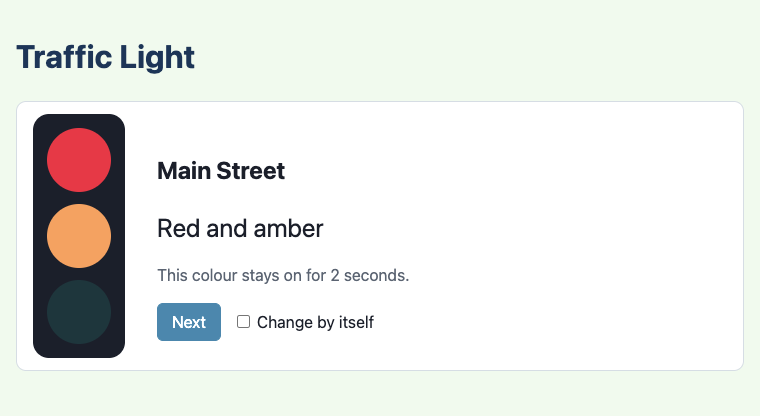
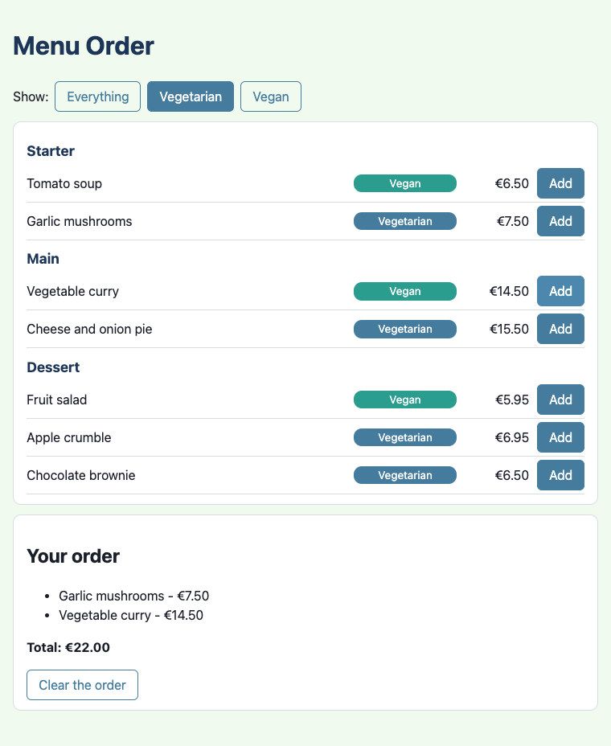
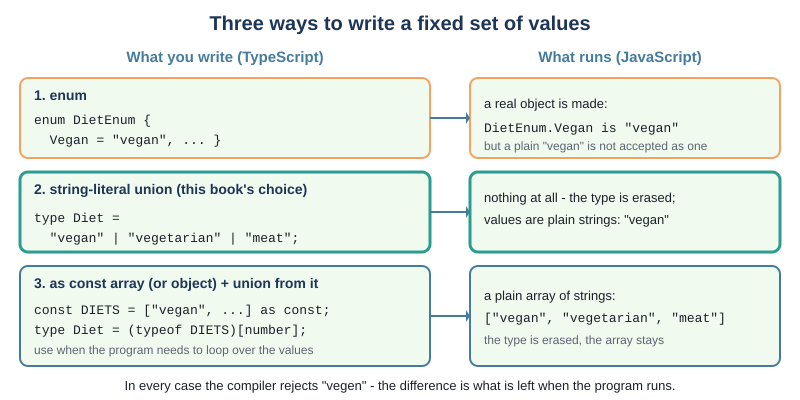
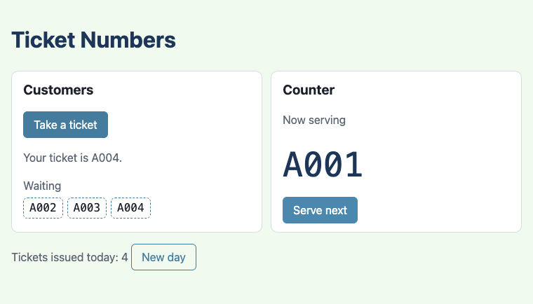
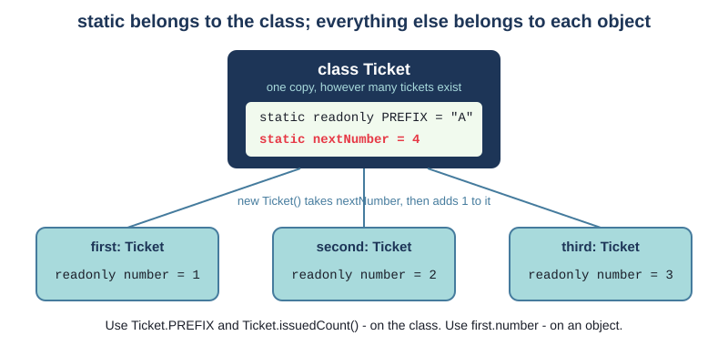

# Chapter 8 - Constants, static and enums

Some values never change: the colours a traffic light can show, the diets on a menu, the letter
printed on a ticket. Some values belong to a whole class rather than to any one object: the number
the *next* ticket will get. This chapter is about both. You will see TypeScript's three kinds of
"never changes" (`const`, `readonly` and `static readonly`), static fields and methods, and the
three ways TypeScript can say "one of these values and nothing else" - including why this book
uses string-literal unions rather than Java-style enums.



## What you will learn

- when to use `const`, `readonly` and `static readonly`, and how they compare with Java's `final`
  and `static final`
- string-literal union types such as `"red" | "amber" | "green"`, and `switch` statements that the
  compiler checks cover every value
- testing every value of a union, with a loop instead of copy and paste
- static fields and static methods, and calling them on the class: `Ticket.issuedCount()`
- what static state does to tests, and how to keep tests independent of each other
- TypeScript's `enum`, unions and `as const`, side by side - and which to choose
- checking strings from a JSON file against a union, and throwing an error for a bad one

## The projects

| Project | What it shows |
|---|---|
| [ch08_project01_traffic_light](projects/ch08_project01_traffic_light/) | a union type for the colours, a `switch` over every value, `static readonly` and `readonly` in one class, `Record` |
| [ch08_project02_menu_order](projects/ch08_project02_menu_order/) | `enum`, union and `as const` compared; diets and courses checked as they come in from JSON; a static factory method |
| [ch08_project03_ticket_numbers](projects/ch08_project03_ticket_numbers/) | a static counter shared by every ticket, static methods, and keeping tests independent when there is static state |

## Three kinds of "never changes"

In Java you write `final` for a variable that is never reassigned, and `public static final` for a
class constant such as `Math.PI`. TypeScript splits the job three ways, depending on *where* the
value lives:

| You want | TypeScript | Java |
|---|---|---|
| a variable (or a module-level value) that is never reassigned | `const LIMIT = 3;` | `final int limit = 3;` |
| a field that each object sets once, in the constructor | `readonly name: string` | `private final String name;` |
| one value for the whole class, used as `ClassName.VALUE` | `static readonly PREFIX = "A";` | `public static final String PREFIX = "A";` |

You have used the first since Chapter 1, and Chapter 6 introduced the second. All three are checked
by the compiler, and all three give the same kind of message when you try to break them:

```text
TS2588 [ERROR]: Cannot assign to 'LIMIT' because it is a constant.
TS2540 [ERROR]: Cannot assign to 'name' because it is a read-only property.
TS2540 [ERROR]: Cannot assign to 'STARTING_COLOUR' because it is a read-only property.
```

The naming rule is the same as in Java: class constants and module constants that are fixed
settings are written in `UPPER_CASE` (`MILLISECONDS_PER_SECOND`, `Ticket.PREFIX`); ordinary
`const` variables inside functions are written in `camelCase`.

## Project 1: A traffic light


A UK traffic light shows four things, always in the same order: red, then red and amber together
(get ready), then green, then amber, then red again. Press **Next** to step through them, or tick
**Change by itself** to let a timer do it.

### A type with exactly four values

How should the program store "the colour the light is showing"? A `string` would work, but it would
also accept `"blue"`, `"Red"` and `"gren"`. Java's answer is an `enum`. TypeScript's simplest answer
is a **string-literal union type**:

`src/light_colour.ts`
```ts
/** One of the four things a UK traffic light can show. */
export type LightColour = "red" | "red-amber" | "green" | "amber";
```

You have met unions before: `number | null` means "a number, or null". Here each part of the union
is not a whole type but a single string value, so `LightColour` means "one of these four strings,
and nothing else". At run time a `LightColour` is just a string - you can print it, compare it with
`===`, put it in a template literal - but the compiler checks every place one is made:

```text
TS2345 [ERROR]: Argument of type '"purple"' is not assignable to parameter of type 'LightColour'.
export const a = nextColour("purple");
```

Your editor knows the four values too: type `nextColour("` and it offers them.

### `nextColour`, test first

The light needs one rule: which colour comes after which. That is a function from `LightColour` to
`LightColour`, and a good one to write test first.

**Red.** The first test, in `tests/light_colour.test.ts`:

```ts
Deno.test("after red comes red and amber", () => {
  assertEquals(nextColour("red"), "red-amber");
});
```

**Green.** The simplest code that passes:

```ts
export const nextColour = (colour: LightColour): LightColour => "red-amber";
```

(The linter points out that `colour` is never used. The next test will need it.)

**Red again.** A second test:

```ts
Deno.test("after red and amber comes green", () => {
  assertEquals(nextColour("red-amber"), "green");
});
```

It fails, because `nextColour` always says `"red-amber"`:

```text
not ok 2 - after red and amber comes green
  ---
  message: |-
    AssertionError: Values are not equal.

        [Diff] Actual / Expected

    -   red-amber
    +   green
```

**Green - and a surprise.** Now the function has to look at the colour. A `switch` suits a union
well: one `case` per value. Write just the two cases the tests need:

```ts
export const nextColour = (colour: LightColour): LightColour => {
  switch (colour) {
    case "red":
      return "red-amber";
    case "red-amber":
      return "green";
  }
};
```

Both tests pass - but the build reports a type error:

```text
TS2366 [ERROR]: Function lacks ending return statement and return type does not include 'undefined'.
export const nextColour = (colour: LightColour): LightColour => {
                                                 ~~~~~~~~~~~
```

The compiler knows that `colour` could also be `"green"` or `"amber"`, and that for those the
function would fall off the end and return nothing - which is not a `LightColour`. It is acting like
a test you did not have to write: *every value must be handled*. So the "simplest code that passes"
here is all four cases:

`src/light_colour.ts`
```ts
/** The colour that comes after this one. A UK light goes red, red and amber, green, amber, red... */
export const nextColour = (colour: LightColour): LightColour => {
  // A switch over a union: the compiler knows the four possible values. Because the return type is
  // LightColour, leaving a case out is a compile error ("Function lacks ending return statement").
  switch (colour) {
    case "red":
      return "red-amber";
    case "red-amber":
      return "green";
    case "green":
      return "amber";
    case "amber":
      return "red";
  }
};
```

Then add the tests for green and amber, one behaviour each, so that every case is pinned down by a
test as well as by the compiler.

Two things to notice about this `switch`. There is no `break`: each case ends with `return`. And
there is no `default:`. A `default` would make the compiler happy even with a case missing - which
is exactly what you do not want. Leave it out, and when someone adds a fifth colour to the union,
the compiler shows them every `switch` that needs a new case. (A typo is caught too: `case "gren":`
gives `Type '"gren"' is not comparable to type 'LightColour'.`)

> **Note** - This only works because the return type is written. Without `: LightColour`, the
> two-case version compiles: TypeScript quietly works out the return type as
> `"red-amber" | "green" | undefined`, and the problem only shows up later, if at all, wherever the
> result is used. One more reason this book always writes return types.

### Testing every value

A union has a small, fixed number of values, so you can test *all* of them. To do that the tests
need the values in an array:

`src/light_colour.ts`
```ts
/** Every colour, in the order the light shows them - so the tests can check every one. */
export const LIGHT_COLOURS: LightColour[] = ["red", "red-amber", "green", "amber"];
```

and then a loop does the work of four copied tests:

`tests/light_colour.test.ts`
```ts
Deno.test("every colour comes back to itself after four steps", () => {
  for (const colour of LIGHT_COLOURS) {
    const afterFour = nextColour(nextColour(nextColour(nextColour(colour))));
    assertEquals(afterFour, colour);
  }
});
```

This test says something the four single tests do not: the sequence is a *cycle*. Another test
checks that four steps visit every colour exactly once, and another that every colour has a name to
show on the page (`colourName`, a second `switch`).

There is a weakness here. The colours are written twice - once in the type, once in the array - and
nothing stops someone adding a colour to the type and forgetting the array. The tests would then
quietly skip the new colour. Project 2 shows how to write the values once and get both.

### `static readonly` and `readonly` together

The `TrafficLight` class holds the current colour. It uses both kinds of read-only field:

`src/TrafficLight.ts`
```ts
export class TrafficLight {
  // static readonly: one value for the whole class, shared by every light, never reassigned.
  // Used from outside as TrafficLight.STARTING_COLOUR - no object needed.
  public static readonly STARTING_COLOUR: LightColour = "red";

  /** How many seconds each colour stays on. Record<LightColour, number> needs a key for every colour. */
  public static readonly SECONDS: Record<LightColour, number> = {
    "red": 5,
    "red-amber": 2,
    "green": 5,
    "amber": 3,
  };

  private colour: LightColour = TrafficLight.STARTING_COLOUR;

  // readonly (a parameter property): each light has its own name, set once in the constructor.
  constructor(public readonly name: string) {}
```

`STARTING_COLOUR` and `SECONDS` are the same for every traffic light, so they belong to the
**class**: there is one copy, however many lights exist, and you reach them through the class name -
`TrafficLight.SECONDS`, never `this.SECONDS` - even inside the class. `name` is different for each
light ("Main Street", "Station Road"), so it belongs to each **object**; `readonly` means it is set
in the constructor and never changed. The test "each light keeps its own name" makes two lights and
checks each one.

`Record<LightColour, number>` is new. It is a built-in type meaning "an object with one property
for every `LightColour`, each holding a `number`". Because the keys come from the union, the
compiler checks that none is missing. Leave out `"red-amber"` and you get:

```text
TS2741 [ERROR]: Property '"red-amber"' is missing in type '{ red: number; green: number; amber: number; }' but required in type 'Record<LightColour, number>'.
```

(`"red-amber"` needs quotes as a key because of the `-`; the others are quoted to match.)

`main.ts` uses the seconds to set a timer for each colour, and a module-level `const` for the
conversion - a plain value, with no class needed:

`src/main.ts`
```ts
// A module-level const: a plain value that is never reassigned. No class needed.
const MILLISECONDS_PER_SECOND = 1000;
```

> **Note** - `readonly` is shallow. `TrafficLight.SECONDS = {...}` is an error, but
> `TrafficLight.SECONDS.red = 99` compiles: the property `SECONDS` cannot be pointed at a different
> object, but the object it points to can still be changed. Java's `final` behaves the same way with
> a `final` array or list. Chapter 9 looks at this properly.

### Exercise 8.1 - One full cycle

Write a test that checks one full cycle of the light - all four colours - takes 15 seconds. Use
`LIGHT_COLOURS` and `TrafficLight.SECONDS`, so the test still makes sense if a colour is added. Try
it before reading on.

Here is one way:

```ts
Deno.test("one full cycle takes 15 seconds", () => {
  const total = LIGHT_COLOURS.reduce((sum, colour) => sum + TrafficLight.SECONDS[colour], 0);
  assertEquals(total, 15);
});
```

`TrafficLight.SECONDS[colour]` looks up a property using a variable, as you would with a Java
`Map`. TypeScript allows it because `colour` is a `LightColour`, and `Record<LightColour, number>`
promises a number for every one.

## Project 2: Menu order - three ways to write an enum



The menu has dishes in three courses, and each dish is vegan, vegetarian or contains meat. The
buttons at the top show only the dishes that suit a diet, and **Add** puts a dish on the order.

### Java's enum

The Java version of a diet is an `enum`:

```java
public enum DietType {
    VEGAN,
    VEGETARIAN,
    CARNIVORE
}
```

It solves the problem that integer codes (`public static final int VEGAN = 0;`) cannot: a
`DietType` variable can only hold one of the three values, and the code reads as words. TypeScript
can do the same thing three ways. `src/three_ways.ts` has all three side by side, and
`tests/three_ways.test.ts` shows how each behaves. Nothing on the page uses that file; it is there
for comparison.



### Way 1: `enum`

`src/three_ways.ts`
```ts
export enum DietEnum {
  Vegan = "vegan",
  Vegetarian = "vegetarian",
  Meat = "meat",
}
```

This looks like Java, and it is used like Java: `DietEnum.Vegan`. Each member is given a string
value, so at run time `DietEnum.Vegan` is the string `"vegan"`. But there are surprises.

**An enum is not just a type.** Almost all of TypeScript disappears when it is turned into
JavaScript: types, `private`, `readonly`, return types. An enum does not - the compiler writes a real
object into the JavaScript to hold the members. That is why the test can list them with
`Object.values(DietEnum)`. Some tools refuse enums for this reason. Node.js can now run TypeScript
files by simply deleting the types, and an enum stops it:

```text
SyntaxError [ERR_UNSUPPORTED_TYPESCRIPT_SYNTAX]: TypeScript enum is not supported in strip-only mode
```

**A plain string is not accepted.** Even though `DietEnum.Vegan` *is* `"vegan"`, you cannot write
the string itself:

```text
TS2322 [ERROR]: Type '"vegan"' is not assignable to type 'DietEnum'.
export const d1: DietEnum = "vegan";
```

That matters as soon as data arrives from outside - a JSON file, a form, a `<select>` - because
data is always plain strings.

**Members without values are numbers.** Leave the values out and the members are numbered from 0,
as in Java's `ordinal()`:

`src/three_ways.ts`
```ts
/** An enum without values: its members are numbered from 0. */
export enum NumberedCourse {
  Starter,
  Main,
  Dessert,
}
```

and the object the compiler makes maps both ways, names to numbers and numbers back to names. The
test shows the result, which surprises most people:

`tests/three_ways.test.ts`
```ts
Deno.test("a numbered enum also maps the numbers back to the names", () => {
  assertEquals(NumberedCourse[1], "Main");
  // A surprise: listing its keys gives the numbers as well as the names.
  assertEquals(Object.keys(NumberedCourse), ["0", "1", "2", "Starter", "Main", "Dessert"]);
});
```

None of this makes enums wrong - plenty of TypeScript code uses them. But they are the one part of
the language that behaves differently from everything around it.

### Way 2: a string-literal union

You have already met this way in Project 1:

`src/three_ways.ts`
```ts
export type DietUnion = "vegan" | "vegetarian" | "meat";
```

It is only a type, so it vanishes completely from the JavaScript, and the values are ordinary
strings - `"vegan"` from a JSON file is a perfectly good `DietUnion`, once you have checked it. It
works with `switch`, the compiler checks for missing cases, and the editor offers the values. Its
one weakness is the one Project 1 ran into: because it is only a type, the program cannot loop over
its values at run time.

### Way 3: `as const`

Write the values once, as an array, and add `as const`:

`src/diet.ts`
```ts
/** Every diet a dish can have, from strictest to least strict. */
export const DIETS = ["vegan", "vegetarian", "meat"] as const;

/** "vegan" | "vegetarian" | "meat" - the type of one element of DIETS. */
export type Diet = (typeof DIETS)[number];
```

Without `as const`, TypeScript would say `DIETS` is a `string[]` - any strings, and the array could
be changed. `as const` tells it: these exact values, in this order, never changed. Then the second
line *works out the union from the array*. Read it from the inside out: `typeof DIETS` is "the type
of `DIETS`", and `[number]` asks "what type do you get if you index it with a number?" - the type of
one element: `"vegan" | "vegetarian" | "meat"`. (You do not need to be able to write this line from
memory; copy the pattern.)

Now the values exist at run time *and* the union exists for the compiler, and since both come from
the same line, they can never get out of step. This is what fixes Project 1's weakness. The page
loops over the courses the same way, to build one section per course in the right order:

`src/main.ts`
```ts
  // COURSES exists at run time (it is an array, not just a type), so the page can loop over it.
  for (const course of COURSES) {
```

There is also an `as const` *object*, which gives enum-style names to plain strings, so you can
write `Diet.Vegan`:

`src/three_ways.ts`
```ts
export const Diet = { Vegan: "vegan", Vegetarian: "vegetarian", Meat: "meat" } as const;
/** "vegan" | "vegetarian" | "meat": the type of any value in the Diet object. */
export type Diet = (typeof Diet)[keyof typeof Diet];
```

You will see this pattern in other people's code, often as a replacement for enums. It works, but
the type line is hard to read, and `"vegan"` is already as clear as `Diet.Vegan`.

### Which to use?

This book's rule:

- use a **string-literal union** for a fixed set of values - it is the simplest, and it is just
  strings at run time
- when the program also needs to **list** the values (to loop over them, to make buttons, to check
  data), write them as an **`as const` array** and work the union out from it
- you will meet `enum` in other people's code, so recognise it - but you do not need it

### Checking data from JSON

The dishes come from `src/menu.json`, where every course and diet is just a string:

```json
{ "name": "Tomato soup", "course": "starter", "diet": "vegan", "price": 650 },
```

TypeScript reads the JSON file and works out its type: `diet: string`, not `diet: Diet`. If you try
to use the data directly, the compiler stops you, and it is right to - nothing has checked that the
file does not say `"vegen"`:

```text
TS2345 [ERROR]: Argument of type 'string' is not assignable to parameter of type '"starter" | "main" | "dessert"'.
```

So each string is checked on the way in. Here is the test first:

`tests/diet.test.ts`
```ts
Deno.test("a string that is not a diet is rejected", () => {
  assertThrows(() => toDiet("pescatarian"), Error, `"pescatarian" is not a diet`);
});
```

and the function, which uses `find` on the `as const` array:

`src/diet.ts`
```ts
/** Turns a string (from a JSON file, say) into a Diet - or throws if it is not one. */
export const toDiet = (text: string): Diet => {
  // find gives back an element of DIETS, so its type is Diet | undefined - no cast needed.
  const diet = DIETS.find((value) => value === text);
  if (diet === undefined) {
    throw new Error(`"${text}" is not a diet - expected one of ${DIETS.join(", ")}`);
  }
  return diet;
};
```

This is where the run-time array earns its place: with only a union type, there would be nothing to
search. The "every value" test for it loops over `DIETS` and checks that each one comes back
unchanged. A further test runs the real `menu.json` through the checks, so a typo in the data turns
the tests red before any customer sees it.

> **Try it** - Change one dish's diet in `menu.json` to `"vegen"` and save. The test "every dish in
> menu.json has a real course and diet" fails, naming the bad value. Put it back.

### A static factory method

Making a `Dish` from the JSON data means checking two strings and calling the constructor. That job
does not belong to any particular dish - there is no dish yet - so it is a **static method**:

`src/Dish.ts`
```ts
export class Dish {
  constructor(
    public readonly name: string,
    public readonly course: Course,
    public readonly diet: Diet,
    public readonly priceInCents: number,
  ) {}

  /**
   * A static "factory" method: it belongs to the class, not to a dish, and makes a Dish from the
   * JSON data - checking the course and diet on the way, so a typo in menu.json is caught.
   */
  public static fromData(data: DishData): Dish {
    return new Dish(data.name, toCourse(data.course), toDiet(data.diet), data.price);
  }
}
```

It is called on the class, before any dish exists: `menu.map((data) => Dish.fromData(data))`. Java
programmers know the idea from `List.of(...)` and `Integer.valueOf(...)`: a static method that makes
objects is often called a **factory method**, and Book 3 has a whole pattern built on it.

`Order` has a static method too. `formatPrice` turns cents into `"€6.95"`. It uses no fields - it
needs a number, not an order - so it is static, and the page calls `Order.formatPrice(...)` for
dishes as well as totals. (Prices are whole cents because, as Chapter 3 showed, adding decimals can
give `12.499999999`; adding whole numbers never does.)

### Exercise 8.2 - Who can eat what

Write a test, using `DIETS` and `filter`, which checks that a vegetarian can eat vegan and
vegetarian dishes and nothing else. Try it before reading on.

Here is one way:

```ts
Deno.test("a vegetarian can eat vegan and vegetarian dishes", () => {
  assertEquals(DIETS.filter((dish) => suits(dish, "vegetarian")), ["vegan", "vegetarian"]);
});
```

The project's own tests do the same with `map`, checking the answer for every diet at once:
`assertEquals(DIETS.map((dish) => suits(dish, "vegetarian")), [true, true, false]);`.

## Project 3: Ticket numbers - static fields and methods



At a deli counter you take a numbered ticket and wait to be called. Each new ticket must get the
next number: A001, A002, A003. Where should "the next number" be stored?

Not in a ticket - each ticket only knows its own number, and a new ticket does not know about the
ones before it. The next number belongs to the **class** `Ticket` as a whole. In Java, and in
TypeScript, that is a **static field**:

`src/Ticket.ts`
```ts
export class Ticket {
  /** Printed before every number. static readonly: one value for the class, never changed. */
  public static readonly PREFIX = "A";

  /** How many digits the number is padded to: 7 is shown as 007. */
  public static readonly DIGITS = 3;

  // static, but not readonly: one counter, shared by every ticket, that goes up each time a ticket
  // is made. There is exactly one nextNumber, however many tickets exist - even none.
  private static nextNumber = 1;

  // readonly, not static: every ticket has its own number, fixed when the ticket is made.
  public readonly number: number;

  constructor() {
    // Inside the class, static members are still reached through the class name, never `this`.
    this.number = Ticket.nextNumber;
    Ticket.nextNumber++;
  }
```



`nextNumber` is `static` but *not* `readonly`: it changes every time a ticket is made. It is
`private`, so nothing outside the class can set it to 500. Each ticket's `number` is the opposite:
not static (every ticket has its own) but `readonly` (it never changes once printed).

### Static methods

A static method is called on the class, and has no object to work on:

`src/Ticket.ts`
```ts
  /** How any number looks when printed. Static: it needs a number, not a ticket. */
  public static format(number: number): string {
    return `${Ticket.PREFIX}${String(number).padStart(Ticket.DIGITS, "0")}`;
  }

  /** How many tickets have been made since numbering last started at 1. */
  public static issuedCount(): number {
    return Ticket.nextNumber - 1;
  }
```

The page shows "Tickets issued today: 4" by calling `Ticket.issuedCount()` - no ticket needed.
(`padStart` is Chapter 2's: it pads `"7"` to `"007"`.) The ordinary method `toString()` uses
`Ticket.format(this.number)`; an instance method can use static members freely, but not the other
way round. A static method has no `this` object, so it cannot reach an object's fields:

```text
TS2339 [ERROR]: Property 'count' does not exist on type 'typeof Broken'.
    return this.count;
```

(That was a test class, `Broken`, with an ordinary field `count` and a static method trying to read
it. Inside a static method, `this` means the class itself - `typeof Broken` - which has no `count`.)

TypeScript is stricter than Java in one way here. Java lets you reach a static member through an
object (`ticket.PREFIX`), with only a warning. TypeScript does not:

```text
TS2576 [ERROR]: Property 'PREFIX' does not exist on type 'Ticket'. Did you mean to access the static member 'Ticket.PREFIX' instead?
```

### Static state and tests

Here is how the first two tests of `Ticket` looked when they were written:

```ts
Deno.test("the first ticket is number 1", () => {
  const ticket = new Ticket();
  assertEquals(ticket.number, 1);
});

Deno.test("each new ticket gets the next number", () => {
  const first = new Ticket();
  const second = new Ticket();
  assertEquals(first.number, 1);
  assertEquals(second.number, 2);
});
```

Each test is right on its own. Run together, the second fails:

```text
ok 1 - the first ticket is number 1
not ok 2 - each new ticket gets the next number
  ---
  message: |-
    AssertionError: Values are not equal.

        [Diff] Actual / Expected

    -   2
    +   1
        at tests/Ticket.test.ts:12:3
```

The first ticket of test 2 is number **2**, because test 1 already made ticket 1, and the static
counter is shared by every ticket in the program - including tickets made in other tests. Run test
2 on its own (`deno test --filter "next number"`) and it passes. A test whose result depends on
which other tests ran before it is a nasty thing: it can pass on your machine and fail on someone
else's, or start failing when somebody adds a test above it.

Every new object starts fresh; a static field does not. So the class needs a way to start again,
which it needs anyway for the "New day" button:

`src/Ticket.ts`
```ts
  /** Starts the numbering again from 1: for a new day - and for tests, which each need a fresh start. */
  public static resetNumbering(): void {
    Ticket.nextNumber = 1;
  }
```

and **every** test that makes tickets calls it first:

`tests/Ticket.test.ts`
```ts
Deno.test("each new ticket gets the next number", () => {
  Ticket.resetNumbering();
  const first = new Ticket();
  const second = new Ticket();
  assertEquals(first.number, 1);
  assertEquals(second.number, 2);
});
```

In `tests/TicketQueue.test.ts` a small helper does it, as Chapter 4 suggested instead of a
`beforeEach`:

`tests/TicketQueue.test.ts`
```ts
/** A fresh queue, with numbering starting at 1 - every test's starting point. */
const freshQueue = (): TicketQueue => {
  Ticket.resetNumbering();
  return new TicketQueue();
};
```

### When not to use static

A static field that changes is a **global variable** wearing a class's clothes. It is shared by
everything, so anything can be affected by anything else - you have just seen that in the tests.
The last queue test shows the other side of it:

`tests/TicketQueue.test.ts`
```ts
Deno.test("two queues share one counter: the numbers never repeat", () => {
  Ticket.resetNumbering();
  const deli = new TicketQueue();
  const bakery = new TicketQueue();
  assertEquals(deli.take().toString(), "A001");
  assertEquals(bakery.take().toString(), "A002");
  assertEquals(deli.take().toString(), "A003");
});
```

For one shop with one counter, that is what you want. For a post office with a parcels desk and a
payments desk, each starting at 1, it is wrong - and no amount of `resetNumbering` will fix it,
because there is only one counter. The fix is to move the counter out of the class and into an
object - a `TicketMachine` with an ordinary field - so that each desk has its own. Challenge 5 asks
you to do exactly that.

A good rule:

- **`static readonly`** constants are always fine: they never change, so sharing them is harmless
- **static methods** that use only their parameters (like `format`) are fine, and easy to test
- **static fields that change** need a reason. Ask: "could there ever be two of these?" If the
  answer is yes, use an object instead

## Java and TypeScript

| Java | TypeScript |
|---|---|
| `final int limit = 3;` | `const limit = 3;` |
| `private final String name;` | `private readonly name: string;` (or a `readonly` parameter property) |
| `public static final double RATE = 0.1;` | `public static readonly RATE = 0.1;` |
| `private static int nextNumber = 1;` | `private static nextNumber = 1;` |
| `public static String format(int n)` | `public static format(n: number): string` |
| `ticket.PREFIX` works (with a warning) | `ticket.PREFIX` is an error: use `Ticket.PREFIX` |
| `enum Diet { VEGAN, VEGETARIAN, MEAT }` | `type Diet = "vegan" \| "vegetarian" \| "meat";` (recommended), or `enum` |
| `Diet.values()` | `DIETS`, an array `as const`, with `type Diet = (typeof DIETS)[number];` |
| `Diet.valueOf("VEGAN")` (throws if unknown) | your own `toDiet("vegan")`, using `DIETS.find` |
| a `switch` over an enum, often with `default` | a `switch` over a union with no `default`, so the compiler checks every case |
| `EnumMap<Diet, Integer>` | `Record<Diet, number>` |

## Summary

- `const` for variables that are never reassigned, `readonly` for fields each object sets once,
  `static readonly` for one value shared by the whole class
- a string-literal union such as `"red" | "amber" | "green"` allows only those strings; at run time
  the values are ordinary strings
- a `switch` over a union, with a written return type and no `default`, will not compile until every
  value has a case
- keep the values in an array so tests can loop over every one; write it `as const` and work the
  union out from it, `(typeof VALUES)[number]`, so the two can never disagree
- `Record<Union, T>` is an object with a property for every value of the union
- TypeScript's `enum` works but is unlike the rest of the language: it makes a real object, rejects
  plain strings, and numbers members by default. This book uses unions
- strings from outside (JSON, forms) must be checked before they become a union value: `find`, then
  throw if `undefined`
- static fields and methods belong to the class: `Ticket.issuedCount()`. A static method has no
  object, so cannot use an object's fields
- a static field that changes is shared by every test: reset it at the start of each test, and think
  twice before using one

## Challenges

Each challenge says which project to start from. Write the tests first.

### 1. What should drivers do?

*Start from `ch08_project01_traffic_light`.* Add a function `instruction(colour: LightColour):
string` that says what a driver should do: "Stop", "Stop - get ready to go", "Go if the way is
clear", "Stop unless it is unsafe to do so". Write a test for each colour first, then use a `switch`
with no `default`, and show the instruction under the colour name on the page.

### 2. A new diet

*Start from `ch08_project02_menu_order`.* Add a fourth diet, `"pescatarian"` (eats fish but no other
meat), between `"vegetarian"` and `"meat"`, and mark Fish and chips as pescatarian in `menu.json`.
Write the tests for `suits` first: what can a pescatarian eat, and can a vegetarian eat fish? Then
let the compiler show you which `switch` statements need a new case - and look carefully for any
code the compiler *cannot* help with. Add a "Pescatarian" filter button.

### 3. Back to the start

*Start from `ch08_project03_ticket_numbers`.* The ticket printer only has room for three digits, so
after A999 the next ticket should be A001 again. Test first: reset, make 999 tickets in a loop, and
check that the next one is number 1. Make sure the existing tests still pass.

### 4. Courses in order

*Start from `ch08_project02_menu_order`.* Customers add dishes in any order, but the kitchen wants
the order listed starter first, then mains, then desserts. Add a method `Order.byCourse(): Dish[]`
that returns the dishes sorted by course (keeping dishes of the same course in the order they were
added), test first, and use it to show the order.

*Hint:* `COURSES.indexOf(dish.course)` gives 0, 1 or 2. Use it in a `toSorted` comparator. The
order of the courses then comes from one place - the `COURSES` array - and nowhere else.

### 5. Two desks

*Start from `ch08_project03_ticket_numbers`.* A post office has two desks: Parcels, whose tickets
start with "P", and Payments, whose tickets start with "M". Each desk numbers its tickets from 1. Write
the test first: take two parcels tickets and one payments ticket, and check they are P001, P002 and
M001. You will find that a static counter cannot pass it.

*Hint:* make a class `TicketMachine` whose constructor takes the prefix
(`constructor(private readonly prefix: string)`) and which has an ordinary field `private nextNumber
= 1` and a method `take(): Ticket`. A `Ticket` is then given its number and prefix by the machine,
in its constructor. Each `TicketQueue` gets its own machine. Do the tests still need
`resetNumbering`? Write a sentence explaining why not.

### 6. A junction

*Start from `ch08_project01_traffic_light`.* At a crossroads, the north-south light and the east-west
light must never both let traffic go. Make a class `Junction` with two `TrafficLight`s and a
`next()` method that moves the junction through a fixed sequence of phases: north-south goes through
red-amber, green and amber while east-west stays red, then the other way round. Show both lights on
the page. The important test: **for every phase** in the whole cycle, at least one of the two lights
is red.

*Hint:* describe the phases with a union type, e.g. `type Phase = "ns-ready" | "ns-go" | ...`, with
an `as const` array of them, and a `switch` (or a `Record<Phase, ...>`) that says what colour each
light shows in each phase. `TrafficLight` will need a way to be set to a colour, not only moved on.
The test loops over every phase.

---

Next: [Chapter 9 - References, composition and modules](../ch09_references_composition_modules/README.md)
