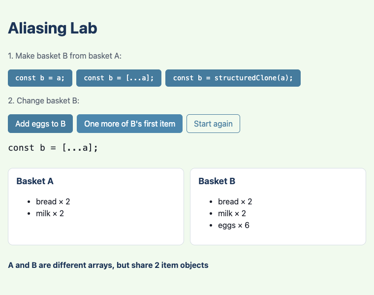
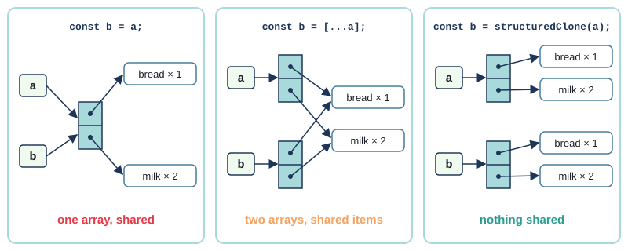
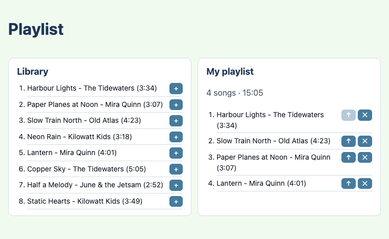
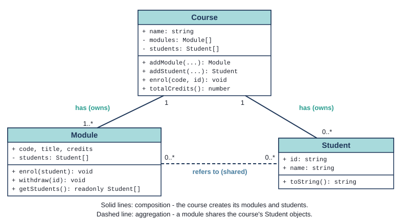
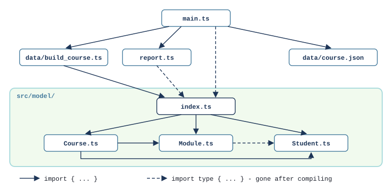

# Chapter 9 - References, composition and modules

Objects are rarely alone. A playlist holds songs, a course holds modules, and a module holds
students. This chapter is about objects that hold other objects: what it means when two variables
refer to the *same* object, how that causes some of the most confusing bugs there are, and how tests
catch them. Then it organises a program with more than a handful of classes into folders of ES
modules, and compares them with Java's packages.



## What you will learn

- the difference between values that are **copied** (numbers, strings, booleans) and values that
  are **shared** (objects and arrays) - and that Java works the same way
- why `const` does not stop an array or object changing
- three ways to "copy" an array - none at all, a spread copy, and `structuredClone` - and what each
  shares
- how to find **aliasing bugs** with tests, and how a class protects its own arrays
- **composition** and **aggregation**: objects that *have* other objects, and who owns what
- ES modules in depth: named exports, `import type`, folders and an `index.ts`, and how they compare
  with Java packages
- why test data should come from a function that builds it fresh, not from a shared constant

## The projects

| Project | What it shows |
|---|---|
| [ch09_project01_aliasing](projects/ch09_project01_aliasing/) | two baskets, three ways to copy one into the other, and tests that pin down what is shared |
| [ch09_project02_playlist](projects/ch09_project02_playlist/) | a `Playlist` has `Song`s; copying arrays in and out of a class; sharing objects that cannot change |
| [ch09_project03_course_modules](projects/ch09_project03_course_modules/) | a `Course` has `Module`s has `Student`s, in a `model/` folder with an `index.ts`; a fresh fixture for every test |

## Values and references

Start with something you already know from Java. Copy a number, change the copy, and the original
does not change:

`tests/values.test.ts`
```ts
Deno.test("numbers are copied: changing b leaves a alone", () => {
  const a = 10;
  let b = a;
  b += 1;
  assertEquals(a, 10);
  assertEquals(b, 11);
});
```

Now do the same with an array:

```ts
Deno.test("arrays are shared: b is a second name for the same array", () => {
  const a = ["bread"];
  const b = a;
  b.push("milk");
  assertEquals(a, ["bread", "milk"]);
  assertStrictEquals(b, a);
});
```

`b.push("milk")` changed `a`. That is because `const b = a` did not copy the array. An array is an
object, and a variable never holds an object - it holds a **reference** to it: where to find it.
`const b = a` copies the reference, so now there are two references to one array, and whatever you
do through `b` you see through `a`. Two names for the same object are called **aliases**.

The rule in TypeScript (really, in JavaScript):

- **primitives** - `number`, `string`, `boolean`, `null`, `undefined` - are copied
- **objects** - including arrays, and objects made from your own classes - are shared

If that sounds familiar, it should: it is exactly Java's rule. In Java an `int` is copied and an
`ArrayList` or a `Student` is shared, because Java variables of class type hold references too. The
only surprise for a Java programmer is strings: a TypeScript `string` is a primitive, not an object -
but since strings can never be changed in either language, it makes no difference in practice.

`assertStrictEquals(b, a)` (from Chapter 4) asks "are these the **same object**?" - it uses `===`.
`assertEquals` asks "do these have the **same contents**?". Two different objects can have the same
contents:

```ts
Deno.test("two objects with the same contents are equal, but not the same object", () => {
  const a = { name: "milk", quantity: 2 };
  const b = { name: "milk", quantity: 2 };
  assertEquals(a, b); // deep equality: same contents
  assertEquals(a === b, false); // identity: two different objects
});
```

In Java terms, `===` on objects is `==` (the same object), and `assertEquals` is a deep `equals()`
that compares every field for you. TypeScript has no `equals` method to override - Book 2's
collections chapter comes back to that.

### `const` is not "constant"

`const` stops the **variable** changing. It says nothing about the object the variable refers to:

```ts
Deno.test("const stops you changing the variable, not the array it refers to", () => {
  const shopping = ["bread"];
  shopping.push("milk"); // allowed: the variable still refers to the same array
  assertEquals(shopping.length, 2);
});
```

What `const` forbids is pointing the variable at something else. `shopping = ["cake"];` is a
compile error:

```text
TS2588 [ERROR]: Cannot assign to 'shopping' because it is a constant.
```

This is Java's `final` again: a `final List<String>` can still have things added to it. To say "this
array must not be changed", TypeScript has a different tool - the type `readonly string[]` - which
you will use in Project 2.

### Parameters are references too

When you pass an array to a function, the function's parameter is one more alias:

```ts
Deno.test("a function can change the caller's array through its parameter", () => {
  const addMilk = (list: string[]): void => {
    list.push("milk");
  };
  const shopping = ["bread"];
  addMilk(shopping);
  assertEquals(shopping, ["bread", "milk"]);
});
```

But pointing the parameter at a *new* array changes only the parameter - the caller's variable still
refers to the old one. The next test in `values.test.ts` shows it. Java's "pass by value" chapter
said exactly this: Java (and TypeScript) pass a **copy of the reference**. The function can change
the object through it, but cannot make the caller's variable refer to something else.

> **Try it** - `tests/values.test.ts` tests the language, not the project. If one of its tests
> surprises you, change it - make `a` an array in the first test, say - and watch it go red.

## Project 1: The Aliasing Lab

The Aliasing Lab has two shopping baskets. Basket A always starts as bread and milk. Three buttons
make basket B from basket A, three different ways; two more change B. After every click the page
shows both baskets, so you can see whether changing B changed A.

A basket is an array of items, and each item is an object:

`src/basket.ts`
```ts
/** One line in a basket. An object, so it is shared, not copied, when you assign it. */
export type Item = { name: string; quantity: number };

/** The three ways the page can make basket B from basket A. */
export type CopyMode = "same array" | "spread copy" | "structuredClone";
```

`CopyMode` is a union of string literals, from Chapter 8, and `copyBasket` switches over it:

```ts
/** Makes B from A. Only one of the three ways gives B nothing in common with A. */
export const copyBasket = (basket: Item[], mode: CopyMode): Item[] => {
  switch (mode) {
    case "same array":
      // Not a copy at all: a second name for the same array.
      return basket;
    case "spread copy":
      // A new array - but its elements are the same Item objects as before.
      return [...basket];
    case "structuredClone":
      // A new array of new Item objects: nothing is shared.
      return structuredClone(basket);
  }
};
```

Here is what each one gives you:



- **`const b = a`** copies nothing. One array, two names. Add eggs to B and they appear in A.
- **`[...a]`** - the **spread** operator - makes a new array and puts A's elements into it. Add eggs
  to B and A is untouched. But the elements are references to the *same* `Item` objects, so "one
  more of B's first item" changes A's bread too. This is a **shallow copy**: one level deep.
- **`structuredClone(a)`** makes a **deep copy**: a new array, new item objects, new everything
  inside them. Nothing you do to B can reach A.

The screenshot at the top of the chapter is the spread copy: eggs went into B only, but the bread
went up to 2 in both.

Spread works on objects too: `{ ...item }` is a new object with the same properties - also shallow.
And Java? Java has no spread, but `new ArrayList<>(list)` is the same shallow copy, and Java has no
built-in deep copy at all.

### Exercise 9.1 - Predict, then check

Make B with `const b = [...a];`, then click **One more of B's first item** twice and **Add eggs to
B** once. What does basket A show? Work it out before you try it in the page.

Here is the answer: bread × 3, milk × 2. The two clicks on "one more" changed the bread object, which
both arrays share; the eggs went into B's array only.

### Testing what is shared

Each behaviour in the page has a test. The tests use both kinds of equality:

`tests/basket.test.ts`
```ts
Deno.test("spread copy: the items are still shared, so one more milk in B is one more in A", () => {
  const a = makeBasket();
  const b = copyBasket(a, "spread copy");
  oneMore(b, 1);
  assertStrictEquals(b[1], a[1]);
  assertEquals(a[1].quantity, 3);
});

Deno.test("structuredClone: B is equal to A, but not the same objects", () => {
  const a = makeBasket();
  const b = copyBasket(a, "structuredClone");
  assertEquals(b, a);
  assertNotStrictEquals(b, a);
  assertNotStrictEquals(b[0], a[0]);
});
```

`assertNotStrictEquals` is the opposite of `assertStrictEquals`: it passes when the two are *not*
the same object. The second test says precisely what a deep copy is: equal contents, different
objects, all the way down.

Notice `makeBasket()`. Every test calls it and gets its own brand new basket:

```ts
/** A new basket every time it is called - new array, new item objects. */
const makeBasket = (): Item[] => [
  { name: "bread", quantity: 1 },
  { name: "milk", quantity: 2 },
];
```

If the tests shared one `const BASKET`, then the test that adds eggs would leave the eggs there for
every test after it. Project 3 shows that bug happening.

> **Note** - `structuredClone` copies **data**, not classes. Cloning an object made with `new Box(3)`
> gives a plain object: `instanceof Box` is `false` and its methods are gone - and TypeScript still
> believes it is a `Box`. Use it for plain data like `Item`; for your own classes, write a method
> that makes the copy.

### An aliasing bug, found test first

The page needs one more function: `withItem(basket, item)`, which gives back a basket with the item
added. Unlike `addItem`, it must leave the basket it is given alone - code that calls it expects to
still have the old basket.

Test first. One test for what it gives back, one for what it must not do:

`tests/basket.test.ts`
```ts
Deno.test("withItem gives a basket with the new item at the end", () => {
  const basket = withItem(makeBasket(), EGGS);
  assertEquals(describeBasket(basket), "bread × 1, milk × 2, eggs × 6");
});

Deno.test("withItem leaves the original basket as it was", () => {
  const original = makeBasket();
  withItem(original, EGGS);
  assertEquals(original.length, 2);
});
```

A first attempt that looks perfectly reasonable:

```ts
export const withItem = (basket: Item[], item: Item): Item[] => {
  basket.push(item);
  return basket;
};
```

The first test passes. The second is red:

```text
not ok 8 - withItem leaves the original basket as it was
  ---
  message: |-
    AssertionError: Values are not equal.

        [Diff] Actual / Expected

    -   3
    +   2
```

`basket` is an alias of the caller's array, so `push` changed the caller's basket - and returned the
same array, so the caller now has two names for one changed basket. Nothing on the screen would have
told you; the first test would never have caught it either, because the result *looks* right.

The fix is to build a new array, with spread:

`src/basket.ts`
```ts
/** A new basket with the item added. The basket it is given is left as it was. */
export const withItem = (basket: Item[], item: Item): Item[] => [...basket, item];
```

`[...basket, item]` means "a new array: everything in `basket`, then `item`". Green. This is the same
idea as Chapter 3's `toSorted`, which makes a sorted copy where `sort` changes the array: functions
that change their arguments are a common source of surprises, so prefer ones that return something
new, and make the ones that do change things obvious (`addItem` says so in its comment and returns
`void`).

## Project 2: A playlist has songs



So far the "objects inside objects" were plain data. Now they are objects of your own classes. A
`Playlist` holds `Song` objects: a playlist **has** songs. In Java you have met this as
**composition**: a class with a field that refers to objects of another class. (Chapter 11's
inheritance is the other relationship: a `Cat` **is an** `Animal`. "Has a" or "is a" is usually the
first design question about two classes.)

There are two flavours of "has a":

- **composition** - the whole **owns** its parts. The parts are made by the whole and live only
  inside it: a `Car` and its `Engine`, a course and its modules (Project 3)
- **aggregation** - the whole **refers to** parts that exist on their own and can be shared: a
  playlist and its songs. The song is in the library whether or not any playlist uses it, and the
  same song can be in many playlists

In TypeScript both look the same - a private field holding objects. The difference is who makes
the objects, and whether anyone else has a reference to them. And that is where aliasing matters.

### Sharing is safe when nothing can change

When you click **+** in the library, the playlist gets the library's own `Song` object, not a copy.
The test says so:

`tests/playlist.test.ts`
```ts
Deno.test("the playlist holds the very same Song objects, not copies of them", () => {
  const playlist = makePlaylist();
  assertStrictEquals(playlist.getSongs()[0], HARBOUR);
  assertEquals(playlist.contains(PLANES), true);
});
```

Sharing `Song` objects is fine, because a `Song` can never change:

`src/Song.ts`
```ts
export class Song {
  constructor(
    public readonly title: string,
    public readonly artist: string,
    public readonly seconds: number,
  ) {
    if (!Number.isInteger(seconds) || seconds <= 0) {
      throw new Error(`A song must last a whole number of seconds above 0, not ${seconds}`);
    }
  }
```

Parameter properties with `readonly` (Chapters 5 and 6): once made, a song stays as it is. No
alias can surprise you if nobody can change the object. That is a rule worth remembering: **share
objects that cannot change; be careful with objects that can.**

`contains` uses `includes`, which compares with `===`, so it asks about *this very object*:

```ts
Deno.test("an equal but different Song object is not 'contained'", () => {
  const lookalike = new Song("Harbour Lights", "The Tidewaters", 214);
  assertEquals(makePlaylist().contains(lookalike), false);
});
```

Here, that is what we want - the page only ever adds the library's own objects. Project 3 needs the
other answer, and compares ids instead.

### The playlist's own array

The songs are shared, but the *array* of songs belongs to the playlist. The playlist keeps it
private, and only its methods change it - `add` refuses a song when the playlist is full, `removeAt`
and `moveUp` check the position. Encapsulation, from Chapter 6.

But a getter can quietly undo all that. The page needs to show the songs, so `Playlist` has a
`getSongs()` method, and the obvious first version is:

```ts
  public getSongs(): Song[] {
    return this.songs;
  }
```

It returns the private array itself - an alias. Any code that calls it can `push` a song, skipping
the "full" check, or empty the playlist. A test that tries it:

`tests/playlist.test.ts`
```ts
Deno.test("changing the array from getSongs does not change the playlist", () => {
  const playlist = makePlaylist();
  const songs = playlist.getSongs();
  songs.push(HARBOUR);
  assertEquals(playlist.count(), 3);
});
```

Red:

```text
not ok 11 - changing the array from getSongs does not change the playlist
  ---
  message: |-
    AssertionError: Values are not equal.

        [Diff] Actual / Expected

    -   4
    +   3
```

`private` protected the *field*, but not the array the field refers to: once a reference has
escaped, anyone holding it can change the array. Java has exactly the same trap (returning a private
`ArrayList` from a getter), and the same fix - return a copy:

```ts
  public getSongs(): Song[] {
    return [...this.songs];
  }
```

Green. Now refactor, with the tests still passing, to say it in the type as well:

`src/Playlist.ts`
```ts
  /** A copy of the songs, in order. Changing the copy cannot change the playlist. */
  public getSongs(): readonly Song[] {
    return [...this.songs];
  }
```

`readonly Song[]` is an array type with no methods that change it - no `push`, `pop`, `splice` or
`sort`. Now TypeScript stops careless code before it runs. In fact it stops the test:

```text
TS2339 [ERROR]: Property 'push' does not exist on type 'readonly Song[]'.
  songs.push(HARBOUR);
        ~~~~
```

That is the type doing its job. But `readonly` exists only at compile time - it vanishes from the
JavaScript - so the copy is still the real protection, and the test should still check it. The test
plays the part of careless code with `as`, which tells TypeScript to treat a value as another type:

```ts
  // getSongs returns readonly Song[], so TypeScript stops honest code changing it. `as Song[]` plays
  // careless code that ignores that - and the copy must protect the playlist even then.
  const songs = playlist.getSongs() as Song[];
  songs.push(HARBOUR);
```

(`as` is a way of overruling the compiler, so it is rare in this book - a test that deliberately
misbehaves is one of the few good reasons.)

The same leak can happen on the way **in**. The constructor accepts a starting array of songs. If it
kept that array (`this.songs = songs`), the caller could change the playlist later through their
own variable. So it copies that too:

```ts
  constructor(public readonly name: string, songs: Song[] = []) {
    if (songs.length > MAX_SONGS) {
      throw new Error(`A playlist holds at most ${MAX_SONGS} songs, not ${songs.length}`);
    }
    // A copy: if we kept the caller's array, the caller could change our songs later.
    this.songs = [...songs];
  }
```

> **Try it** - change the constructor to `this.songs = songs;` and save. The test "changing the
> array given to the constructor does not change the playlist" goes red - and so does the one you
> are about to write in Exercise 9.2. Put the copy back.

Copying arrays in and out of a class is called **defensive copying**. It is cheap for small arrays,
and it means the class's rules (at most ten songs) cannot be broken from outside.

One more `import` detail in `Playlist.ts`: it never calls `new Song(...)`, it only mentions the type,
so it says so:

```ts
import type { Song } from "./Song.ts";
```

Project 3 explains `import type`.

### Exercise 9.2 - Two playlists, one array

Write a test: make an array of two songs, make two playlists from that same array, move a song up in
one, and check that the other has its songs in the original order. Will it pass? Try it before
reading on.

Here is one way:

```ts
Deno.test("two playlists made from one array do not affect each other", () => {
  const songs = [HARBOUR, PLANES];
  const first = new Playlist("First", songs);
  const second = new Playlist("Second", songs);
  first.moveUp(1);
  assertEquals(titles(second), ["Harbour Lights", "Paper Planes at Noon"]);
});
```

It passes straight away, because the constructor copies. Without that copy, both playlists would
share one array, and moving a song in one would move it in the other. The test is now the last one
in `tests/playlist.test.ts`.

## Project 3: Course modules


A course has modules, a module has students. Pick a module and the page lists who is on it; you can
enrol and withdraw students. Three classes, a data file, a function that builds the course from the
data, and some text for the page - enough files that it is worth organising them.

> **Note** - this project uses "module" in two senses: a **course module** (the `Module` class, like
> OOP2 or Databases 1) and an **ES module** (a TypeScript file that exports things). The text says
> `Module` (in code font) for the class.

### Who owns what



The class diagram uses plain lines, as in the Java book, with how many objects are at each end. Read
it as: one course has one or more modules and any number of students; a module and a student can be
linked any number of times.

The **course owns** its modules and students. Nothing else creates them - the course does, in
`addModule` and `addStudent`. That is composition:

`src/model/Course.ts`
```ts
  /** Makes a new module on this course, and gives it back so it can be used straight away. */
  public addModule(code: string, title: string, credits: number): Module {
    if (this.getModule(code) !== undefined) {
      throw new Error(`${this.name} already has a module ${code}`);
    }
    const module = new Module(code, title, credits);
    this.modules.push(module);
    return module;
  }
```

A **module refers to** students that the course already has. Aoife takes OOP2 and Web Development
2, and both modules hold the *same* `Student` object - aggregation. The test checks it with the real
data:

`tests/build_course.test.ts`
```ts
Deno.test("a student on two modules is one shared object", () => {
  const course = buildCourse(data);
  const onOop = moduleOf(course, "OOP2").getStudents()[0];
  const onWeb = moduleOf(course, "WEB2").getStudents()[0];
  assertEquals(onOop.name, "Aoife Byrne");
  assertStrictEquals(onOop, onWeb);
});
```

As with songs, the shared `Student` is safe because its fields are `readonly`.

`getModule(code)` hands out the course's **real** `Module` object, not a copy - the page needs it, to
enrol and withdraw. Is that an aliasing risk? Not here, because `Module` protects itself: its
student array is private, `getStudents()` returns a `readonly` copy, and the only ways to change
it are `enrol` (which refuses a student who is already enrolled) and `withdraw`. Sharing an object
whose methods guard its own rules is fine. Sharing a bare array is not.

`Module` compares students by **id** rather than with `===`:

`src/model/Module.ts`
```ts
  public isEnrolled(student: Student): boolean {
    // some(...) is true if the arrow function is true for at least one element.
    // Comparing ids, not objects (===), means a second Student object for the same person - made
    // from the same data, say - still counts as the same student.
    return this.students.some((enrolled) => enrolled.id === student.id);
  }
```

Identity (`===`) asks "the same object?"; an id asks "the same person?". For a playlist the first was
right; for students it is the second. Choosing which question to ask is part of designing the class.

## ES modules in depth

Since Chapter 1, every file you have written has been an **ES module** (ECMAScript module - the
standard JavaScript module system). A module is simply a file with `import` or `export` in it. It
has its own scope: nothing in it can be seen from outside unless it is exported, and nothing from
another file can be used unless it is imported. This section fills in the details.

### Named exports

This book only uses **named exports** - `export` in front of a class, function, constant or type:

```ts
export class Course { ... }
export const MAX_SONGS = 10;
export type Item = { name: string; quantity: number };
```

and imports them by name, in braces:

```ts
import { courseSummary, moduleSummary } from "./report.ts";
```

The names must match - import a name that a file does not export and the compiler says so (here,
asking `index.ts` for a `Teacher` class that does not exist):

```text
TS2305 [ERROR]: Module '".../src/model/index.ts"' has no exported member 'Teacher'.
```

JavaScript also has **default exports** (`export default class Course`, imported as
`import Course from "./Course.ts"`, with no braces and any name you like). This book avoids them: a
named export has one name everywhere, so searching for it finds every use, and editors can add the
import for you.

Relative imports always end in `.ts`. Leave it off and Deno will not guess:

```text
TS2307 [ERROR]: Cannot find module '.../src/model/Student'. Maybe add a '.ts' extension or run with --sloppy-imports
```

### `import type`

`report.ts` uses `Course` and `Module` only as **types** - in parameter lists - and never makes one
with `new`. So it imports them as types only:

`src/report.ts`
```ts
import type { Course, Module } from "./model/index.ts";
```

A type-only import disappears completely when the TypeScript is turned into JavaScript, because types
do not exist at run time. Writing `import type` says so to the reader ("this file only *talks about*
courses, it never makes one"), and makes sure the bundler does not load a file just for its types.
Try to use the import as a value and you are told:

```text
TS1361 [ERROR]: 'Course' cannot be used as a value because it was imported using 'import type'.
```

When one import brings in both values and types, mark just the types with `type` inside the braces.
You saw that back in Chapter 3's `main.ts` (`import { average, ..., type Student, ... }`), and
Project 1's `main.ts` does the same:

```ts
import { addItem, COPY_MODES, copyBasket, copyCode, type CopyMode, describeBasket, type Item, oneMore, sharing } from "./basket.ts";
```

> **Note** - Deno's linter has an optional rule, `verbatim-module-syntax`, that insists on
> `import type` whenever everything imported is a type. It is not switched on in these projects, but
> `deno lint --rules-include=verbatim-module-syntax src/` will show you where it would apply.

### Folders and `index.ts`

Project 3 puts its classes in a folder:

```text
src/
  main.ts
  report.ts
  data/
    course.json
    course_data.ts      types for the JSON: StudentData, ModuleData, CourseData
    build_course.ts     JSON -> objects
  model/
    index.ts
    Course.ts
    Module.ts
    Student.ts
```

The `model/` folder has an `index.ts` that does nothing but **re-export** the three classes:

`src/model/index.ts`
```ts
export { Course } from "./Course.ts";
export { Module } from "./Module.ts";
export { Student } from "./Student.ts";
```

Code outside the folder imports from `./model/index.ts` and never needs to know which file each
class is in:

`src/data/build_course.ts`
```ts
import { Course } from "../model/index.ts";
import type { CourseData } from "./course_data.ts";
```

The `index.ts` is the folder's front door. It lists what the folder offers the rest of the program;
anything it does not re-export is, by agreement, for the folder's own use. If you later split
`Course.ts` in two, only `index.ts` changes. Here is who imports whom:



Notice that the arrows only go one way. The model knows nothing about the page or the report; the
report and the page depend on the model. Keeping dependencies flowing in one direction - and never in
a circle - is what keeps a larger program understandable. (Book 2's code quality chapter measures
this with a tool.) Files inside the folder import each other directly (`Course.ts` imports
`./Module.ts`), not through `index.ts`, so the front door cannot cause a circle.

`course_data.ts` contains only types. It still has to be a module of its own, so others can import
them - with `import type`, since there is nothing else in it.

### Java packages and ES modules

| Java | TypeScript |
|---|---|
| a **package** is a folder of classes, declared with `package model;` at the top of each file | a **module** is one file; folders are just folders - no declaration |
| `public class Course` is visible outside the package | `export class Course` is visible to any file that imports it |
| no modifier: visible only inside the package | not exported: visible only inside the file |
| `import model.Course;` | `import { Course } from "./model/index.ts";` (a path, relative to this file) |
| `import model.*;` | `import * as model from "./model/index.ts";` then `new model.Course(...)` - rarely needed |
| the class name must match the file name | not enforced; this book does it anyway (`Course.ts`) |
| one public class per file | any number of exports per file; this book keeps one class per file |
| there is no "package front door" | an `index.ts` re-exporting the folder's public names |

The biggest difference: in Java the **package** is the unit of privacy; in TypeScript it is the
**file**. Something not exported cannot be used anywhere else at all - even in the same folder.

## Fresh fixtures, every time

The tests for Project 3 need a course to work on. It is tempting to build one at the top of the
file and share it:

```ts
const COURSE = makeCourse();

Deno.test("enrol adds Bob to Maths", () => {
  COURSE.enrol("MATH", "S2");
  assertEquals(moduleOf(COURSE, "MATH").count(), 1);
});

Deno.test("nobody is on Maths yet", () => {
  assertEquals(moduleOf(COURSE, "MATH").count(), 0);
});
```

Each test is correct on its own. Together, the second fails:

```text
ok 21 - enrol adds Bob to Maths
not ok 22 - nobody is on Maths yet
  ---
  message: |-
    AssertionError: Values are not equal.

        [Diff] Actual / Expected

    -   1
    +   0
```

The first test enrolled Bob on the shared course, and the second test saw him there. It is an
aliasing bug in the *tests*: both tests hold a reference to the same course. Run the second test on
its own (`deno test --filter "nobody" tests/shared.test.ts`) and it passes - the worst kind of
failure, one that depends on which tests run and in what order.

The fix is the one Project 1 used: a **function** that builds fresh data every time it is called. It
lives in its own file so all the test files can import it:

`tests/fixtures.ts`
```ts
/** Two modules, three students; Ann is on Programming. A new course every time. */
export const makeCourse = (): Course => {
  const course = new Course("Test course");
  course.addStudent("S1", "Ann");
  course.addStudent("S2", "Bob");
  course.addStudent("S3", "Cat");
  course.addModule("MATH", "Maths", 5);
  course.addModule("PROG", "Programming", 10);
  course.enrol("PROG", "S1");
  return course;
};
```

Every test starts with `const course = makeCourse();` and gets a course no other test has touched.
(Data that can never change - the `Song` constants in Project 2's tests - is safe to share.) Java's
JUnit does this with `@BeforeEach`; Deno has no `beforeEach`, and as Chapter 4 said, a helper function
is clearer anyway: you can see in the test exactly where its data comes from.

`fixtures.ts` has a second helper. `course.getModule("MATH")` gives `Module | undefined`, and checking
for `undefined` in every test would bury what the test is about. `moduleOf` throws instead, so the
test fails loudly if the module is missing:

```ts
/** The course's module with this code. Throws if there is none, so tests need no undefined checks. */
export const moduleOf = (course: Course, code: string): Module => {
  const module = course.getModule(code);
  if (module === undefined) {
    throw new Error(`The test course has no module ${code}`);
  }
  return module;
};
```

## Java and TypeScript

| Java | TypeScript |
|---|---|
| `int`, `double`, `boolean` copied; objects and arrays shared | `number`, `string`, `boolean` copied; objects and arrays shared - the same rule |
| `String` is an object, but immutable | `string` is a primitive (and immutable) |
| `a == b` on objects: the same object | `a === b` on objects: the same object |
| `a.equals(b)`, written by you | no `equals`; tests use `assertEquals` for deep equality |
| `final List<String> list` - the list can still change | `const list: string[]` - the same |
| `Collections.unmodifiableList(list)` | `readonly string[]` (compile time only) |
| `new ArrayList<>(list)` - a shallow copy | `[...list]` - a shallow copy |
| no built-in deep copy | `structuredClone(data)` for plain data |
| composition: a field referring to another class's objects | the same, usually `private` |
| packages, `public` classes, `import model.Course;` | file modules, `export`, `import { Course } from "./model/index.ts";` |
| `@BeforeEach` builds fresh test data | a function like `makeCourse()`, called at the start of each test |

## Summary

- primitives are copied; objects and arrays are shared - a variable holds a **reference**, and two
  references to one object are **aliases**
- `===` asks "the same object?" (`assertStrictEquals`); `assertEquals` asks "the same contents?"
- `const` fixes the variable, not the object; `readonly string[]` forbids changing methods, at
  compile time
- `[...a]` is a shallow copy (new array, same elements); `structuredClone(a)` is a deep copy of plain
  data
- a function that changes its argument surprises its caller; prefer returning something new, and
  test that the original is left alone
- a class must not let a reference to its private array escape: copy it coming in and going out,
  and type it `readonly`
- **composition**: the whole owns and creates its parts; **aggregation**: it refers to shared
  parts. Sharing is safe when the shared object cannot change, or guards its own rules
- every file is an ES module; use named exports, `import type` for types, and an `index.ts` as a
  folder's front door; in TypeScript the file, not the package, is the unit of privacy
- test data comes from a function that builds it fresh for each test

## Challenges

Each challenge says which project to start from. Write the tests first.

### 1. Take it out again

*Start from `ch09_project01_aliasing`.* Write `withoutItem(basket: Item[], name: string): Item[]`,
which gives back a basket without the item of that name, and leaves the original basket as it was.
Test first: the item is gone from the result, the original still has it, and removing a name that is
not there gives an equal basket. Add a **Remove eggs from B** button that uses it.

### 2. Move down

*Start from `ch09_project02_playlist`.* Add `moveDown(index)` to `Playlist`, with a **↓** button on
each song. Test first: it swaps a song with the one after it, the last song stays where it is, and a
position with no song throws, like `moveUp`.

### 3. Duplicate a playlist

*Start from `ch09_project02_playlist`.* Give `Playlist` a method `duplicate(name: string): Playlist`
that makes a new playlist with the same songs. Test first: the duplicate has the same songs in the
same order; removing a song from the duplicate leaves the original alone; and the songs in both are
the very same `Song` objects. Write a sentence in a comment explaining why the songs do not need
copying, but the array does.

### 4. Which modules is a student on?

*Start from `ch09_project03_course_modules`.* Add `modulesFor(id: string): Module[]` to `Course`, and
show "Ann is on: OOP2, WEB2" on the page when a student in the list is clicked. Test first, using
`makeCourse()`: a student on one module, a student on none, and an id that is not on the course.

*Hint:* `filter` the course's modules with `isEnrolled`. `isEnrolled` takes a `Student`; you have
an id - `getStudent` turns one into the other.

### 5. A second folder

*Start from `ch09_project03_course_modules`.* Move `report.ts` into a new `src/report/` folder with
its own `index.ts`, and add a new function `courseToCsv(course: Course): string` in
`src/report/csv.ts` that gives one line per enrolment: `OOP2,C001,Aoife Byrne`, with a header line
`module,id,name`. Test first. Every import of a model class in `src/report/` should be an
`import type`. Check with `deno lint --rules-include=verbatim-module-syntax src/` that none was missed.

*Hint:* `index.ts` can re-export functions just like classes: `export { courseToCsv } from
"./csv.ts";`. After moving `report.ts`, its import of the model needs one more `../`.

### 6. Save and restore

*Start from `ch09_project03_course_modules`.* Add `toData(): CourseData` to `Course`, which gives
back the course as plain data in the same shape as `course.json`, and add **Save** and **Restore**
buttons: Save keeps a snapshot, Restore rebuilds the course from it with `buildCourse`. Test first:

- `buildCourse(course.toData())` gives a course whose `toData()` is equal (`assertEquals`) to the
  original's
- changing the course after `toData()` does not change the saved data
- after restoring, the new course's modules are not the same objects as the old ones
  (`assertNotStrictEquals`)

*Hint:* `toData` must build new arrays and new objects (`map` is good at that) - if it handed out the
course's own arrays, the snapshot would change along with the course. Why would
`structuredClone(course)` not work as a snapshot? (Look back at the Note in Project 1.) `main.ts`
will need `let course` instead of `const course`.

---

Next: [Chapter 10 - Interfaces and structural typing](../ch10_interfaces/README.md)
