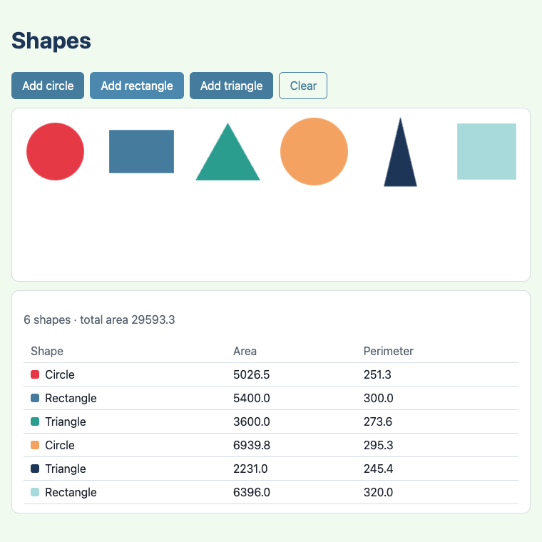
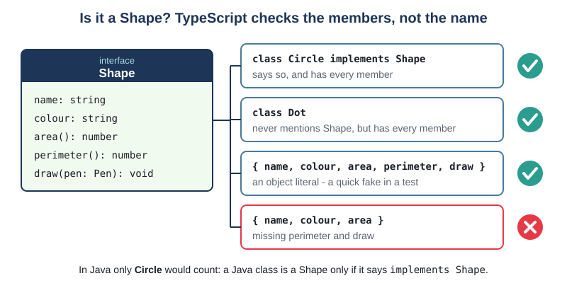
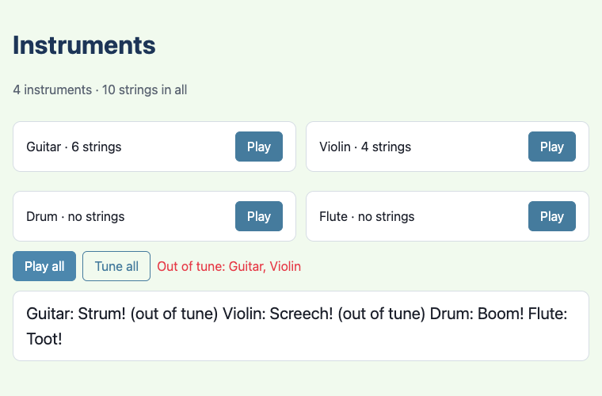
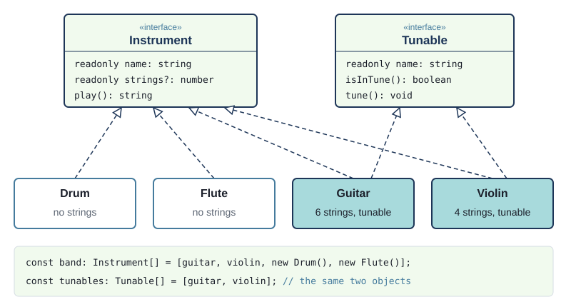
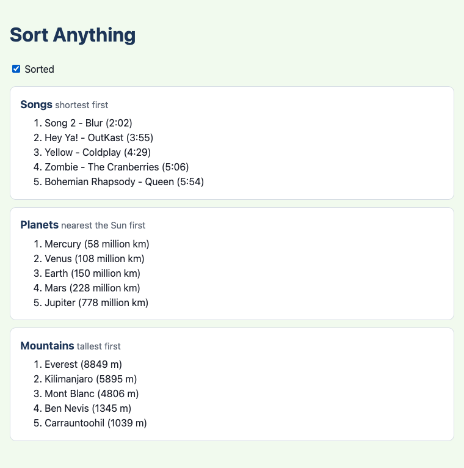

# Chapter 10 - Interfaces and structural typing

In Java, an interface is a promise: "any class that says `implements Shape` will have these
methods". TypeScript has interfaces too, written almost the same way - but it checks the promise
differently. TypeScript does not care what a class *says* it is; it cares what it *has*. If an
object has every member an interface asks for, it counts. This chapter shows how to write and
implement interfaces, what this **structural typing** makes possible (fake objects in tests in one
line, the browser's own canvas fitting an interface we wrote ourselves), and where it can surprise a
Java programmer.



## What you will learn

- how to write an `interface`, and make a class keep it with `implements`
- letting the compiler drive test first: "incorrectly implements interface" as your first red
- **structural typing**: a type is about shape, not name - and how that differs from Java
- one class implementing two interfaces, and one object seen through both
- optional members (`strings?: number`) and `readonly` members
- `type` or `interface`: what each can do, and which to choose
- why interfaces vanish when the code runs, and what that means for `instanceof`
- object literals as quick fakes in tests

## The projects

| Project | What it shows |
|---|---|
| [ch10_project01_shapes](projects/ch10_project01_shapes/) | a `Shape` interface, three classes that implement it, one `Shape[]` drawn on a `<canvas>`; a `Pen` interface the canvas fits by structure; fake shapes and a fake pen in the tests |
| [ch10_project02_instruments](projects/ch10_project02_instruments/) | `Instrument` and `Tunable`: a class implementing two interfaces, an optional member, `readonly` |
| [ch10_project03_sort_anything](projects/ch10_project03_sort_anything/) | a `Comparable`-like `Sortable` interface: one function sorts songs, planets and mountains, developed test first |

## Why interfaces?

Think about drawing a picture made of circles, rectangles and triangles. The code that draws the
picture wants to say "for every shape, draw it", and the code that totals the area wants to say "for
every shape, add its area". Neither wants a chain of `if (it is a circle) ... else if (it is a
rectangle) ...` - and neither should have to change when somebody adds a hexagon.

What they need is a **contract**: a list of what every shape can do, which the drawing and totalling
code can rely on, and which every kind of shape must keep. In Java that contract is an interface:

```java
interface Shape {
    String getName();
    double area();
    double perimeter();
}

class Circle implements Shape { ... }
```

The Java course's `SoundMaker` example made the same point: cats, cars and pianos are in different
class hierarchies, but they can all promise a `getSound()` method. TypeScript keeps the idea, and
almost the same syntax.

## Project 1: Shapes


### Writing an interface

`src/Shape.ts`
```ts
// The contract every shape keeps. Anything with these members can be drawn and measured -
// the page, and the functions in shapes.ts, only ever see a Shape, never a Circle or a Triangle.

import type { Pen } from "./Pen.ts";

export interface Shape {
  /** What to call it in the table: "Circle", "Rectangle" ... */
  readonly name: string;
  /** A CSS colour, used to fill it. */
  readonly colour: string;
  area(): number;
  perimeter(): number;
  /** Draws the shape, centred on its position, with the pen it is given. */
  draw(pen: Pen): void;
}
```

An interface lists **members**, with their types and no bodies:

- `area(): number;` - a method that takes nothing and returns a number. Like Java, no body, just a
  semicolon
- `readonly name: string;` - a **property**. Java interfaces can only hold methods (and constants);
  a TypeScript interface can also say "every shape has a `name` you can read". `readonly` means
  code using a `Shape` may read it but not change it (more on that in Project 2)
- there is no `public`: everything in an interface is public, as in Java

`export interface` makes it importable, and `import type` (Chapter 9) brings in `Pen`, which we
will meet shortly. One interface per file, named after it, like a class.

### Implementing it

`src/Circle.ts`
```ts
const FULL_TURN = 2 * Math.PI; // a whole circle, in radians - what canvas arc() measures angles in

export class Circle implements Shape {
  public readonly name: string = "Circle";

  constructor(
    private readonly x: number,
    private readonly y: number,
    private readonly radius: number,
    public readonly colour: string,
  ) {}

  public area(): number {
    return Math.PI * this.radius * this.radius;
  }

  public perimeter(): number {
    return FULL_TURN * this.radius;
  }

  public draw(pen: Pen): void {
    pen.beginPath();
    pen.arc(this.x, this.y, this.radius, 0, FULL_TURN);
    pen.fill();
  }
}
```

`implements Shape` is the same as Java. The interface's `name` property is kept by a field
(`public readonly name: string = "Circle"`) and `colour` by a parameter property (Chapter 5) - either
is fine; the interface only cares that the member is there.

### The interface is the type

Now the page can hold every kind of shape in one array, and treat them all alike:

`src/main.ts`
```ts
// The model: one array of Shape. Circles, rectangles and triangles all fit in it.
let shapes: Shape[] = [
  new Circle(60, 60, 40, COLOURS[0]),
  new Rectangle(180, 60, 90, 60, COLOURS[1]),
  new Triangle(300, 60, 90, 80, COLOURS[2]),
];
```

and the code that totals the areas never asks which kind of shape it has:

`src/shapes.ts`
```ts
/** The areas of all the shapes, added up. */
export const totalArea = (shapes: Shape[]): number => shapes.reduce((total, shape) => total + shape.area(), 0);
```

`shape.area()` runs the circle's `area` for a circle and the triangle's for a triangle. (Running the
right method for each object is **polymorphism**; Book 2 starts with it.) Add a `Hexagon` class that
implements `Shape` and `totalArea` works with it, unchanged.

### Rectangle, test first

`Circle` is done. Let's build `Rectangle` test first, and watch what the compiler does with
`implements`. Start with one test, before there is any `Rectangle` at all:

`tests/Rectangle.test.ts`
```ts
Deno.test("a 3 by 4 rectangle has an area of 12", () => {
  const rectangle = new Rectangle(0, 0, 3, 4, "blue");
  assertEquals(rectangle.area(), 12);
});
```

Red, of course - there is nothing to import:

```text
TS2307 [ERROR]: Cannot find module 'src/Rectangle.ts'.
    at tests/Rectangle.test.ts:2:27
```

The smallest step: a class with the constructor the test uses, which says it implements `Shape`:

`src/Rectangle.ts`
```ts
export class Rectangle implements Shape {
  constructor(
    private readonly x: number,
    private readonly y: number,
    private readonly width: number,
    private readonly height: number,
    public readonly colour: string,
  ) {}
}
```

Still red - and this time the compiler, not the test, is telling us what is missing:

```text
TS2420 [ERROR]: Class 'Rectangle' incorrectly implements interface 'Shape'.
  Type 'Rectangle' is missing the following properties from type 'Shape': name, area, perimeter, draw
export class Rectangle implements Shape {
             ~~~~~~~~~
    at src/Rectangle.ts:6:14
```

That is the point of `implements`: it turns the interface into a checklist, and the compiler ticks
it off. The test fails too, with `TypeError: rectangle.area is not a function` - type errors do not
stop the tests running, so you see both.

Next step: the members the checklist asks for, doing as little as possible:

```ts
  public readonly name: string = "Rectangle";

  // ... constructor

  public area(): number {
    return 0;
  }

  public perimeter(): number {
    return 0;
  }

  public draw(pen: Pen): void {
  }
```

The compiler is happy now. The test is not - it is a real assertion failure, which is the red we
wanted:

```text
    AssertionError: Values are not equal.

        [Diff] Actual / Expected

    -   0
    +   12
```

(The linter also says `` `pen` is never used `` - true for now, and it will be fixed when `draw`
is written.) Make it green:

```ts
  public area(): number {
    return this.width * this.height;
  }
```

Then the same cycle for `perimeter` (a 3 by 4 rectangle: 14) and for `draw` - which raises a
question. How do you test that something was *drawn*?

### A Pen of our own

Drawing on a `<canvas>` uses its **2D context**, an object of the browser's type
`CanvasRenderingContext2D`, with methods such as `beginPath`, `arc`, `rect` and `fill`. A shape could
take one of those as its `draw` parameter. But the tests run in Deno, with no page and no canvas.

So the shapes do not ask for a canvas context. They ask for something smaller, which we wrote
ourselves:

`src/Pen.ts`
```ts
// The drawing methods a shape needs. We wrote this interface ourselves - the browser's canvas
// context (CanvasRenderingContext2D) has never heard of it - yet the canvas context fits it,
// because it has every one of these methods. That is structural typing: the shape counts, not the name.
// It also means a test can hand a shape a small fake pen instead of a real canvas.

export interface Pen {
  beginPath(): void;
  arc(x: number, y: number, radius: number, startAngle: number, endAngle: number): void;
  rect(x: number, y: number, width: number, height: number): void;
  moveTo(x: number, y: number): void;
  lineTo(x: number, y: number): void;
  closePath(): void;
  fill(): void;
}
```

And `main.ts` hands the real canvas context to `draw`:

`src/main.ts`
```ts
  for (const shape of shapes) {
    context.fillStyle = shape.colour;
    // The real canvas context is passed where a Pen is wanted - it fits the Pen interface.
    shape.draw(context);
  }
```

Stop and think about that from a Java point of view. `CanvasRenderingContext2D` was written by the
people who wrote the browser, years ago. It certainly does not say `implements Pen`. In Java, passing
it where a `Pen` is wanted would be an error, full stop. In TypeScript it compiles - because the
canvas context *has* `beginPath()`, `arc(...)`, `rect(...)` and the rest, with matching types. That
is enough.

## Structural typing: shape, not name

Java's type system is **nominal** (by name): a class is a `Shape` only if it, or a superclass,
*says* `implements Shape`. TypeScript's is **structural**: a value is a `Shape` if it has the
structure a `Shape` needs - every member, with compatible types. The name of the class, and whether
it mentions `Shape` at all, does not matter.



So this class, which never mentions `Shape`, can go into a `Shape[]`:

```ts
// no "implements Shape"
export class Dot {
  public readonly name: string = "Dot";
  public readonly colour: string = "black";
  public area(): number { return 0; }
  public perimeter(): number { return 0; }
  public draw(pen: Pen): void { pen.fill(); }
}
const shapes: Shape[] = [new Dot()];   // fine
```

and so can a plain object literal, with no class at all:

`tests/shapes.test.ts`
```ts
/** A fake shape with a given area. It cannot draw, and does not need to. */
const fakeShape = (area: number): Shape => ({
  name: "fake",
  colour: "black",
  area: () => area,
  perimeter: () => 0,
  draw: () => {},
});
```

(An arrow function that returns an object literal wraps it in brackets, `=> ({ ... })`, so that the
`{` is not read as the start of a block body.)

What does not fit is anything with a member missing, or a member of the wrong type:

```ts
export const blob: Shape = { name: "Blob", colour: "red", area: () => 1 };
```
```text
TS2739 [ERROR]: Type '{ name: string; colour: string; area: () => number; }' is missing the following properties from type 'Shape': perimeter, draw
```

```ts
  public area(): string { return "big"; }   // in a class that implements Shape
```
```text
TS2416 [ERROR]: Property 'area' in type 'Square' is not assignable to the same property in base type 'Shape'.
  Type '() => string' is not assignable to type '() => number'.
    Type 'string' is not assignable to type 'number'.
```

### Why write `implements` at all?

If `Dot` fits without it, why does `Circle` say `implements Shape`? Because of *where* the error
appears. Without `implements`, a mistake in `Dot` (say, `area` misspelled `aera`) is only reported
where a `Dot` is first used as a `Shape` - perhaps in `main.ts`, far from the mistake. With
`implements`, the error is on the class itself, as you saw with `Rectangle`, and the class tells the
reader what it is for. So: **write `implements` on your own classes**; enjoy structural typing for
fakes in tests and for objects you did not write, like the canvas context.

### A fit that fails

Structural typing checks the types of the members, not just their names. The shapes need a fill
colour, so it is tempting to put `fillStyle: string` in `Pen`. Try it, with a cut-down pen:

```ts
export interface StrictPen {
  fillStyle: string;
  fill(): void;
}
```
```text
TS2345 [ERROR]: Argument of type 'CanvasRenderingContext2D' is not assignable to parameter of type 'StrictPen'.
  Types of property 'fillStyle' are incompatible.
    Type 'string | CanvasGradient | CanvasPattern' is not assignable to type 'string'.
```

A canvas's `fillStyle` can hold a gradient or a pattern as well as a colour, so it does not fit
`string`. That is why the colour is set in `main.ts` (`context.fillStyle = shape.colour`) and the
`Pen` holds only methods.

> **Note** - One extra check applies to object literals. If you write an object literal straight
> into a place that wants a `Shape`, and give it a member the interface does not have, TypeScript
> calls it a mistake: `{ ..., draw: () => {}, sides: 3 }` gives `Object literal may only specify
> known properties, and 'sides' does not exist in type 'Shape'.` Extra members are allowed on
> objects made elsewhere (the canvas context has dozens more than `Pen`), but in a fresh literal an
> extra member is usually a typo.

### Fakes in tests

Structural typing makes test fakes cheap. `draw` is tested with a fake `Pen` that, instead of
drawing, writes down every call it gets:

`tests/recording_pen.ts`
```ts
/** A pen that records its calls, and the list it records them in. */
export const recordingPen = (): { pen: Pen; calls: string[] } => {
  const calls: string[] = [];
  const pen: Pen = {
    beginPath: () => {
      calls.push("beginPath");
    },
    arc: (x, y, radius, startAngle, endAngle) => {
      calls.push(`arc ${x} ${y} ${radius} ${startAngle} ${endAngle.toFixed(2)}`);
    },
    rect: (x, y, width, height) => {
      calls.push(`rect ${x} ${y} ${width} ${height}`);
    },
    // ... moveTo, lineTo, closePath and fill, the same way
  };
  return { pen, calls };
};
```

No class, no `implements`, no mocking library: an object literal with the right methods *is* a
`Pen`. (The arrow functions' parameters need no types - `Pen` says what they are, just as
`Converter` did in Chapter 3.) Each arrow function remembers `calls` (a closure), so the test can
read the list afterwards:

`tests/Rectangle.test.ts`
```ts
Deno.test("a rectangle is drawn from its top-left corner", () => {
  const recorder = recordingPen();
  new Rectangle(100, 50, 40, 20, "blue").draw(recorder.pen);
  assertEquals(recorder.calls, ["beginPath", "rect 80 40 40 20", "fill"]);
});
```

A rectangle centred on (100, 50) that is 40 wide and 20 high starts at (80, 40). The test proves
`draw` works out the corner correctly - without a browser. Now `draw` can be written, and the last
red goes green:

`src/Rectangle.ts`
```ts
  public draw(pen: Pen): void {
    // canvas rect() wants the top-left corner, so step back half the size from the centre
    pen.beginPath();
    pen.rect(this.x - this.width / 2, this.y - this.height / 2, this.width, this.height);
    pen.fill();
  }
```

`fakeShape` does the same job for `totalArea`: a test wants shapes with areas of exactly 10, 5 and
2.5, and gets them in one line each, without working out which rectangle has an area of 2.5.

```ts
Deno.test("the total area adds up every shape's area", () => {
  assertEquals(totalArea([fakeShape(10), fakeShape(5), fakeShape(2.5)]), 17.5);
});
```

> **Try it** - Open `ch10_project01_shapes`, add a few shapes, and check the total area against the
> table. Then pass `"red"` (a string) to `shape.draw(...)` in `main.ts` and read the error: a string
> does not fit `Pen`.

### Exercise 10.1 - The Triangle tests

`Triangle` has a base and a height. Before reading its code, write a test for its perimeter. Pick
numbers that make the answer easy.

Here is one way. Half of a base of 6 is 3; with a height of 4 the sloping sides are exactly 5 (a
3-4-5 triangle), so the perimeter is 6 + 5 + 5:

`tests/Triangle.test.ts`
```ts
Deno.test("a triangle with base 6 and height 4 has a perimeter of 16", () => {
  const triangle = new Triangle(0, 0, 6, 4, "green");
  assertEquals(triangle.perimeter(), 16);
});
```

Choosing friendly numbers means `assertEquals` works, with no `assertAlmostEquals` needed.
(`Math.hypot(3, 4)` - the length of the long side of a right-angled triangle - is exactly 5.)

## Project 2: Instruments



A band has a guitar, a violin, a drum and a flute. Every instrument can be played. Some have strings
and some do not. Some can drift out of tune and be tuned; others cannot. Interfaces describe all of
that.

### Optional members

`src/Instrument.ts`
```ts
export interface Instrument {
  readonly name: string;
  /** How many strings it has - left out by instruments without strings. */
  readonly strings?: number;
  /** The sound it makes, as text: "Strum!" */
  play(): string;
}
```

The `?` in `strings?` makes the member **optional**: an `Instrument` may have it or leave it out. The
drum leaves it out:

`src/Drum.ts`
```ts
export class Drum implements Instrument {
  public readonly name: string = "Drum";

  public play(): string {
    return "Boom!";
  }
}
```

Java has no direct equivalent; you would return 0, or `null`, or an `Optional`. In TypeScript, the
type of `instrument.strings` is `number | undefined`, and the compiler makes you deal with the
`undefined`:

```ts
export const withSpare = (instrument: Instrument): number => instrument.strings + 1;
```
```text
TS18048 [ERROR]: 'instrument.strings' is possibly 'undefined'.
```

So code that reads it checks first, as you did with `find` in Chapter 3:

`src/band.ts`
```ts
/** "Guitar · 6 strings", or "Drum · no strings" when `strings` was left out. */
export const describeInstrument = (instrument: Instrument): string => {
  // strings is optional, so its type is number | undefined: check before using it
  if (instrument.strings === undefined) {
    return `${instrument.name} · no strings`;
  }
  return `${instrument.name} · ${instrument.strings} strings`;
};
```

After the `if`, TypeScript knows `instrument.strings` is a `number`. The tests use a fake harp (47
strings) and a fake kazoo (none):

`tests/band.test.ts`
```ts
const kazoo: Instrument = { name: "Kazoo", play: () => "Bzzz!" };
const harp: Instrument = { name: "Harp", strings: 47, play: () => "Twinkle!" };
```

One surprise is worth knowing about. Through the `Instrument` type you may ask for `strings`, and
get `undefined`. Through the `Drum` type you may not ask at all: `new Drum().strings` is an error,
`Property 'strings' does not exist on type 'Drum'.` - the `Drum` class has no such member. The
test asks through the interface:

`tests/instruments.test.ts`
```ts
Deno.test("a drum, seen as an Instrument, has no strings", () => {
  // Drum itself has no `strings` at all; through the Instrument interface it is optional, so we may ask
  const drum: Instrument = new Drum();
  assertEquals(drum.strings, undefined);
  assertEquals(drum.play(), "Boom!");
});
```

### Two interfaces, one class

Tuning is a separate idea from playing, so it gets its own interface:

`src/Tunable.ts`
```ts
export interface Tunable {
  readonly name: string;
  isInTune(): boolean;
  tune(): void;
}
```

A class can implement as many interfaces as it likes, separated by commas - exactly as in Java:

`src/Guitar.ts`
```ts
const GUITAR_STRINGS = 6;

export class Guitar implements Instrument, Tunable {
  public readonly name: string = "Guitar";
  public readonly strings: number = GUITAR_STRINGS;

  // A new guitar arrives out of tune unless we say otherwise (a default parameter, Chapter 5).
  constructor(private inTune: boolean = false) {}

  public play(): string {
    return this.inTune ? "Strum!" : "Strum! (out of tune)";
  }

  public isInTune(): boolean {
    return this.inTune;
  }

  public tune(): void {
    this.inTune = true;
  }
}
```

Both interfaces ask for `name`; one field keeps both promises.



The page puts the guitar and the violin into **two** arrays:

`src/main.ts`
```ts
const guitar = new Guitar();
const violin = new Violin();
const band: Instrument[] = [guitar, violin, new Drum(), new Flute()];
const tunables: Tunable[] = [guitar, violin];
```

As Chapter 9 showed, arrays hold references, so there is still only one guitar. `band` sees it as an
`Instrument` (it can be played), `tunables` sees it as a `Tunable` (it can be tuned). "Tune all" works
on `tunables`; "Play all" on `band`; and because they share the objects, playing after tuning gives
a clean "Strum!". A test says exactly that:

`tests/Guitar.test.ts`
```ts
Deno.test("the same guitar can be used as an Instrument and as a Tunable", () => {
  const guitar = new Guitar();
  const instrument: Instrument = guitar;
  const tunable: Tunable = guitar;

  tunable.tune();

  // one object, two views of it: tuning through one is seen through the other
  assertEquals(instrument.play(), "Strum!");
});
```

Each interface is a **view** of the object: through `instrument` you can only `play` (and read
`name` and `strings`); through `tunable` you can only `tune` and `isInTune`. Code that is given a
`Tunable[]`, like `tuneAll`, cannot play anything, even by accident. Small interfaces like these -
one job each - are easier to implement, to fake, and to understand than one big one.

### Exercise 10.2 - A fake Tunable

`outOfTune(tunables)` returns the names of everything out of tune. Write a test for it that uses no
real instruments at all. Try it before reading on.

Here is one way: a small function that builds fake `Tunable`s, each remembering its own state in a
closure:

`tests/band.test.ts`
```ts
/** A fake Tunable that starts in or out of tune. */
const fakeTunable = (name: string, inTune: boolean): Tunable => {
  let tuned = inTune;
  return {
    name,
    isInTune: () => tuned,
    tune: () => {
      tuned = true;
    },
  };
};

Deno.test("out of tune lists only the instruments that are out of tune", () => {
  const tunables = [fakeTunable("Cello", false), fakeTunable("Lute", true)];
  assertEquals(outOfTune(tunables), ["Cello"]);
});
```

`{ name, ... }` is short for `{ name: name, ... }`: when a property has the same name as the variable
holding its value, you can write it once.

### readonly

`readonly` on an interface member means: *through this interface*, you can read it but not assign
it.

```ts
const shape: Shape = new Circle(0, 0, 1, "red");
shape.colour = "blue";
```
```text
TS2540 [ERROR]: Cannot assign to 'colour' because it is a read-only property.
```

Note the words "through this interface". It is a promise about the *view*, not about the object. A
class may keep `name` as a plain, changeable `public name: string`, and still implement
`Instrument`: code holding the object as its own class can change it, while code holding it as an
`Instrument` cannot. If you want a field that nobody can change, mark it `readonly` in the class
too, as every class in this chapter does (Chapter 6 has the details).

## `type` or `interface`?

Chapter 3 used `type` to name object shapes:

```ts
export type Student = { name: string; mark: number };
```

and this chapter uses `interface`. For describing an object, they are nearly interchangeable. This
compiles, and a class can implement it just the same:

```ts
type InstrumentType = {
  readonly name: string;
  readonly strings?: number;
  play(): string;
};

export class Bell implements InstrumentType { ... }
```

The differences that matter at this stage:

| | `interface` | `type` |
|---|---|---|
| an object shape | yes | yes |
| a class can `implements` it | yes | yes (if it is an object shape) |
| build on another | `interface Loud extends Instrument { ... }` | `type Loud = Instrument & { ... }` |
| a union, such as `"red" \| "amber" \| "green"` (Chapter 8) | no | yes |
| a function type, such as `(value: number) => number` | possible, but awkward | yes |
| a name for any other type: `type Id = string` | no | yes |

An interface can `extend` one or more others (as in Java, interfaces may extend interfaces), and
can extend an object `type` too.

This book's rule, which is the common one in TypeScript code:

- use **`interface`** for the shape of an object, and anything a class will implement
- use **`type`** for everything else: unions, function types, and short names for other types

## Interfaces vanish at run time

Here is the start of the shapes project's `dist/app.js` - the JavaScript the browser actually runs:

```js
  // src/Circle.ts
  var FULL_TURN = 2 * Math.PI;
  var Circle = class {
    x;
    y;
    radius;
    colour;
    name;
    constructor(x, y, radius, colour) {
```

Look for `implements Shape`: it is gone. Look for `src/Shape.ts` or `src/Pen.ts`: there is nothing
- not even a comment. All the types (`: number`, `: Pen`, `private`, `readonly`) were removed when
the TypeScript was turned into JavaScript. Interfaces are checked by the compiler, and then thrown
away. That is why we import them with `import type`: there is nothing to import at run time.

In Java, an interface is a real thing at run time, so you can ask `if (thing instanceof Shape)`. In
TypeScript you cannot, because there is no `Shape` left to ask about:

```ts
export const isShape = (value: object): boolean => value instanceof Shape;
```
```text
TS2693 [ERROR]: 'Shape' only refers to a type, but is being used as a value here.
```

(`instanceof Circle` does work: classes are real at run time.) Most of the time you do not need to
ask - keeping the guitar in a `Tunable[]` as well as in the band means the program always knows
which objects can be tuned. When you really do need to find out at run time what something is, Book
2's chapter on **narrowing** shows the tools.

## Project 3: Sort anything



Java has a famous interface for putting things in order: `Comparable`, with its one method
`compareTo`. A class that implements it decides its own "natural order", and `Collections.sort` can
then sort a list of them. This project builds a small TypeScript interface in the same spirit:

`src/Sortable.ts`
```ts
// Anything that can be put in order and shown in a list. Like Java's Comparable, each class
// decides its own order - here by giving a number to sort by (smaller comes first).

export interface Sortable {
  /** The text to show in a list. */
  label(): string;
  /** Where it goes in the order: smaller numbers come first. */
  sortKey(): number;
}
```

Three classes that have nothing else in common implement it. A `Song` sorts by its length; a
`Planet` by its distance from the Sun; a `Mountain` tallest first:

`src/Mountain.ts`
```ts
export class Mountain implements Sortable {
  constructor(
    public readonly name: string,
    public readonly metres: number,
  ) {}

  /** "Everest (8849 m)" */
  public label(): string {
    return `${this.name} (${this.metres} m)`;
  }

  public sortKey(): number {
    return -this.metres;
  }
}
```

Minus the height gives the tallest mountain the smallest key, so it comes first. The class decides
its own order; the sorting code does not need to know.

### sortAll, test first

The function to write is `sortAll(items: Sortable[]): Sortable[]`. What should the tests use? Not
songs or planets - the function must work for *any* `Sortable`, so the tests use the simplest
`Sortable` possible: a label and a key, as an object literal.

`tests/sorting.test.ts`
```ts
/** A fake Sortable with a label and a key. */
const item = (label: string, key: number): Sortable => ({
  label: () => label,
  sortKey: () => key,
});

Deno.test("sortAll puts the smallest key first", () => {
  const items = [item("c", 3), item("a", 1), item("b", 2)];
  assertEquals(labels(sortAll(items)), ["a", "b", "c"]);
});
```

The labels make the expected order obvious at a glance. `labels` is a one-liner, `items.map((item)
=> item.label())`. To see the test fail for the right reason, `sortAll` starts by giving back what
it was given:

```ts
export const sortAll = (items: Sortable[]): Sortable[] => items;
```

Red, and the diff shows the order is wrong:

```text
    AssertionError: Values are not equal.

        [Diff] Actual / Expected

        [
    -     "c",
          "a",
          "b",
    +     "c",
        ]
```

Green, with a comparator (Chapter 3) that compares keys:

`src/sorting.ts`
```ts
/** A sorted copy: smallest sort key first. The original array is left as it was. */
export const sortAll = (items: Sortable[]): Sortable[] => items.toSorted((a, b) => a.sortKey() - b.sortKey());
```

More tests pin down the edges: negative keys (mountains!), an empty array, and that the original
array is not changed. Then the real classes get a test each, to check the order each one chose:

`tests/classes.test.ts`
```ts
Deno.test("mountains sort tallest first", () => {
  const mountains = [new Mountain("Ben Nevis", 1345), new Mountain("Everest", 8849)];
  assertEquals(labels(sortAll(mountains)), ["Everest (8849 m)", "Ben Nevis (1345 m)"]);
});
```

### One function, three classes

The page loads its data from a JSON file, makes objects with `map` (Chapter 5), and shows each list
with the same function:

`src/main.ts`
```ts
const songs: Song[] = data.songs.map((song) => new Song(song.title, song.artist, song.seconds));
const planets: Planet[] = data.planets.map((planet) => new Planet(planet.name, planet.millionKm));
const mountains: Mountain[] = data.mountains.map((mountain) => new Mountain(mountain.name, mountain.metres));
```
```ts
const render = (): void => {
  // A Song[] can be passed where a Sortable[] is wanted: every Song is a Sortable.
  showList("#songs", songs);
  showList("#planets", planets);
  showList("#mountains", mountains);
};
```

`showList` and `sortAll` were written once, and work for all three - and for any class you add,
as long as it has a `label()` and a `sortKey()`.

> **Note** - `sortAll` gives back `Sortable[]`, not `Song[]`: once a song has gone through it, the
> compiler only knows it is *something sortable*, so you could call `label()` on it but not read its
> `artist`. Java's `Comparable<T>` avoids this with a type parameter, the `<T>`. TypeScript has the
> same idea - **generics** - and Book 2 has a chapter on them. Here it does not matter: the page only
> needs the labels.

### Exercise 10.3 - Where does it go?

Which way round do planets sort if `Planet.sortKey()` returns `-this.millionKm`? Which test fails?

Here is the answer: furthest first, Jupiter at the top. "planets sort nearest the Sun first" goes
red, with Mars and Earth the wrong way round in the diff. `sortAll` is untouched, and its own tests
still pass: they use fake items, so a change in `Planet` cannot break them. That is a good sign - each
test checks one thing.

## Java and TypeScript

| Java | TypeScript |
|---|---|
| `interface Shape { double area(); }` | `interface Shape { area(): number; }` |
| interfaces hold methods and constants | interfaces can also hold properties: `readonly name: string;` |
| `class Circle implements Shape, Drawable` | `class Circle implements Shape, Drawable` |
| `interface B extends A` | `interface B extends A` |
| nominal: a class must *say* `implements Shape` | structural: anything with the right members is a `Shape` |
| a fake needs a class (or Mockito) | a fake can be an object literal: `{ area: () => 10, ... }` |
| no optional methods (only `default` ones) | optional members: `strings?: number` |
| `obj instanceof Shape` works | interfaces vanish at run time - `instanceof Shape` is an error |
| `Comparable<T>` with `compareTo` | your own interface (`Sortable`), or a comparator function |

## Summary

- an `interface` lists the members an object must have: methods, and properties too, all public
- `implements` makes a class keep the contract; a missing member is a compile error on the class,
  which makes a good first red when working test first
- TypeScript's typing is **structural**: anything with the right members fits, whatever it is called
  and whether or not it says `implements` - even the browser's canvas context fits our `Pen`
- still write `implements` on your own classes, so mistakes are reported where they are made
- an object literal is the quickest fake in a test; a fresh literal may not have extra members
- a class can implement several interfaces; one object can be held through each of them
- `strings?: number` is optional, and its type is `number | undefined`; `readonly` stops assignment
  *through that type*
- use `interface` for object shapes and `type` for unions, function types and other names
- interfaces exist only for the compiler: they vanish from the JavaScript, so `instanceof Shape`
  cannot work

## Challenges

Each challenge says which project to start from. Write the tests first.

### 1. Square

*Start from `ch10_project01_shapes`.* Add a `Square` class that implements `Shape`, with a centre and
one side length, and an "Add square" button. Write the tests first: a square of side 5 has an area
of 25 and a perimeter of 20, and a test with the recording pen checks where it is drawn. Watch the
compiler's "incorrectly implements" message shrink as you add each member.

### 2. Cities

*Start from `ch10_project03_sort_anything`.* Add a `City` class that is `Sortable`, sorted by
population, **biggest first**, and a fourth list on the page with five cities from the JSON file.
Test first: the label (for example "Dublin (592,713)" - look up `toLocaleString`) and the order.
Did `sortAll` need to change?

### 3. The biggest shape

*Start from `ch10_project01_shapes`.* Show "Largest: Circle (area 6939.8)" under the table. Write a
function `largestShape(shapes: Shape[]): Shape | undefined` in `src/shapes.ts`, tested with fake
shapes made from object literals only - no real `Circle`s. Remember the empty array.

### 4. Things that make a sound

*Start from `ch10_project02_instruments`.* The Java course's `SoundMaker` idea: a doorbell makes a
sound, but it is not an instrument. Make a `SoundMaker` interface with `name` and `play()`, change
`Instrument` so it `extends SoundMaker`, and add a `Doorbell` class that is a `SoundMaker` only. Add
a "Sound check" button that plays the band *and* the doorbell, using a function
`soundCheck(makers: SoundMaker[]): string[]` written test first.

*Hint:* once `Instrument extends SoundMaker`, it only needs to list `strings?`. Can you pass the
`band` array (an `Instrument[]`) to a function that wants a `SoundMaker[]`? Why?

### 5. Ties

*Start from `ch10_project03_sort_anything`.* When two items have the same key, `sortAll` leaves them
in whatever order they came. Change it so that ties are sorted alphabetically by label. Write the
tests first, with fake items: `item("b", 1)` and `item("a", 1)` should come out "a", "b"; and items
with different keys must still sort by key, whatever their labels.

*Hint:* in the comparator, if the keys are different, return their difference as now; if they are
equal, return `a.label().localeCompare(b.label())`.

### 6. Click to choose

*Start from `ch10_project01_shapes`.* Click on a shape on the canvas to select it: show its details
under the canvas ("Triangle: area 3600.0, perimeter 273.6"). Add a method `contains(x: number, y:
number): boolean` to the `Shape` interface - and let the compiler list every class that now breaks.
Test `contains` first for each class, inside and outside, including a point just outside each edge.

*Hint:* a circle contains a point if its distance from the centre (`Math.hypot`) is at most the
radius. A rectangle checks both coordinates against its edges. For the triangle, checking its
bounding rectangle is a fair first version; a better one checks the point is above both sloping
sides. In `main.ts`, listen for `click` on the canvas; `event.offsetX` and `event.offsetY` give the
position in the canvas - but the canvas is shown at a different size from its 720 by 240 pixels, so
scale them by `canvas.width / canvas.clientWidth`. Use `find` to get the clicked shape, and search
from the end of the array if you want the shape drawn on top to win.

---

Next: [Chapter 11 - Inheritance](../ch11_inheritance/README.md)
