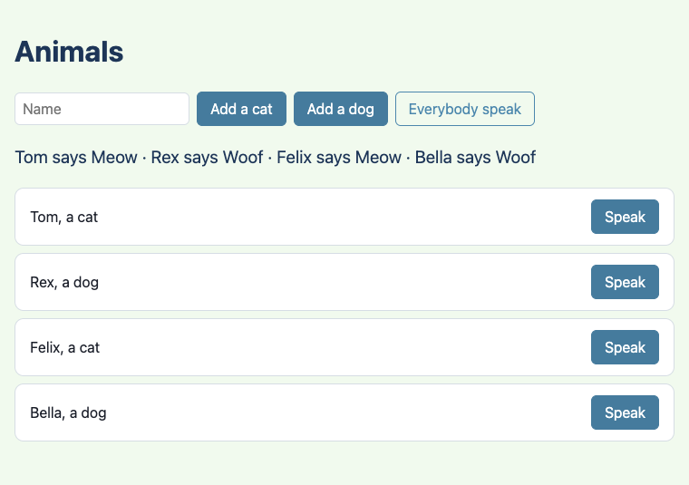
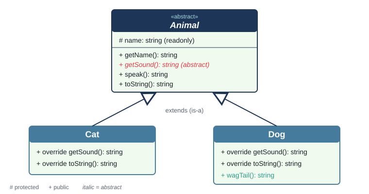
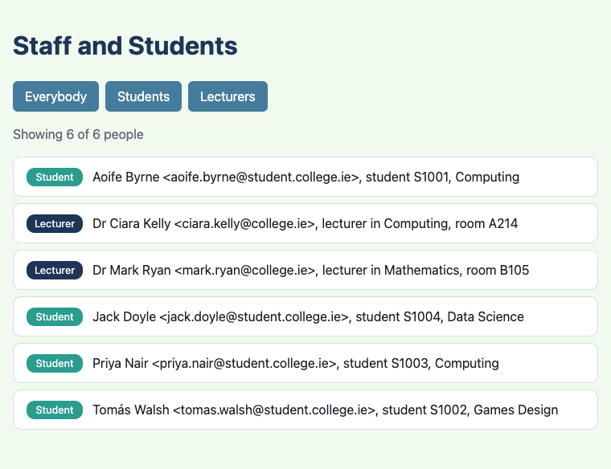
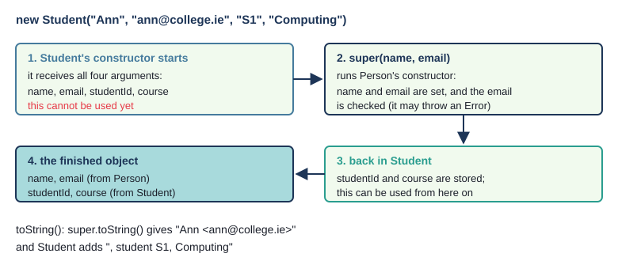
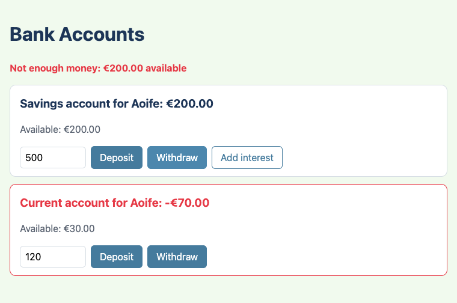
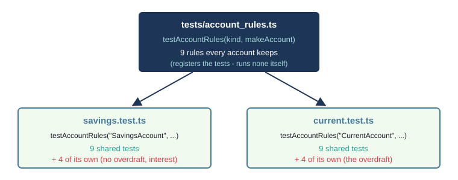
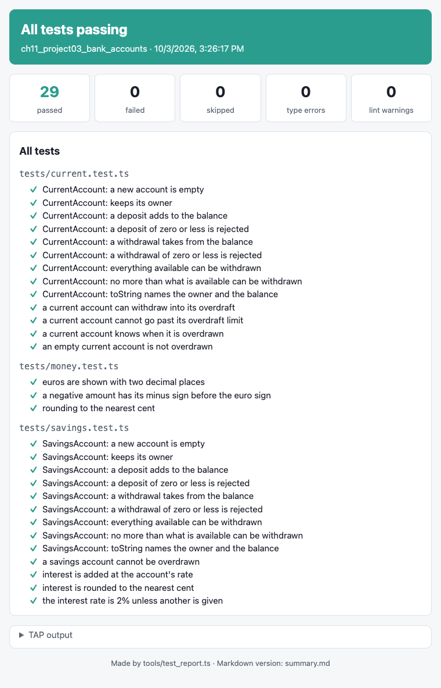

# Chapter 11 - Inheritance

A cat is an animal. A student is a person. A savings account is a bank account. When one kind of
thing is a special case of another, inheritance lets you write what they share once, in a
**superclass**, and only what is different in each **subclass**. You know the idea from Java, and
TypeScript's version will look very familiar: `extends`, `super`, `protected`, `abstract`. This
chapter shows where TypeScript is the same, where it differs (`override` is a keyword, and there is no
`final`), and how one set of tests can check every subclass at once.



## What you will learn

- how to make a subclass with `extends`, and what it inherits
- `abstract` classes and methods: a class you cannot make objects of, and methods every subclass must write
- `override`, and how the compiler (with `noImplicitOverride`) catches overriding mistakes
- `protected`: members a subclass may use but the outside world may not
- calling the superclass's constructor with `super(...)`, and its methods with `super.method()`
- overriding `toString()` so that each subclass describes itself
- what to do in TypeScript instead of Java's `final`
- writing **one test suite as a function**, and running it against every subclass

## The projects

| Project | What it shows |
|---|---|
| [ch11_project01_animals](projects/ch11_project01_animals/) | an abstract `Animal`, `Cat` and `Dog` that extend it, `override`, `protected`, and a mixed `Animal[]` |
| [ch11_project02_staff](projects/ch11_project02_staff/) | `Person`, `Student` and `Lecturer` from a JSON file: `super(...)` in constructors, `super.toString()`, a check inherited by every subclass |
| [ch11_project03_bank_accounts](projects/ch11_project03_bank_accounts/) | an abstract `BankAccount` holding the rules, `SavingsAccount` and `CurrentAccount`, an overdraft built test first, and one test suite run against both |

## Is-a, and why inherit

In Java you met two ways for classes to be related. **Composition** - a playlist *has* songs, a course
*has* modules - was Chapter 9's subject. **Inheritance** is for the other relationship, **is-a**: a cat
*is an* animal, so anything that is true of every animal is true of a cat.

Without inheritance, `Cat` and `Dog` would each need their own `name` field, their own `getName()`,
their own `speak()` - the same lines, twice, and any fix made in two places. Inheritance is one way to
keep to the rule "don't repeat yourself": put what they share in `Animal`, and let `Cat` and `Dog`
**inherit** it.

A quick test for whether inheritance fits: say "a ___ is a ___" out loud. "A dog is an animal" - yes.
"A student is a person" - yes. "A car is an engine" - no: a car *has* an engine, so that is
composition.

## Project 1: Animals



The Java inheritance chapters built this up in eleven small projects, `cat1` to `cat11`. You know the
ideas already, so here is the whole journey at once, with the TypeScript for each step:

| Java project | The step | In TypeScript |
|---|---|---|
| `cat1` | one class, `Cat` | `class Cat { ... }` |
| `cat2` | a superclass `Animal`; `Cat extends Animal` | `class Cat extends Animal { }` - the same |
| `cat3` | `Cat` overrides `getSound()`, with `@Override` | `public override getSound()` - a keyword, and required |
| `cat4`, `cat5` | an `Animal` variable can hold a `Cat` | `const pet: Animal = new Cat("Tom");` - the same |
| `cat6` | override `toString()` | `public override toString()`, used by `${pet}` |
| `cat7` | `abstract class Animal` | `export abstract class Animal` - the same |
| `cat8`, `cat9` | `final` classes and methods | **no `final`** - see later in the chapter |
| `cat10` | `abstract` method `getSound()` | `public abstract getSound(): string;` - the same |
| `cat11` | cats and dogs together | `const animals: Animal[] = [new Cat("Tom"), new Dog("Rex")];` |

Here is where the journey ends up.

### An abstract superclass

`src/Animal.ts`
```ts
export abstract class Animal {
  // `protected`: this class and its subclasses can read `name`; code outside cannot.
  // `readonly`: an animal keeps its name.
  constructor(protected readonly name: string) {}

  public getName(): string {
    return this.name;
  }

  /** Every animal makes a sound, but each kind makes its own - so there is no body here. */
  public abstract getSound(): string;

  /** Written once, for every animal. It calls getSound(), and the subclass's version runs. */
  public speak(): string {
    return `${this.name} says ${this.getSound()}`;
  }

  /** A subclass can override this to say what kind of animal it is. */
  public toString(): string {
    return `${this.name}, an animal`;
  }
}
```

Three things to notice:

- `abstract class` means there is no such thing as "just an animal": you can make cats and dogs, but
  not `new Animal(...)`
- `getSound()` is an **abstract method**: it has a signature but no body, ending in `;`. Every
  (non-abstract) subclass must write it
- `speak()` is written once, here, and it *calls* `getSound()`. When a cat speaks, `this` is the cat,
  so the cat's `getSound()` runs. `Animal` does not know or care which subclass it is

The constructor uses a **parameter property** (Chapter 5): `protected readonly name: string` declares
the field and sets it in one go.

If you try to make an `Animal`, the compiler stops you:

```text
TS2511 [ERROR]: Cannot create an instance of an abstract class.
```

### A subclass

`src/Cat.ts`
```ts
import { Animal } from "./Animal.ts";

export class Cat extends Animal {
  // `override`: this replaces a method of Animal. The compiler checks that Animal has one.
  public override getSound(): string {
    return "Meow";
  }

  public override toString(): string {
    // `name` is protected in Animal, so a subclass may use it.
    return `${this.name}, a cat`;
  }
}
```

`extends Animal` works exactly as in Java. `Cat` inherits `name`, `getName()`, `speak()` - everything
`Animal` has. It has no constructor of its own, so it uses `Animal`'s: `new Cat("Tom")` runs `Animal`'s
constructor with `"Tom"`. (In Java, constructors are never inherited; a Java `Cat` would need its own
constructor calling `super(name)`. In TypeScript, a subclass with no constructor gets its superclass's,
parameters and all.)

If `Cat` forgets `getSound()`, it is an error - the compiler will not let a class leave a promise
unkept:

```text
TS2515 [ERROR]: Non-abstract class 'Cow' does not implement inherited abstract member getSound from class 'Animal'.
```

(That message came from a `Cow` with no methods - Challenge 1 asks you to write a proper one.)

### `override`

In Java, `@Override` is an annotation you may leave out. In TypeScript, `override` is a keyword, and
these projects make it **compulsory**: every project's `deno.json` switches on the compiler option
`noImplicitOverride`:

`deno.json`
```json
"compilerOptions": {
  "lib": ["dom", "dom.iterable", "esnext", "deno.ns"],
  "noImplicitOverride": true
},
```

With it on, replacing a superclass's method *without* saying `override` is an error. Leave the word
out of a `Cow`'s `toString()`, and:

```text
TS4114 [ERROR]: This member must have an 'override' modifier because it overrides a member in the base class 'Animal'.
```

Why insist? Because it stops two kinds of accident. The first: you add a method to a subclass, not
knowing the superclass already has one with that name, and silently replace it. The second is a typo.
Write `override getSond()` and the compiler spots that there is nothing to override - and even guesses
what you meant:

```text
TS4117 [ERROR]: This member cannot have an 'override' modifier because it is not declared in the base class 'Animal'. Did you mean 'getSound'?
```

Java's `@Override` catches the typo too, but only if you remember to write it.

> **Note** - Strictly, the compiler only *requires* `override` when a method replaces one that has a
> body. Writing an abstract method's body, like `getSound()` in `Cat`, is allowed without it. This
> book writes `override` on every one, so that a reader can see at a glance which methods come from
> the superclass.

### Adding something new

A subclass can also add methods its superclass does not have:

`src/Dog.ts`
```ts
export class Dog extends Animal {
  public override getSound(): string {
    return "Woof";
  }

  public override toString(): string {
    return `${this.name}, a dog`;
  }

  /** Only dogs have this method. A variable of type Animal cannot call it. */
  public wagTail(): string {
    return `${this.name} wags their tail`;
  }
}
```

### A cat is an animal

Because a cat is an animal, a cat can go anywhere an `Animal` is expected - in an `Animal` variable, an
`Animal[]` array, or an `Animal` parameter. The page keeps all its animals in one array:

`src/main.ts`
```ts
// One array holds cats and dogs together, because both are Animals.
const animals: Animal[] = [new Cat("Tom"), new Dog("Rex"), new Cat("Felix")];
```

and `chorus` works with any animals at all:

`src/farm.ts`
```ts
/** Every animal speaks, in order. Each one uses its own getSound(). */
export const chorus = (animals: Animal[]): string[] => animals.map((animal) => animal.speak());
```

`chorus` only knows about `Animal`, yet each animal says its own sound. The method that runs is
decided by the *object*, not by the type of the variable. Java works the same way, and Book 2 begins
with this idea - it is called **polymorphism**.

There is a price. Through an `Animal` variable you can only use what *every* animal has:

```ts
const pet: Animal = new Dog("Rex");
pet.wagTail();
```

```text
TS2339 [ERROR]: Property 'wagTail' does not exist on type 'Animal'.
```

The object really is a `Dog`, but the variable only promises an `Animal`, and not every animal has a
tail to wag.

Classes, unlike Chapter 10's interfaces, still exist when the program runs, so `instanceof` works with
them, as in Java:

`tests/animals.test.ts`
```ts
Deno.test("a cat is an Animal, and instanceof can tell", () => {
  const tom = new Cat("Tom");
  assert(tom instanceof Cat);
  assert(tom instanceof Animal);
  assertEquals(tom instanceof Dog, false);
});
```

(`assert` passes if what it is given is `true`.)

### `toString()`

`Animal`, `Cat` and `Dog` each have a `toString()`. A template literal calls it for you: `${animal}`
gives `"Tom, a cat"` or `"Rex, a dog"` - the subclass's version, even though the array is an
`Animal[]`. That is how the page labels each card:

`src/main.ts`
```ts
    // `${animal}` calls animal.toString() - the Cat or Dog version.
    label.textContent = `${animal}`;
```

Without any `toString()` at all, an object turns into the unhelpful `[object Object]` - JavaScript's
version of Java's `Animal@1b6d3586`.

### `protected`

`Cat.toString()` uses `this.name`, which belongs to `Animal`. That works because `name` is
**protected**: visible in the class and its subclasses, hidden from everyone else. From outside:

```ts
const tom = new Cat("Tom");
console.log(tom.name);
```

```text
TS2445 [ERROR]: Property 'name' is protected and only accessible within class 'Animal' and its subclasses.
```

| Modifier | The class itself | Its subclasses | Everyone else |
|---|---|---|---|
| `private` | yes | **no** | no |
| `protected` | yes | yes | no |
| `public` | yes | yes | yes |

One difference from Java: Java's `protected` also opens a member to every class in the same package.
TypeScript has no packages, so `protected` means exactly "this class and its subclasses". (And, as in
Chapter 6, these checks are made by the compiler; `#private` fields are the ones that are private
even at run time. A `#name` field cannot be seen by subclasses at all, so `protected` has no `#`
version.)

Use `protected` sparingly. Every protected member is something subclasses may come to depend on, so it
is harder to change later. Start `private`, and open a member up only when a subclass really needs it.

### Exercise 11.1 - Which lines compile?

```ts
const pet: Animal = new Dog("Rex");
pet.speak();          // 1
pet.wagTail();        // 2
pet.name;             // 3
new Animal("Thing");  // 4
```

Decide for each line, then read on.

Only line 1 compiles: every `Animal` can speak, and the dog's own sound is used ("Rex says Woof").
Line 2 is TS2339 - `wagTail` is not on `Animal`. Line 3 is TS2445 - `name` is protected. Line 4 is
TS2511 - `Animal` is abstract.

## Project 2: Staff and students



A college directory lists students and lecturers. Both have a name and an email address; a student
also has a student number and a course, and a lecturer a department and an office.

This time the superclass is **not** abstract. A visitor to the college is just a `Person`, so it makes
sense to create one:

`src/Person.ts`
```ts
/** The roles the directory knows about (a string literal union, as in Chapter 8). */
export type Role = "Visitor" | "Student" | "Lecturer";

export class Person {
  // Parameter properties (Chapter 5). `protected`, so Student and Lecturer can use them too.
  constructor(protected readonly name: string, protected readonly email: string) {
    // Every Person checks this, so every Student and Lecturer gets the check for free.
    if (!email.includes("@")) {
      throw new Error(`Not an email address: ${email}`);
    }
  }

  public getName(): string {
    return this.name;
  }

  public getEmail(): string {
    return this.email;
  }

  public getRole(): Role {
    return "Visitor";
  }

  public toString(): string {
    return `${this.name} <${this.email}>`;
  }
}
```

### `super(...)` - calling the superclass's constructor

`Student` needs more than a name and an email, so it needs its own constructor - and a subclass's
constructor must call the superclass's constructor, with `super(...)`:

`src/Student.ts`
```ts
export class Student extends Person {
  // name and email are plain parameters, handed on to Person's constructor.
  // studentId and course are new parameter properties, belonging to Student.
  constructor(name: string, email: string, private readonly studentId: string, private readonly course: string) {
    // A subclass constructor must call super(...) - Person's constructor - before it uses `this`.
    super(name, email);
  }
```

Look at the parameters carefully. `name` and `email` have no modifier: they are ordinary parameters,
only passed on. `Person` already stores them. `studentId` and `course` are written as parameter
properties, so `Student` stores those. (Writing `protected readonly name` again here would declare a
second `name` - leave it to `Person`.)



The rules are Java's, and the compiler enforces them. Leave out `super(...)`:

```text
TS2377 [ERROR]: Constructors for derived classes must contain a 'super' call.
```

Use `this` before calling it:

```text
TS17009 [ERROR]: 'super' must be called before accessing 'this' in the constructor of a derived class.
```

Pass the wrong arguments, say `super(name)`:

```text
TS2554 [ERROR]: Expected 2 arguments, but got 1.
```

("Derived class" and "base class", in these messages, are other names for subclass and superclass.)

The reason for the order: until `Person`'s constructor has run, the object is not a proper `Person` yet
- it has no name, and its email has not been checked. `super(...)` first means a subclass can always
rely on the superclass's part being ready.

### Inherited rules

`Person`'s constructor checks the email. Every `Student` and `Lecturer` goes through that constructor,
so they all get the check, without a line of extra code. A test makes sure:

`tests/people.test.ts`
```ts
Deno.test("Person's email check protects every subclass too", () => {
  assertThrows(() => new Person("Val", "nope"), Error, "Not an email address: nope");
  assertThrows(() => new Student("Ann", "ann.college.ie", "S1", "Computing"), Error, "Not an email address");
  assertThrows(() => new Lecturer("Bob", "bob", "Maths", "B105"), Error, "Not an email address");
});
```

### `super.toString()` - building on the superclass's method

A student's `toString()` should say everything a person's does, and more. Rather than repeat
`Person`'s code, it calls it with `super.toString()`:

`src/Student.ts`
```ts
  public override toString(): string {
    // super.toString() runs Person's version: "Ann <ann@college.ie>". Student adds to it.
    return `${super.toString()}, student ${this.studentId}, ${this.course}`;
  }
```

`super.method()` means "the superclass's version of this method" - the same as in Java. If `Person`
later shows email addresses differently, students and lecturers change with it.

`Lecturer` is built the same way, and adds a method of its own that uses the protected `name`:

`src/Lecturer.ts`
```ts
  /** How a lecturer signs an email. `name` is protected in Person, so Lecturer can read it. */
  public signature(): string {
    return `${this.name}, Department of ${this.department}`;
  }
```

### From JSON to objects

`people.json` keeps the students and the lecturers in two lists. `peopleFrom` turns each list into
objects with `map` (Chapter 5) and joins them with the spread operator (Chapter 9):

`src/directory.ts`
```ts
/** Everybody, as objects. The result is a Person[], holding Students and Lecturers together. */
export const peopleFrom = (data: DirectoryData): Person[] => {
  const students = data.students.map((s) => new Student(s.name, s.email, s.studentId, s.course));
  const lecturers = data.lecturers.map((l) => new Lecturer(l.name, l.email, l.department, l.office));
  return [...students, ...lecturers];
};

/** Only the people with this role. */
export const withRole = (people: Person[], role: Role): Person[] =>
  people.filter((person) => person.getRole() === role);
```

Each subclass overrides `getRole()` to return `"Student"` or `"Lecturer"`, so the filter buttons can
ask any `Person` what it is. Because `getRole()` returns the union `Role`, a typo such as
`withRole(people, "Lecturor")` is a type error.

### Exercise 11.2 - Initials for everybody

Give *every* person a method `getInitials()`: `"Ann Lee"` gives `"AL"`. Write the test first. Where
does the method go, and what do you test it on?

Here is one way. The method goes in `Person`, so `Student` and `Lecturer` inherit it:

```ts
public getInitials(): string {
  return this.name.split(" ").map((word) => word[0]).join("");
}
```

and the test uses a subclass, to show that the method really is inherited:

```ts
Deno.test("a student inherits getInitials from Person", () => {
  assertEquals(new Student("Ann Lee", "ann@college.ie", "S1", "Computing").getInitials(), "AL");
});
```

(`split(" ")` cuts a string into an array of words.)

## Project 3: Bank accounts



Every bank account takes deposits and allows withdrawals, and both must be more than zero. What
differs is **how much you may take out**: a savings account only what is in it, a current account
that and an overdraft as well. So the shared rules go in an abstract class, and each subclass answers
one question.

`src/BankAccount.ts`
```ts
export abstract class BankAccount {
  // protected: subclasses need the balance (to work out what is available, or to add interest),
  // but code outside must go through deposit and withdraw, which check the rules.
  protected balance: number = 0;

  constructor(private readonly owner: string) {}

  public getOwner(): string {
    return this.owner;
  }

  public getBalance(): number {
    return this.balance;
  }

  public deposit(amount: number): void {
    this.requirePositive(amount);
    this.balance += amount;
  }

  /**
   * The same for every account: the amount must be positive, and no more than available().
   * Subclasses are not meant to override this - TypeScript has no `final` to stop them, so the
   * shared tests in tests/account_rules.ts check that every subclass keeps these rules.
   */
  public withdraw(amount: number): void {
    this.requirePositive(amount);
    if (amount > this.available()) {
      throw new Error(`Not enough money: ${formatEuro(this.available())} available`);
    }
    this.balance -= amount;
  }

  /** How much may be withdrawn now. Each kind of account has its own rule. */
  public abstract available(): number;

  /** "Savings account", "Current account" ... used by toString. */
  public abstract getKind(): string;
  // ... toString(), and a private requirePositive(amount)
}
```

`withdraw` is written once and calls the abstract `available()` - the same shape as `speak()` calling
`getSound()`. (Book 3 gives this shape a name: the *Template Method* pattern.)

The fields are chosen with care. `balance` is `protected`, because subclasses need it. `owner` is
`private`: no subclass needs to change it, and a `SavingsAccount` that tries to read `this.owner` is
told

```text
TS2341 [ERROR]: Property 'owner' is private and only accessible within class 'BankAccount'.
```

- it must use the public `getOwner()`, like everyone else.

### A subclass with a default parameter

`src/SavingsAccount.ts`
```ts
const DEFAULT_INTEREST_RATE = 2; // per cent

export class SavingsAccount extends BankAccount {
  constructor(owner: string, private readonly interestRate: number = DEFAULT_INTEREST_RATE) {
    super(owner);
  }

  public override available(): number {
    return this.balance;
  }

  public override getKind(): string {
    return "Savings account";
  }
  // ... getInterestRate()

  /** Adds one year's interest. Uses the protected balance directly - no need for a deposit. */
  public addInterest(): void {
    this.balance = roundToCent(this.balance * (1 + this.interestRate / 100));
  }
}
```

`new SavingsAccount("Aoife")` earns 2%; `new SavingsAccount("Aoife", 5)` earns 5% - a default
parameter (Chapter 5) in a subclass constructor, passing only `owner` up to `super`.

### The overdraft, test first

`CurrentAccount` starts as the simplest thing that could work: copy the savings rule.

`src/CurrentAccount.ts` (first version)
```ts
  public override available(): number {
    return this.balance;
  }
```

Now the first test of what makes a current account different. With €50 in it and a €100 overdraft,
taking out €120 should leave it at -€70:

`tests/current.test.ts`
```ts
Deno.test("a current account can withdraw into its overdraft", () => {
  const account = new CurrentAccount("Ann", 100);
  account.deposit(50);
  account.withdraw(120);
  assertEquals(account.getBalance(), -70);
});
```

Red. This time it is not a diff: `withdraw` throws, and the error ends the test:

```text
not ok 10 - a current account can withdraw into its overdraft
  ---
  message: |-
    Error: Not enough money: €50.00 available
          throw new Error(`Not enough money: ${formatEuro(this.available())} available`);
                ^
        at CurrentAccount.withdraw (src/BankAccount.ts:35:13)
        at tests/current.test.ts:12:11
  at: tests/current.test.ts:9
  ...
```

The stack lines say where: the error was thrown in `BankAccount.ts` (by the `withdraw` that
`CurrentAccount` inherited), called from line 12 of the test. The message says why: only €50 counts as
available. So the fix is in `available()`, not in `withdraw`:

`src/CurrentAccount.ts`
```ts
  /** The balance plus the overdraft: with €50 and a €100 overdraft, €150 may be taken out. */
  public override available(): number {
    return this.balance + this.overdraftLimit;
  }
```

Green. The next test - "a current account cannot go past its overdraft limit", withdrawing €151 - was
green straight away: `withdraw`'s check, written once in `BankAccount`, already did the work. The
two tests for `isOverdrawn()` were red until the one-line method was written.

### One test suite for every subclass

Some rules are the same for *every* kind of account: a new account is empty, deposits add, a deposit
of zero is rejected, you can never take out more than `available()` says. You could copy those tests
into `savings.test.ts` and `current.test.ts` - and copy them again for each new kind of account, and
fix every copy when a rule changes.

Instead, write them **once, as a function**:

`tests/account_rules.ts`
```ts
/** Something that makes a new, empty account for an owner. */
export type MakeAccount = (owner: string) => BankAccount;

export const testAccountRules = (kind: string, makeAccount: MakeAccount): void => {
  Deno.test(`${kind}: a new account is empty`, () => {
    assertEquals(makeAccount("Ann").getBalance(), 0);
  });

  Deno.test(`${kind}: no more than what is available can be withdrawn`, () => {
    const account = makeAccount("Ann");
    account.deposit(100);
    const before = account.getBalance();
    assertThrows(() => account.withdraw(account.available() + 1), Error, "Not enough money");
    assertEquals(account.getBalance(), before);
  });
  // ... seven more rules
};
```

`testAccountRules` does not run any tests itself. When it is *called*, it **registers** nine tests
with `Deno.test`, each named after the kind of account. It is given a function, `makeAccount`, that
makes a fresh account of whichever kind is being tested - so every test starts from a new, empty
account (a helper function instead of a `beforeEach`, as in Chapter 4). The file's name does not end
in `.test.ts`, so Deno does not run it on its own; the test files call it:

`tests/savings.test.ts`
```ts
testAccountRules("SavingsAccount", (owner) => new SavingsAccount(owner));
```

`tests/current.test.ts`
```ts
testAccountRules("CurrentAccount", (owner) => new CurrentAccount(owner));
```

One line each, and each kind of account gets all nine tests. The rules are written so that they hold
for *any* account: "everything available can be withdrawn" asks the account what is available rather
than assuming a number.



The report shows the shared tests twice, once for each subclass, followed by each subclass's own:



This is the test-first answer to an important rule of inheritance: **anywhere the program expects a
`BankAccount`, any subclass must work**. (It has a name - the *Liskov substitution principle*, the "L"
in SOLID.) A subclass that breaks a shared rule - say, a new account that lets a deposit of €0
through - fails its shared tests the moment `testAccountRules` is called for it.

### Errors on the page

`withdraw` throws an `Error` when a rule is broken. The page must not crash; it should show the
message. `main.ts` uses `try` and `catch`, which work as in Java:

`src/main.ts`
```ts
/** Runs an action on an account; if a rule is broken, shows the error's message instead. */
const attempt = (action: () => void, done: string): void => {
  try {
    action();
    message.textContent = done;
    message.className = "good";
  } catch (error) {
    message.textContent = error instanceof Error ? error.message : "Something went wrong";
    message.className = "bad";
  }
  render();
};
```

One difference: JavaScript can throw *anything*, not only errors, so `catch (error)` cannot say what
type `error` is. `error instanceof Error` checks before `error.message` is used. Book 2's chapter on
errors goes further.

`wireCard(prefix, account: BankAccount)` connects a card's Deposit and Withdraw buttons. Because it
takes a `BankAccount`, it works for both cards. Only the savings card has an Add interest button,
wired to the `savings` variable, whose type is `SavingsAccount`.

## No `final` - and what to do instead

Java has `final` for three things, and TypeScript has a different answer for each.

**A field that never changes** - Java's `final` field - is TypeScript's `readonly` (Chapter 6), as in
`protected readonly name`.

**A class that nobody may extend** - Java's `final class`. TypeScript has no keyword, but a class with
a **private constructor** cannot be extended, because a subclass could not call `super(...)`.
Objects are then made with a static method (Chapter 8):

```ts
export class Euro {
  private constructor(public readonly cents: number) {}
  public static of(cents: number): Euro { return new Euro(cents); }
}
export class Dollar extends Euro {}
```

```text
TS2675 [ERROR]: Cannot extend a class '"file:///.../Euro.ts".Euro'. Class constructor is marked as private.
```

(The real message has the file's full path where the `...` is.)

Use this rarely. Most TypeScript code simply does not extend classes that were not designed for it.

**A method no subclass may override** - Java's `final` method. TypeScript has nothing that does this.
`BankAccount.withdraw` holds the rules, and a subclass *could* override it and skip them. What you can
do instead:

1. **Keep helpers `private`.** A subclass cannot call or replace a private method. Declare a
   `requirePositive` of its own and the compiler refuses:
   `TS2415 [ERROR]: Class 'Isa' incorrectly extends base class 'BankAccount'.`
   `Types have separate declarations of a private property 'requirePositive'.`
2. **Say so** in a comment, as `withdraw`'s does.
3. **Test it**: the shared suite checks that every subclass still keeps the rules, whoever wrote it.
4. **Keep hierarchies shallow**, and prefer composition when "is-a" is doubtful. Book 3 starts with a
   famous example of inheritance going wrong (ducks that fly when they should not) and the advice
   "favour composition over inheritance".

## Abstract class or interface?

Chapter 10's interfaces also describe what a group of classes can do. Which should you use?

| | Interface | Abstract class |
|---|---|---|
| Holds code (method bodies) | no | yes - `speak()`, `withdraw()` |
| Holds fields and a constructor | no | yes - `name`, `balance` |
| How many can a class have? | `implements A, B, C` - any number | `extends` exactly one |
| Exists at run time (`instanceof`) | no | yes |
| Objects need to come from the class? | no - any object of the right shape will do | for the shared code, yes |

Use an **interface** when you only need to say what something can do - it is lighter, and an object
literal can stand in for it in a test. Use an **abstract class** when the subclasses share real code
or state, as the bank accounts share their rules. The two mix well: an abstract class can `implement`
an interface and leave some of its methods abstract.

## Java and TypeScript

| Java | TypeScript |
|---|---|
| `class Cat extends Animal` | `class Cat extends Animal` |
| `@Override` (optional) | `override` keyword (required with `noImplicitOverride`) |
| `super(name);` first in the constructor | `super(name);` before any use of `this` |
| constructors are never inherited | a subclass with no constructor gets its superclass's |
| `protected` = subclasses **and** the same package | `protected` = the class and its subclasses only |
| `abstract class`, `abstract` methods | the same |
| `final` field | `readonly` |
| `final class` | no keyword; a `private constructor` prevents `extends` |
| `final` method | nothing - private helpers, comments and shared tests |
| every class extends `Object`; default `toString()` gives `Animal@1b6d3586` | default gives `[object Object]` |
| `super.toString()` | `super.toString()` |
| `obj instanceof Animal` | the same (classes exist at run time; interfaces do not) |

## Summary

- inheritance is for **is-a**: a subclass `extends` a superclass and inherits all its members
- an `abstract` class cannot be instantiated; an `abstract` method has no body and every concrete
  subclass must write it
- with `noImplicitOverride`, replacing a method needs the `override` keyword, which catches accidental
  overrides and typos
- `protected` members can be used by subclasses but not from outside; start `private`
- a subclass constructor must call `super(...)` before using `this`; a subclass with no constructor
  uses its superclass's
- `super.method()` calls the superclass's version, so a subclass can build on it, as `toString()` does
- through a superclass variable you can only use superclass members, but each object runs its own
  version of them
- there is no `final`: use `readonly` for fields, a private constructor for classes, and private
  helpers plus tests for methods
- shared rules can be tested once, in a function that registers tests, called once per subclass

## Challenges

Each challenge says which project to start from. Write the tests first.

### 1. A cow

*Start from `ch11_project01_animals`.* Add a `Cow` that says "Moo" and describes itself as "Daisy, a
cow", and an "Add a cow" button. Write the tests first - copy the shape of the cat tests - and watch
them fail before `Cow.ts` exists.

### 2. A technician

*Start from `ch11_project02_staff`.* The college also has technicians, each looking after a lab.
Add a `Technician` subclass of `Person` with a `lab`, the role `"Technician"`, and a `toString()`
built on `super.toString()`: "Sam <sam@college.ie>, technician, lab C12". Add some technicians to
`people.json` and a filter button. Test first, including the email check.

### 3. Legs

*Start from `ch11_project01_animals`.* Every animal should know how many legs it has. Give `Animal` a
second constructor parameter `legs`, and a `getLegs()` method. Cats and dogs have four, so they now
need constructors of their own that call `super(name, 4)`. Add a `Bird` with two. The tests come
first: what should `new Cat("Tom").getLegs()` be? Do the old tests still pass without changes?

### 4. A student account

*Start from `ch11_project03_bank_accounts`.* A student account is a current account with a smaller
overdraft (€50) that also refuses any single withdrawal over €200. Write `StudentAccount extends
CurrentAccount`. First call `testAccountRules` for it - before the class has any code of its own -
then add tests for the €50 overdraft and the €200 limit.

*Hint:* the limit on one withdrawal is a rule about *withdrawing*, not about what is *available*. Can
you put it in `available()`, or must you override `withdraw`? If you override it, call
`super.withdraw(amount)` so the shared rules still run - and check that the shared tests agree.

### 5. Three levels deep

*Start from `ch11_project02_staff`.* A PhD student is a student who also teaches: `PhdStudent extends
Student`, with a `module` they teach. Its `toString()` should build on `Student`'s: "Lee <lee@college.ie>,
student S9, Computing, teaches Databases". Test first. Then write one test that checks a `PhdStudent`
is a `Student` *and* a `Person`, and that the email check still applies.

*Hint:* `super(...)` in `PhdStudent` calls `Student`'s constructor, which calls `Person`'s. Which
arguments does each need?

### 6. Month end

*Start from `ch11_project03_bank_accounts`.* At the end of each month, a savings account adds a
twelfth of its yearly interest, and an overdrawn current account is charged a €5 fee (which may take
it past its overdraft). Add an abstract method `monthEnd(): void` to `BankAccount`, write it in each
subclass, and add an "End of month" button that runs it on every account in an array. Test first:
add a shared rule to `testAccountRules` ("month end on a new, empty account leaves it at zero"), then
tests for each subclass.

*Hint:* a fee is not a withdrawal - it must not be refused. The fee can change the protected
`balance` directly. What does the compiler say about the subclasses the moment you add the abstract
method, before you write them?

## What next

That is the end of Book 1. You can now write and test small object-oriented TypeScript programs that
run in a web page: classes and constructors, encapsulation, model and view, static members and
unions, references and composition, modules, interfaces - and inheritance. You also have the habit
that holds it together: test first, red, green, refactor.

**Book 2, *Object-oriented TypeScript, further*,** takes you on, one project per chapter and more
slowly. It begins with **polymorphism** - the idea behind `chorus` and `wireCard`, properly - and goes
on to **narrowing** (finding out what something is with `typeof`, `instanceof` and `in`),
**discriminated unions** (a TypeScript alternative to class hierarchies), **generics** (`Stack<T>`),
the **collections** `Map` and `Set`, **`null` and `undefined`** in depth, **errors** and `try`/`catch`,
**test doubles** (fakes, stubs and spies), and finally **code quality**: measuring your code with
static analysis and in the running page.
